# Instal·lació Percona Server 8.0 

### Connexió per SSH al Sistema
Primer de tot, ens connectarem a la màquina per **SSH** desde CMD (ho tenim prèviament instal·lat).
```
ssh machineuser@ip 
```
<details open>
<summary>Screenshot <b>(Connection SSH)</b></summary>

</details>


### Actualització dels Paquets del Sistema
Després, actualitzarem els nostres paquets del sistema.
```
# yum update && yum upgrade
```
<details open>
<summary>Screenshot <b>(OS Upgrade)</b></summary>
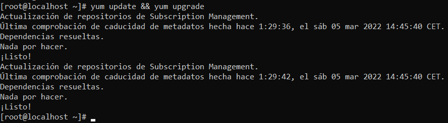
</details>
<hr>

### Instal·lació des del Repositori
1. Començarem instal·lant el Repositori de Percona Server per MySQL amb la següent comanda amb un usuari **root** o **sudo**.
```
# sudo yum install https://repo.percona.com/yum/percona-release-latest.noarch.rpm
```
<details open>
<summary>Screenshot <b>(Installing Percona)</b></summary>

</details>

2. Activarem el Repositori Instal·lat de Percona.
```
sudo percona-release setup ps80 -y
```
<details open>
<summary>Screenshot <b>(Enable Repository)</b></summary>

</details>

3. Instal·lem els paquets (Percona Server)
```
# sudo yum install percona-server-server
```
<details open>
<summary>Screenshot <b>(Installation Packages)</b></summary>

</details>...
<details open>
<summary>Screenshot <b>(Installation Packages Part 2)</summary>

</details>
<hr>

### Post Instal·lació
Al acabar la instal·lació cal que ferm un seguit de passos per acabar de tenir correctament modificat i montar el nostre Percona Server

1. Primer de tot encendrem el servei de MySQL.
```
# sudo systemctl start mysqld
```
<details open>
<summary>Screenshot <b>(Start Mysqld)</b></summary>

</details>

2. Posteriorment configurarem que MySQL s'inic al iniciar el Sistema operatiu
```
# sudo systemctl enable mysqld
```
<details open>
<summary>Screenshot <b>(Enable Mysqld)</b></summary>

</details>

3. Comprovació del estat del servei **mysqld**
```
# sudo systemctl status mysqld
```
<details open>
<summary>Screenshot <b>(Status Mysqld)</b></summary>

</details>

4. Obtenir la contrasenya del **Root del MySQL** que es genera per defecte en els logs.
```
# cat /var/log/mysqld.log | grep generated
```
<details open>
<summary>Screenshot <b>(Password Generated)</b></summary>

</details>

5. Farem el secure_installation per **millorar la seguretat** del nostre servidor, el Script que executarem fa lo següent:
    > - Canvia la contrassenya **Root**.
    > - **Inhabilita la connexió** remota a la BBDD per l'usuari **Root**.
    > - Elimina els usuaris anónims.
    > - Elimina la Base de Dades de Test.
    > - Reinicia els permisos de les Taules.
```
# mysql_secure_installation
```
<details open>
<summary>Screenshot <b>(Root Password)</b></summary>
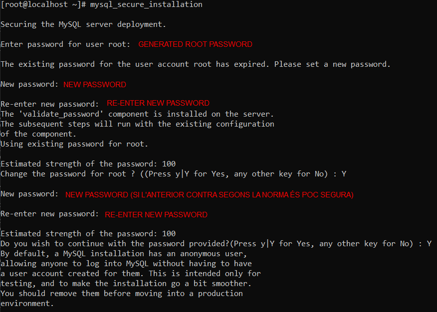
</details>
<details open>
<summary>Screenshot <b>(Disallow Remote Conection Root + Remove Anonymous Users + Remove Database and Privileges Test + Reloading Tables Privileges)</b></summary>

</details>

6. Arribat en aquest punt, procedirem a mirar la versió del MySQL instal·lat.
```
# sudo mysqladmin -u root -p version
```
<details open>
<summary>Screenshot <b>(Check Version)</b></summary>
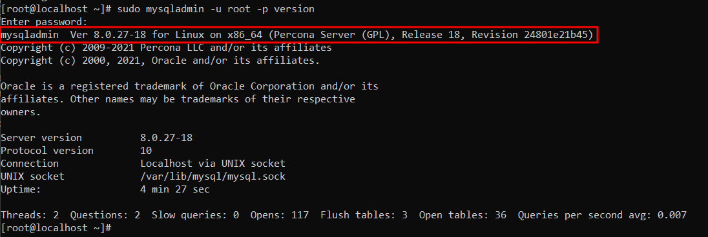
</details>
<hr>

## [Extra] Accedir en Remot
Arribat al punt anterior, ja estaria la instal·lació i configuració del Percona Server, però aquest punt és per poder accedir-hi remotament.

Tal com ho tenim ara configurat:
- Port MySQL 3306 **escoltant**. ✔️
- Firewall Configurat. ❌
- Usuari MySQL amb el qual poder accedir-hi des de qualsevol màquina. ❌

1. Procedirem a configurar el Firewall per poder accedir al MySQL del Percona Server Remotament.

```
# sudo firewall-cmd --zone=public --add-port=3306/tcp --permanent

# sudo systemctl restart firewalld.service
```
<details open>
<summary>Screenshot <b>(Firewall Configuration)</b></summary>

</details>
<details open>
<summary>Screenshot <b>(Check Firewall Conf)</b></summary>
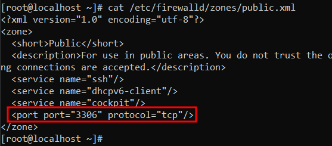
</details>

2. Ara procedirem a crear un usuari que pugui accedir des de qualsevol màquina al MySQL i li donarem els màxims privilegis possibles (per comprobar que funciona.)
```
# mysql -u root -p
[root password]

mysql> CREATE USER 'new_user'@'%' IDENTIFIED BY 'P4SSW0RD';

mysql> GRANT ALL PRIVILEGES ON *.* TO 'new_user'@'%';

mysql> FLUSH PRIVILEGES;
```
<details open>
<summary>Screenshot <b>(MySQL Access)</b></summary>
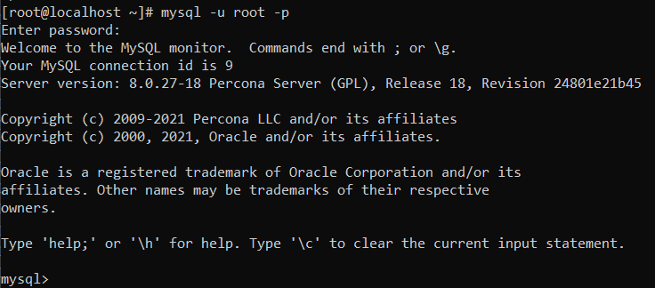
</details>

<details open>
<summary>Screenshot <b>(MySQL Create User)</b></summary>

</details>

<details open>
<summary>Screenshot <b>(MySQL Grant Privileges User)</b></summary>

</details>

<details open>
<summary>Screenshot <b>(MySQL Flush Privileges To Take Effect Now)</b></summary>
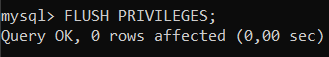
</details>

3. Crearem una connexió cap a aquesta màquina des del Workbench
<details open>
<summary>Screenshot <b>(Creating Connection)</b></summary>
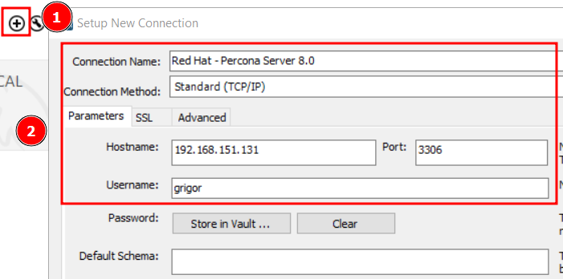
</details>
<details open>
<summary>Screenshot <b>(Acceding to MySQL)</b></summary>
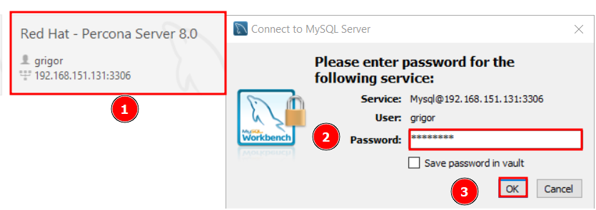
</details>
<details open>
<summary>Screenshot <b>(Testing DB)</b></summary>

</details>
<hr>

## RESPON O COMPROVA ELS SEGÜENTS APARTATS

1. Un cop realitzada la instal·lació realitza una securització de la mateixa. Quin programa realitza aquesta tasca? Realitza una securització de la instal·lació indicant que la contrasenya de root sigui patata. 

    ><span style="color:#6495ED">La securització s'ha fet en els passos anteriors de la Post Instal·lació, el programa que el realitza és el mysql_secure_installation, i el executable es troba al path `/usr/bin/mysql_secure_installation` i està dissenyat per establir alguns paràmetres inicials que són més segurs que els de la instal·lació en el nostre SO</span>.

    <details open>
    <summary>Screenshot <b>(Path Mysql Secure Installation)</b></summary>
    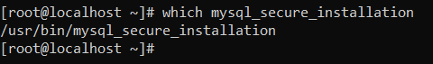
    </details>

2. Quines són les instruccions per arrancar / verificar status / apagar servei de la base de dades
de Percona Server en el sistema operatiu?
> Per arrancar el Servei
> ```
># systemctl start mysqld
> ```

> Per verificar el Status del Servei
> ```
> # systemctl status mysqld
> ```

> Per apagar el Servei
> ```
> # systemctl stop mysqld
> ```

3. A on es troba i quin nom rep el fitxer de configuració del SGBD Percona Server?

    Es troba a /etc i  el fitxer rep el nom de my.cnf
    
    Com accedir:
    ```
    # cd /etc/my.cnf
    ```

4. A on es troben físicament els fitxers de dades (per defecte). Com ho has sabut?

    Es troben a `/usr/mysql/data` ho sabem perquè en el fitxer /etc/my.cnf hi ha una variable de "datadir" on crida aquesta ruta.

    ```
    # cat /etc/my.cnf
    ```
    <details open>
    <summary>Screenshot <b>(Lloc del Fitxer my.cnf on ens diu la ruta del directori dels fitxers)</b></summary>
    
    </details>

    I si veiem els passos anteriors vam crear una base de dades de prova nomenada github, on hauria de sortir al llistar el contingut d'aquesta ruta.
    ```
    # ls /var/lib/mysql
    ```
    <details open>
    <summary>Screenshot <b>(Es veu el lloc on es guarden els fitxers de dades (i podrem veure la nostra BBDD creada))</b></summary>
    
    </details>

    I ara si creem en la BBDD de github una taula, ens apareix la manera en que ho guarda.
    ```
    # ls /var/lib/mysql/github
    ```
    <details open>
    <summary>Screenshot <b>(Com es guarden les nostres taules)</b></summary>
    
    </details>

5. Crea un usuari anomenat asix en el sistema operatiu i en SGBD de tal manera que aquest usuari del sistema operatiu no hagi d'introduir l'usuari i password cada vegada que cridem al client mysql?

    Crearem i li establirem al usuari una contrasenya (SO).
    ```
    # useradd asix
    ```
    
    ```
    # passwd asix
    ```

    Ara, per posar una contrasenya feble en el MySQL, hem de baixar el nivell de seguretat afegint les següents línies al final del fitxer de configuració `/etc/my.cnf` i desprès reiniciarem el servei de `mysqld`.
    ```
    ...
    validate_password.privacy=LOW
    validate.password.length=4
    ```
    <details open>
    <summary>Screenshot <b>(Configurar el nivell de seguretat de la password)</b></summary>
    
    </details>

    I reiniciarem el servei per a que s'apliquin els canvis.
    ```
    # systemctl restart mysqld
    ```

    Crearem el mateix usuari en el MySQL des de Root.
    ```
    mysql> CREATE USER IF NOT EXISTS asix IDENTIFIED BY 'patata';
    ```
    <details open>
    <summary>Screenshot <b>(MySQL usuari asix)</b></summary>
    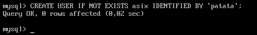
    </details>

    Ara ens loguejarem amb el usuari asix que hem creat.
    I ens situarem en el directori personal `/home/asix`
    ```
    # cd /home/asix
    # pwd
    /home/asix
    ```
    Crearem l'arxiu `.my.cnf` (fitxer ocult)
    ```
    # nano .my.cnf
    ```
    I dintre escriurem lo següent:
    ```
    [CLIENT]
    password = patata
    ``` 
    <details open>
    <summary>Screenshot <b>(.my.cnf configuration)</b></summary>
    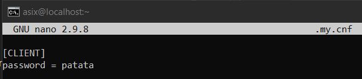
    </details>

    Ara definirem uns permisos al fitxer perquè sigui lo menys accessible per la resta possible, ja que conté la nostra PASSWORD.
    ```
    # chmod 600 .my.cnf
    ```
    I al fer MySQL des d'aquest usuari que hem configurat entraria automàticament.
    ```
    # mysql
    ```
    <details open>
    <summary>Screenshot <b>(.my.cnf configuration)</b></summary>
    
    </details>

6. El servei de MySQL (mysqld) escolta al port 3306. Quina modificació/passos caldrien fer per canviar aquest port a 33306 per exemple? Important: No realitzis els canvis. Només indica els passos que faries.

    Primer de tot aniriem a l'arxiu de configuració del SGBD.
    ```
    # nano /etc/my.cnf
    ```

    I afegiriem el següent text. ( Si no hi ha aquesta opció escrita per defecte està en 3306, al escriure una nosaltres aquesta agafa la prioritat.)
    ```
    port = 33306
    ```
    <details open>
    <summary>Screenshot <b>(my.cnf canviar port)</b></summary>
    
    </details>

<hr>

### WEBGRAFIA

- [Instal·lació Percona Server](https://www.percona.com/doc/percona-server/8.0/installation/yum_repo.html)

- [Post Instal·lació](https://www.percona.com/doc/percona-server/8.0/installation/yum_repo.html)

- [Obtenir contrasenya Root Generada](https://forums.percona.com/t/default-password-after-installing-in-centos7/4838)

- [Accés Remot MySQL](https://bgasparotto.com/enable-mysql-remote-access)

- [MySQL Auto Login](https://dev.mysql.com/doc/refman/5.7/en/password-security-user.html)