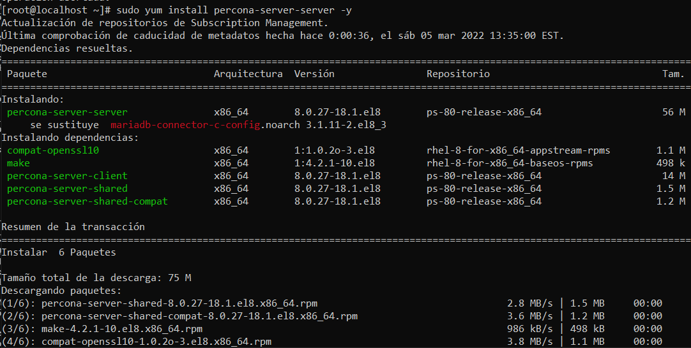
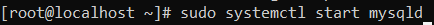
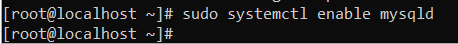
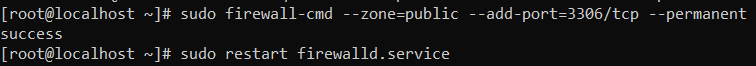
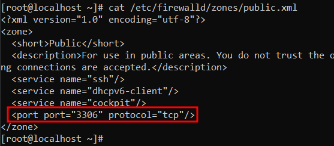
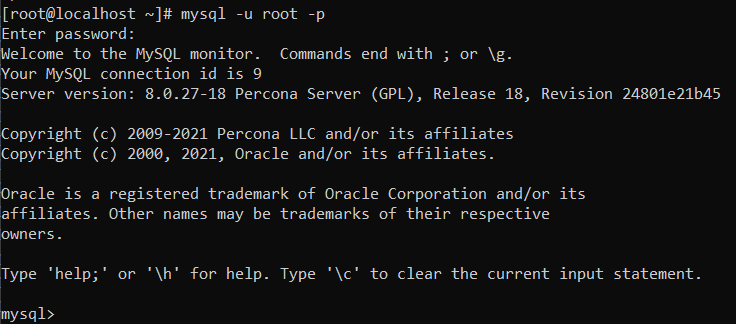
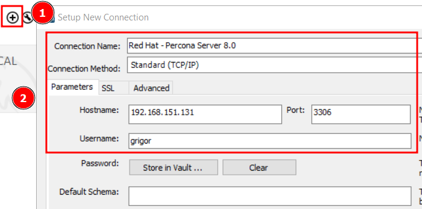
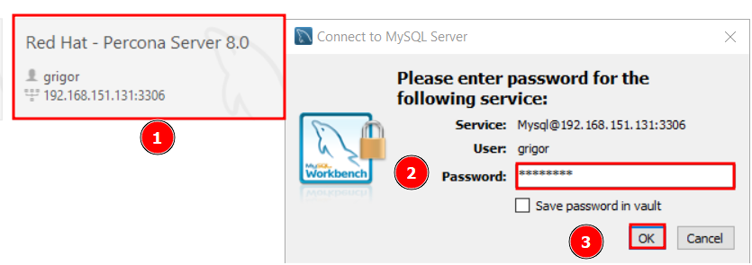

# Instal·lació Percona Server 8.0 

### Connexió per SSH al Sistema
Primer de tot, ens connectarem a la màquina per **SSH** desde CMD (ho tenim prèviament instal·lat).
```
ssh machineuser@ip 
```
<details open>
<summary>Screenshot <b>(Connection SSH)</b></summary>

</details>


### Actualització dels Paquets del Sistema
Després, actualitzarem els nostres paquets del sistema.
```
yum update && yum upgrade
```
<details open>
<summary>Screenshot <b>(OS Upgrade)</b></summary>

</details>
<hr>

### Instal·lació des del Repositori
1. Començarem instal·lant el Repositori de Percona Server per MySQL amb la següent comanda amb un usuari **root** o **sudo**.
```
sudo yum install https://repo.percona.com/yum/percona-release-latest.noarch.rpm
```
<details open>
<summary>Screenshot <b>(Installing Percona)</b></summary>

</details>

2. Activarem el Repositori Instal·lat de Percona.
```
sudo percona-release setup ps80 -y
```
<details open>
<summary>Screenshot <b>(Enable Repository)</b></summary>

</details>

3. Instal·lem els paquets (Percona Server)
```
sudo yum install percona-server-server
```
<details open>
<summary>Screenshot <b>(Installation Packages)</b></summary>

</details>...
<details open>
<summary>Screenshot <b>(Installation Packages Part 2)</summary>

</details>
<hr>

### Post Instal·lació
Al acabar la instal·lació cal que ferm un seguit de passos per acabar de tenir correctament modificat i montar el nostre Percona Server

1. Primer de tot encendrem el servei de MySQL.
```
sudo systemctl start mysqld
```
<details open>
<summary>Screenshot <b>(Start Mysqld)</b></summary>

</details>

2. Posteriorment configurarem que MySQL s'inic al iniciar el Sistema operatiu
```
sudo systemctl enable mysqld
```
<details open>
<summary>Screenshot <b>(Enable Mysqld)</b></summary>

</details>

3. Comprovació del estat del servei **mysqld**
```
sudo systemctl status mysqld
```
<details open>
<summary>Screenshot <b>(Status Mysqld)</b></summary>

</details>

4. Obtenir la contrasenya del **Root del MySQL** que es genera per defecte en els logs.
```
cat /var/log/mysqld.log | grep generated
```
<details open>
<summary>Screenshot <b>(Password Generated)</b></summary>

</details>

5. Farem el secure_installation per **millorar la seguretat** del nostre servidor, el Script que executarem fa lo següent:
    > - Canvia la contrassenya **Root**.
    > - **Inhabilita la connexió** remota a la BBDD per l'usuari **Root**.
    > - Elimina els usuaris anónims.
    > - Elimina la Base de Dades de Test.
    > - Reinicia els permisos de les Taules.
```
mysql_secure_installation
```
<details open>
<summary>Screenshot <b>(Root Password)</b></summary>

</details>
<details open>
<summary>Screenshot <b>(Disallow Remote Conection Root + Remove Anonymous Users + Remove Database and Privileges Test + Reloading Tables Privileges)</b></summary>

</details>

6. Arribat en aquest punt, procedirem a mirar la versió del MySQL instal·lat.
```
sudo mysqladmin -u root -p version
```
<details open>
<summary>Screenshot <b>(Check Version)</b></summary>

</details>
<hr>

## [Extra] Accedir en Remot
Arribat al punt anterior, ja estaria la instal·lació i configuració del Percona Server, però aquest punt és per poder accedir-hi remotament.

Tal com ho tenim ara configurat:
- Port MySQL 3306 **escoltant**. ✔️
- Firewall Configurat. ❌
- Usuari MySQL amb el qual poder accedir-hi des de qualsevol màquina. ❌

1. Procedirem a configurar el Firewall per poder accedir al MySQL del Percona Server Remotament.

```
# sudo firewall-cmd --zone=public --add-port=3306/tcp --permanent

# sudo systemctl restart firewalld.service
```
<details open>
<summary>Screenshot <b>(Firewall Configuration)</b></summary>

</details>
<details open>
<summary>Screenshot <b>(Check Firewall Conf)</b></summary>

</details>

2. Ara procedirem a crear un usuari que pugui accedir des de qualsevol màquina al MySQL i li donarem els màxims privilegis possibles (per comprobar que funciona.)
```
# mysql -u root -p
[root password]

# CREATE USER 'new_user'@'%' IDENTIFIED BY 'P4SSW0RD';

# GRANT ALL PRIVILEGES ON *.* TO 'new_user'@'%';

# FLUSH PRIVILEGES;
```
<details open>
<summary>Screenshot <b>(MySQL Access)</b></summary>

</details>

<details open>
<summary>Screenshot <b>(MySQL Create User)</b></summary>

</details>

<details open>
<summary>Screenshot <b>(MySQL Grant Privileges User)</b></summary>

</details>

<details open>
<summary>Screenshot <b>(MySQL Flush Privileges To Take Effect Now)</b></summary>

</details>

3. Crearem una connexió cap a aquesta màquina des del Workbench
<details open>
<summary>Screenshot <b>(Creating Connection)</b></summary>

</details>
<details open>
<summary>Screenshot <b>(Acceding to MySQL)</b></summary>

</details>
<details open>
<summary>Screenshot <b>(Testing DB)</b></summary>

</details>