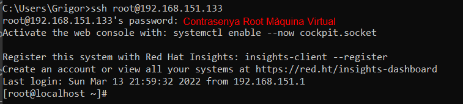
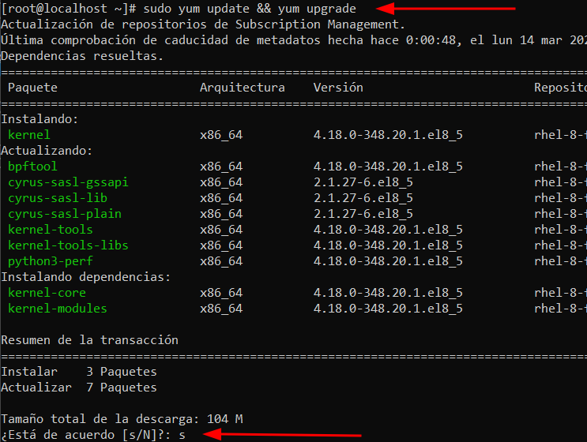
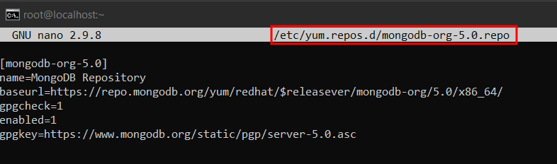
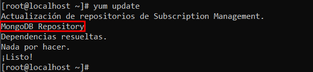
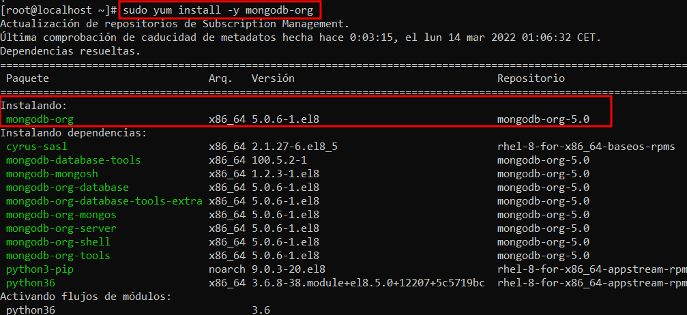
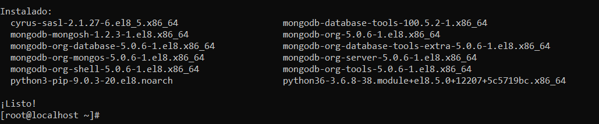
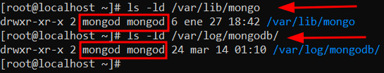
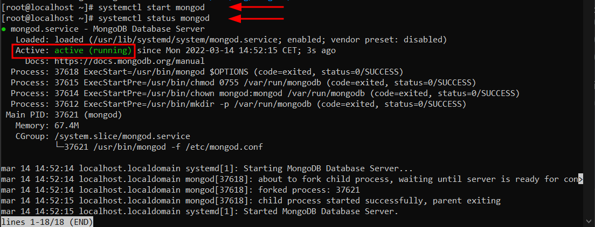
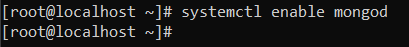

# Instal·lació Mongo DB 5.0 

## Connexió per SSH al Sistema
Primer de tot, ens connectarem a la màquina per **SSH** desde CMD (ho tenim prèviament instal·lat).
```
ssh machineuser@ip 
```
<details open>
<summary><b>Connexió per SSH</b></summary>

</details>

## Actualització dels Paquets del Sistema
Després, actualitzarem els nostres paquets del nostre sistema acceptant tots els inputs que ens vagi demanant.
```
# sudo yum update && yum upgrade
```
<details open>
<summary><b>Actualització Paquets SO</b></summary>

</details>
<hr>

## Instal·lació MongoDB 5.0 des del Repositori
**Nota**: ***Totes les següents comandas s'han executat amb un usuari root***.

1. Començarem afegint el Repositori de Mongo DB 5.0 al nostre Linux.
    
    Crearem el repositori de Mongo DB 5.0

    ```
    # sudo nano /etc/yum.repos.d/mongodb-org-5.0.repo
    ```

    I dins afegirem lo següent per a que es connecti als repositoris de Mongo DB 5.0

    ```
    [mongodb-org-5.0]
    name=MongoDB Repository
    baseurl=https://repo.mongodb.org/yum/redhat/$releasever/mongodb-org/5.0/x86_64/
    gpgcheck=1
    enabled=1
    gpgkey=https://www.mongodb.org/static/pgp/server-5.0.asc
    ```

    <details open>
    <summary><b>Configuració Repositori Mongo DB 5.0</b></summary>
    
    </details>
    

    Posteriorment actualitzarem els paquets perquè es refresquin els repositoris actuals i podrem veure que hi ha un de nou que és el que hem afegit.
    ```
    # yum update
    ```
    <details open>
    <summary><b>Actualitzar Paquets</b></summary>
    
    </details>

2. Ara un cop tenim el repositori configurat podrem instal·lar el MongoDB en la versió més estable en aquest cas 5.0

    ```
    # sudo yum install -y mongodb-org 
    ```
    <details open>
    <summary><b>Instal·lació MongoDB</b></summary>
    
    </details>
    ...

    <details open>
    <summary><b>Instal·lació Feta MongoDB</b></summary>
    
    </details>
<hr>

## Post Instal·lació

1. Un cop tenim instal·lat el MongoDB, ens assegurarem que en els directoris de dades i de logs el propietari és el usuari mongod que és el que utilitza per defecte MongoDB per la instal·lació i creació de dependencies.
    ```
    # ls -ld /var/lib/mongo

    # ls -ld /var/log/mongodb
    ```
    <details open>
    <summary><b>Comprovació Permisos</b></summary>
    
    </details>

2. Ara iniciarem el Servei de MongoDB i comprovarem que hagi arrancat.

    ```
    # sudo systemctl start mongod

    # sudo systemctl status mongod
    ```

    <details open>
    <summary><b>Activar Servei mongod</b></summary>
    
    </details>

3. Ara habilitarem el servei de MongoDB per a que s'inicii juntament amb el sistema operatiu.
    ```
    # sudo systemctl enable mongod
    ```

    <details open>
    <summary><b>Iniciar mongod amb el sistema</b></summary>
    
    </details>

4. 


