# Instal·lació MySQL 8.0 

## Connexió per SSH al Sistema
Primer de tot, ens connectarem a la màquina per **SSH** desde CMD (ho tenim prèviament instal·lat).
```
ssh machineuser@ip 
```
<details open>
<summary>Screenshot <b>(Connection SSH)</b></summary>
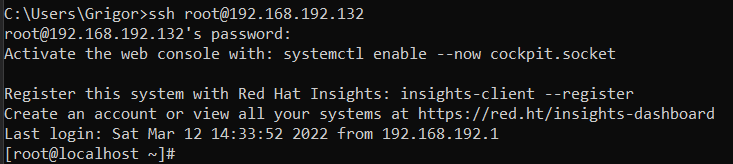
</details>

## Actualització dels Paquets del Sistema
Després, actualitzarem els nostres paquets del nostre sistema.
```
# yum update && yum upgrade
```
<details open>
<summary>Screenshot <b>(OS Upgrade)</b></summary>
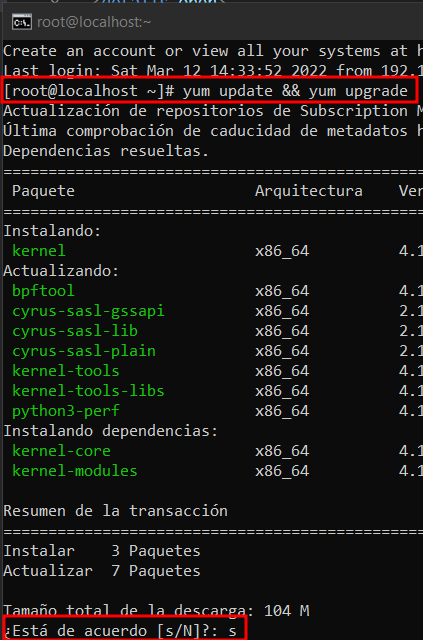
</details>
<hr>

## Instal·lació MySQL 8.0 des del Repositori
1. Començarem instal·lant el Repositori de MySQL 8.0 amb la següent comanda amb un usuari **root** o amb **sudo**.
```
# sudo yum install https://repo.mysql.com/mysql80-community-release-el8-3.noarch.rpm -y
```
<details open>
<summary><b>Instal·lant el Repositori de MySQL 8.0</b></summary>
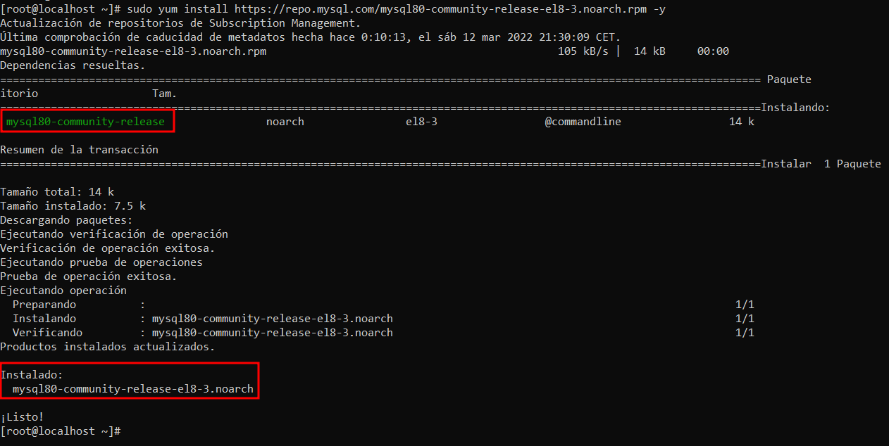
</details>

2. Comprovarem que realment tenim el repositori instal·lat i activat (per defecte ve activat), en aquest cas ens hauria d'apareixér el MySQL 8.0 Community.
```
# sudo yum repolist enabled | grep "mysql.*-community.*"
```
<details open>
<summary><b>Veure els repositoris instal·lats prèviament.</b></summary>
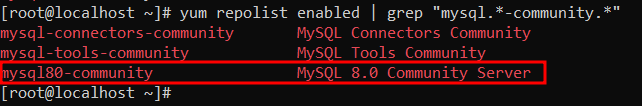
</details>

3. Si no ens aparegués res hauriem d'habilitar aquest repositori
```
# sudo dnf config-manager --enable mysql80-community
```

4. A partir dels sistemes RHEL8 en posterior hi ha un mòdul activat per defecte de MySQL, on enmascara tots els paquets de MySQL, llavors haurem de deshabilitar aquest mòdul per fer visibles els paquets del repositori de MySQL.

```
# sudo yum module disable mysql -y
```
<details open>
<summary><b>Deshabilitar el mòdul MySQL per defecte (Posterior a RHEL8.0).</b></summary>
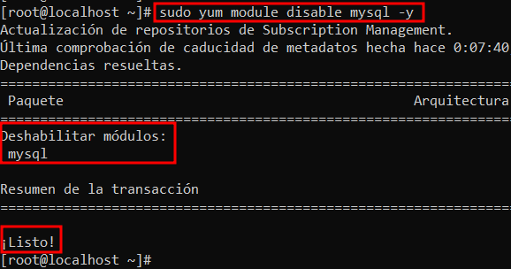
</details>

5. I ara sí que podem instal·lar el MySQL amb les seves dependències en el nostre sistema.
```
# sudo yum install mysql-community-server -y
```
<details open>
<summary><b>Instal·lació MySQL</b></summary>
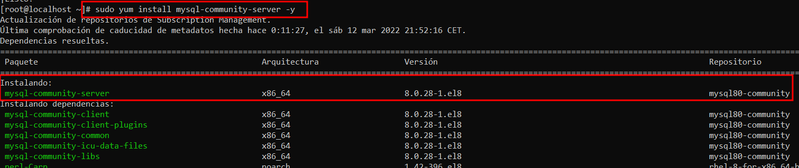
</details>

<details open>
<summary><b>Instal·lació Feta Correctament</b></summary>
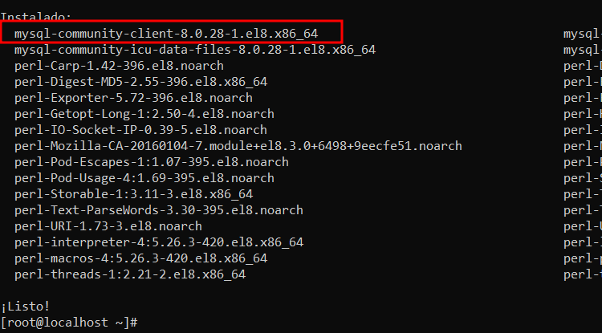
</details>

<hr>

## Post Instal·lació
Al acabar la instal·lació cal que fem un seguit de passos per acabar de tenir correctament configurat i montat el nostre MySQL Server 8.0.

1. Primer de tot encendrem el nostre servei de MySQL i comprovarem el seu estat, ha d'estar en <span style="color:green">active running</span>.
```
# sudo systemctl start mysqld

# sudo systemctl status mysqld
```
<details open>
<summary><b>Iniciem el servei Mysqld</b></summary>
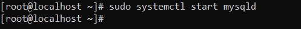
</details>

<details open>
<summary><b>Comprovem l'estat del servei.</b></summary>
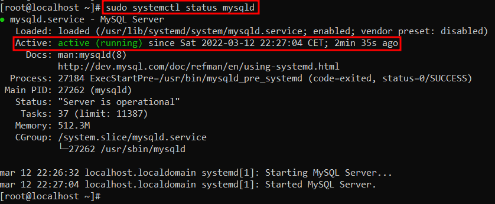
</details>

2. Per defecte al instal·lar el MySQL, en els logs s'ha generat la contrasenya del Root per poder accedir-hi, llavors filtrarem aquest apartat dels logs per veure la contrasenya.
    ```
    # sudo grep 'temporary password' /var/log/mysqld.log
    ```
    <details open>
    <summary><b>Obtenir la contrasenya Root dels Logs.</b></summary>
    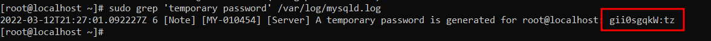
    </details>

3. Ara executarem el script <span style="color:yellow">mysql_secure_installation</span>, millorar la seguretat del nostre MySQL instal·lat on haurem de configurar els següents apartats.

    > - Canvia la contrasenya del Root.
    > - Treure el accés remot per l'usuari Root.
    > - Treure els usuaris anonims.
    > - Treure la base de dades test on per defect poden accedir tots els usuaris i els anonims, i també reiniciar els privilegis de les bases de dades que comencin per "test_.".

    Executarem el mysql_secure_installation.
    ```
    # sudo mysql_secure_installation
    ```
    I configurarem les opcions que venen a continuació.
    <details open>
    <summary><b>Opció 1:  Canviar Contrasenya Root.</b></summary>
    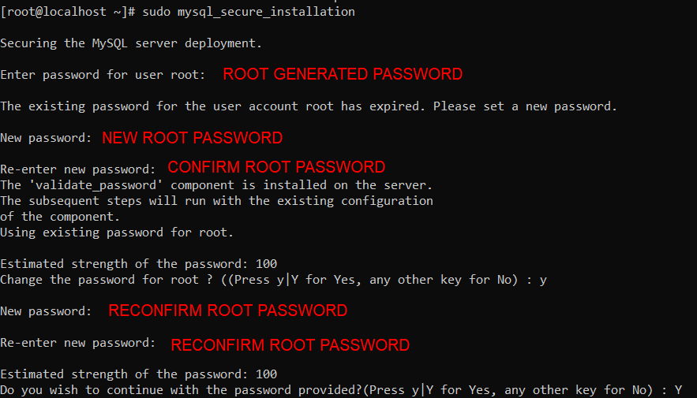
    </details>

    <details open>
    <summary><b>Opció 2: Eliminar usuaris anonims.</b></summary>
    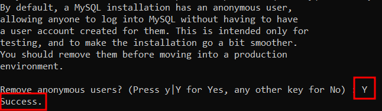
    </details>

    <details open>
    <summary><b>Opció 3: Desactivar l'accés remot per l'usuari Root.</b></summary>
    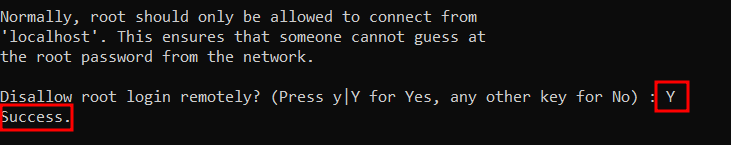
    </details>
    
    <details open>
    <summary><b>Opció 4: Eliminar la base de dades per defecte Test.</b></summary>
    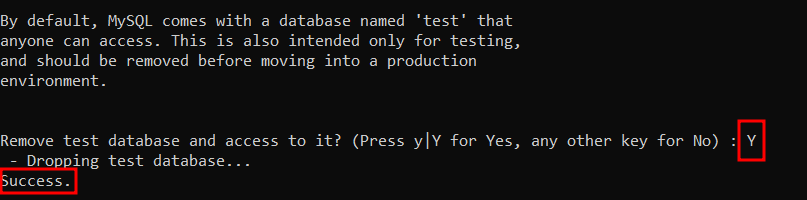
    </details>

    <details open>
    <summary><b>Opció 5: Reiniciar la taula de permisos.</b></summary>
    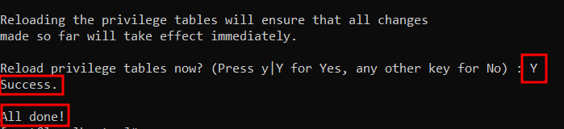
    </details>

4. Arribat en aquest punt, ja tenim configurat la base de MySQL, si volem podem veure quina versió s'ha instal·lat ho podrem fer.
    ```
    # sudo mysqladmin -u root -p version
    (root password)
    ```
    <details open>
    <summary><b>Veure versió MySQL</b></summary>
    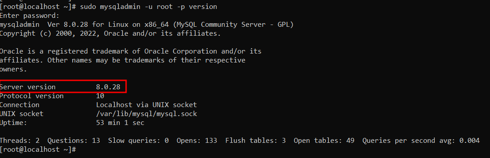
    </details>

<hr>

## [Extra] Accedir en remot al MySQL
Arribat al punt anterior ja estaria la instal·lació del MySQL base, però ara ens agradaria accedir en remot cap aquest SGBD.

Llavors haurem de configurar els següents punts amb una ❌
- Port MySQL 3306 **escoltant**. ✔️
- Firewall Configurat. ❌
- Usuari MySQL amb el qual poder accedir-hi des de qualsevol màquina. ❌

1. Procedirem a configurar el Firewall per poder accedir al MySQL 8.0 Remotament, configurarem la regla i reiniciarem el servei per a que s'apliquin els canvis.

    ```
    # sudo firewall-cmd --zone=public --add-port=3306/tcp --permanent

    # sudo systemctl restart firewalld.service
    ```
    <details open>
    <summary><b>Configurar Firewall</b></summary>
    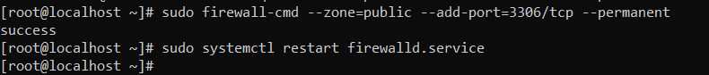
    </details>

2. Ara crearem en el MySQL el compte d'usuari que volguem que pugui accedir en remot i li donarem els seus permisos corresponents en el meu cas de prova tots els permisos el hostname % significa que aquell compte pugui accedir des de qualsevol màquina i per això ens ve bé aquest hostname per provar l'accés remot.

    ```
    # mysql -u root -p
    [root password]

    mysql> CREATE USER 'new_user'@'%' IDENTIFIED BY 'P4SSW0RD';

    mysql> GRANT ALL PRIVILEGES ON *.* TO 'new_user'@'%';

    mysql> FLUSH PRIVILEGES;
    ```
    <details open>
    <summary><b>Configuració Usuari MySQL</b></summary>
    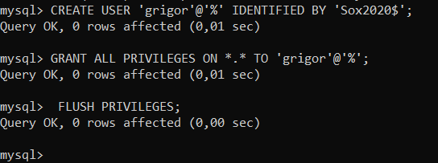
    </details>

3. Ara si des de remot volem accedir, en aquest cas desde WorkBench creem la connexió i intentem accedir podrem accedir sense cap problema.

    <details open>
    <summary><b>Accedir en Remot</b></summary>
    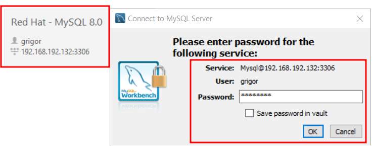
    </details>

    <details open>
    <summary><b>Prova fer alguna acció sobre el SGBD</b></summary>
    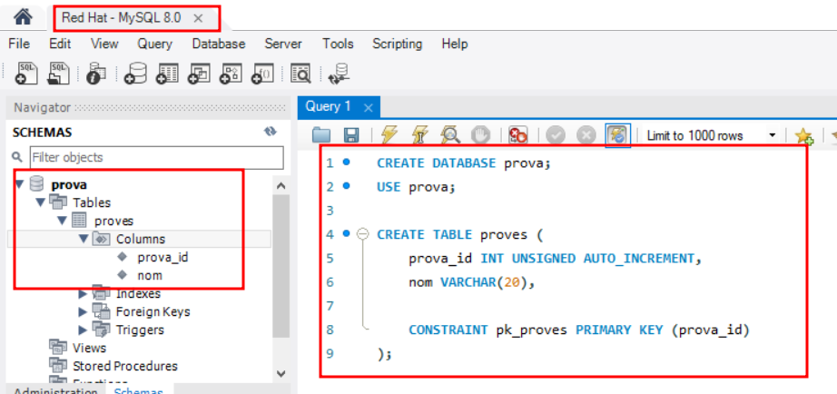
    </details>
<hr>

## RESPON O COMPROVA ELS SEGÜENTS APARTATS

1. A on es troben físicament els fitxers de dades?

    Es troben al path **/var/lib/msyql**

    Ho podrem saber utilitzant la següent comanda per obtenir la linea del my.cnf on ens ho diu.

    ```
    cat /etc/my.cnf | grep datadir
    ```
    <details open>
    <summary><b>Ruta Directori de Dades</b></summary>
    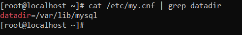
    </details>

    <details open>
    <summary><b>Comprovació de com guarda les taules de les BBDD el SGBD.</b></summary>
    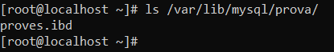
    </details>

2. A on es troba el fitxer de configuració? Quin és el seu contingut?

    Es troba a la ruta **/etc/my.cnf**

    Podrem veure el seu contingut amb la comanda cat.

    ```
    cat /etc/my.cnf
    ```

    <details open>
    <summary><b>Contingut fitxer de configuració my.cnf</b></summary>
    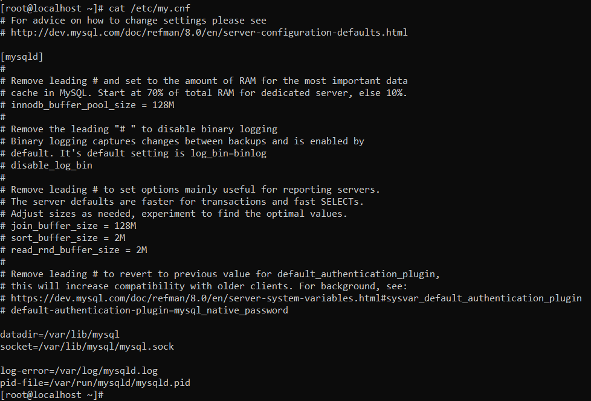
    </details>

3. El procés de mysqld escolta al port 3306. Quina modificació/passos caldrien fer per canviar aquest port a 33306 per exemple? Important: No realitzis els canvis. Només indica els passos que faries.

    El procés escolta per defecte el 3306 i en el my.cnf no està escrit però per defecte és com si estigués.

    Llavors per modificar el port aniriem al fitxer de configuració amb el nostre editor de fitxers de linux preferit
    ```
    # sudo nano /etc/my.cnf
    ```
    I afegiriem la següent línia, i d'aquesta manera sobrescriuriem el port per defecte que hi ha.

    ```
    port = 33306
    ```

    I clarament reiniciariem el servei per aplicar els canvis.

    ```
    systemctl restart mysqld
    ```

4. Un cop finalitzada la instal·lació i veure que funciona, mostra el resultat de la comanda:
    ```
    ps -ef | grep mysql
    ```

    <details open>
    <summary><b>Resultat de la comanda anterior</b></summary>
    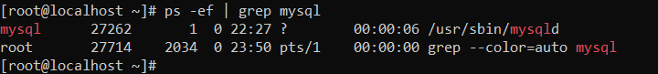
    </details>

<hr>

## WEBGRAFIA

- [Instal·lació MySQL 8.0](https://dev.mysql.com/doc/refman/8.0/en/linux-installation-yum-repo.html)

- [Instal·lació MySQL 8.0 (+ Ajuda)](https://www.tecmint.com/install-latest-mysql-on-rhel-centos-and-fedora/)

- [Instal·lació MySQL 8.0 (++ Ajuda)](https://www.youtube.com/watch?v=5MfoG2OFDmA&ab_channel=TechBrothersIT)

- [Post Instal·lació](https://dev.mysql.com/doc/refman/8.0/en/postinstallation.html)

- [Accedir en Remot](https://bgasparotto.com/enable-mysql-remote-access)


    


    


