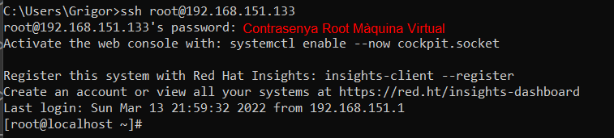
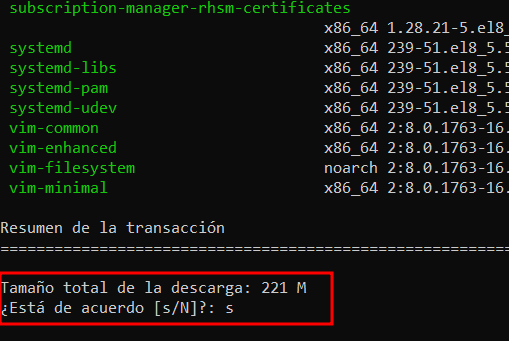
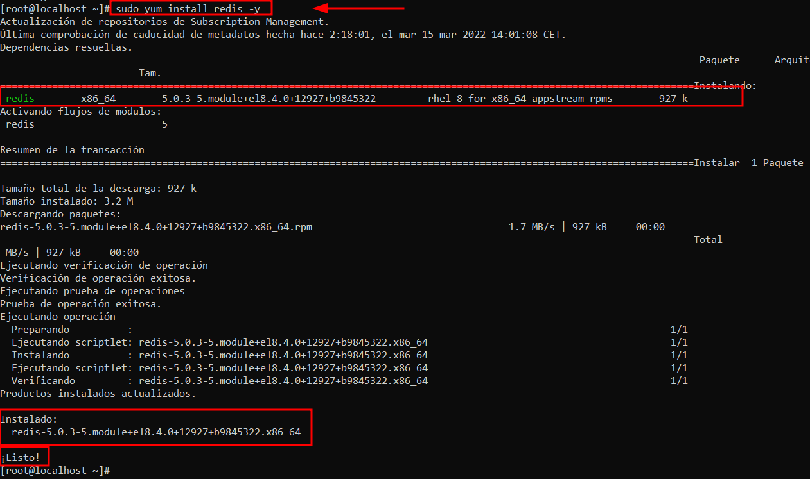
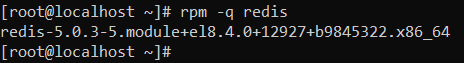
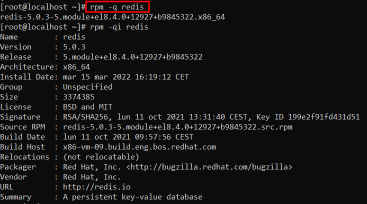

# Instal·lació Redis 5.0 

## Connexió per SSH al Sistema
Primer de tot, ens connectarem a la màquina per **SSH** desde CMD (ho tenim prèviament instal·lat).
```
ssh machineuser@ip 
```
<details open>
<summary><b>Connexió per SSH</b></summary>

</details>

## Actualització dels Paquets del Sistema
Després, actualitzarem els nostres paquets del nostre sistema acceptant tots els inputs que ens vagi demanant.
```
# sudo yum update && yum upgrade
```
<details open>
<summary><b>Actualització Paquets SO</b></summary>

</details>
<hr>

## Instal·lació Redis 5.0
**Nota**: ***Totes les següents comandas s'han executat amb un usuari root***.

La versió de Redis 5.0, ja ve incorporat en el nostre sistema, en el repositori AppStream no hem d'afegir cap repositori ja que ja ho tenim afegit.

1. Per instal·lar Redis utilitzarem la següent comanda:
    ```
    # sudo yum install redis -y
    ```

    <details open>
    <summary><b>Instal·lació Redis</b></summary>
    
    </details>

2. Un cop instal·lat, podem verificar la versió de Redis instal·lat

    ```
    # rpm -q redis
    ```
    <details open>
    <summary><b>Versió Redis</b></summary>
    
    </details>

    Si volem més informació encara ho podem fer de la següent manera.
    ```
    # rpm -qi redis
    ```
    <details open>
    <summary><b>Versió Redis Ampliat</b></summary>
    
    </details>

3. Iniciarem el servei de Redis i ho habilitarem a l'arrancada del sistema també
    ```
    # sudo systemctl start redis 

    # sudo systemctl enable redis 
    ```
    <details open>
    <summary><b>Activar i habilitar redis</b></summary>
    
    </details>