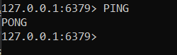

# Instal·lació Redis 5.0 

## Connexió per SSH al Sistema
Primer de tot, ens connectarem a la màquina per **SSH** desde CMD (ho tenim prèviament instal·lat).
```
ssh machineuser@ip 
```
<details open>
<summary><b>Connexió per SSH</b></summary>

</details>

## Actualització dels Paquets del Sistema
Després, actualitzarem els nostres paquets del nostre sistema acceptant tots els inputs que ens vagi demanant.
```
# sudo yum update && yum upgrade
```
<details open>
<summary><b>Actualització Paquets SO</b></summary>

</details>
<hr>

## Instal·lació Redis 5.0
**Nota**: ***Totes les següents comandas s'han executat amb un usuari root***.

La versió de Redis 5.0, ja ve incorporat en el nostre sistema, en el repositori AppStream no hem d'afegir cap repositori ja que ja ho tenim afegit.

1. Per instal·lar Redis utilitzarem la següent comanda:
    ```
    # sudo yum install redis -y
    ```

    <details open>
    <summary><b>Instal·lació Redis</b></summary>
    
    </details>

2. Un cop instal·lat, podem verificar la versió de Redis instal·lat

    ```
    # rpm -q redis
    ```
    <details open>
    <summary><b>Versió Redis</b></summary>
    
    </details>

    Si volem més informació encara ho podem fer de la següent manera.
    ```
    # rpm -qi redis
    ```
    <details open>
    <summary><b>Versió Redis Ampliat</b></summary>
    
    </details>

3. Iniciarem el servei de Redis i ho habilitarem a l'arrancada del sistema també
    ```
    # sudo systemctl start redis 

    # sudo systemctl enable redis 
    ```
    <details open>
    <summary><b>Activar i habilitar redis</b></summary>
    
    </details>

4. Comprovarem el seu estat, ha d'estar en <span style=color:green>Active (Running)</span>
    ```
    # sudo systemctl status redis
    ```
    <details open>
    <summary><b>Veure l'estat del Redis</b></summary>
    
    </details>

5. Si volem entrar a la Shell de Redis ho podem fer de la següent manera.
    ```
    # redis-cli
    ```

    <details open>
    <summary><b>Entrar al Shell de Redis</b></summary>
    
    </details>

6. Si fem un ping al server rebrem un "PONG"
    ```
    ping
    ```
    <details open>
    <summary><b>Ping Server</b></summary>
    
    </details>

7. Tal com tenim ara la configuració, qualsevol persona pot accedir a la Shell i a la base de dades sense autentificació i això ens genera problemes de seguretat. Llavors anirem al fitxer de configuració `/etc/redis.conf`
    ```
    # nano /etc/redis.conf
    ```

    I ubicarem l'apartat de `requierepass`, on descomentarem la linea i posarem la contrasenya segura per el redis.
    <details open>
    <summary><b>Posar Contrasenya</b></summary>
    
    </details>

8. Reiniciarem el Servei per a que s'apliquin els canvis
    ```
    # systemctl restart redis
    ```

9. I si entrem a la Shell de Redis i volguem fer un PING no ens deixarà perquè no ens hem autenticat Per autenticar-nos farem servir la comanda `auth password`.
    <details open>
    <summary><b>Autentificar-se</b></summary>
    
    </details>

10. Ara comprobarem de que podem utilitzar Redis.

    Crearem una clau i valor i les consultarem.
    ```
    set fruta melon

    get fruta
    ```

    <details open>
    <summary><b>Testejar Redis</b></summary>
    
    </details>
<hr>


## Configuració per Accedir en Remot

Ara, configurarem els paràmetres necessaris per poder accedir a redis remotament.

### Configurar Servidor
1. Configurarem el `Bind a 0.0.0.0` per poder accedir-hi des de qualsevol màquina.
    ```
    # nano /etc/redis.conf

    bind 0.0.0.0
    ```
    <details open>
    <summary><b>Configurar Bind</b></summary>
    
    </details>

2. Reiniciarem el servei de Redis
    ```
    # systemctl restart redis
    ```

3. Aplicarem una regla de firewall per acceptar connexions entrants al port 6379 que és el port per defecte de redis i reiniciarem el servei del firewall per a que la regla s'apliqui.
    ```
    # sudo firewall-cmd --add-port=6379/tcp --permanent

    # sudo firewall-cmd --reload
    ```
    <details open>
    <summary><b>Configurar Firewall</b></summary>
    
    </details>

### Configurar Client
Utilitzarem un client Linux per poder accedir remotament.

1. Instal·larem les redis tool en el client per poder utilitzar la comanda per accedir a redis.
    <details open>
    <summary><b>Redis Tools</b></summary>
    
    </details>

2. Per poder accedir al redis remotament, hem de utilitzar la següent comanda, on el paràmetre -h fa referència al host del server, (han d'estar en la mateixa xarxa).
    ```
    # redis-cli -h 192.168.151.133
    ```
    <details open>
    <summary><b>Client accedint a Redis</b></summary>
    
    </details>

3. Com Redis guarda tota la informació que posem a la memòria principal, podem guardar la informació manualment, dient-li, cada 60 segons per cada 10 canvis fets guarda el que hi ha fet en forma de fitxer on després el carregaràs al encendre. Però també podem posar que ho faci automàtic, i que guardi en un fitxer per cada acció realitzada, d'aquesta manera si hi ha una avaria, sabrem quin va ser l'última comanda.

    Per activar aquesta opció d'autoguarda activarem l'opció `AOF, (Append Only File)`
    ```
    127.0.0.1:6397> config set appendonly yes
    ```
    <details open>
    <summary><b>Activant l'autoguardat AOF</b></summary>
    
    </details>
<hr>

### Quin tipus de SGBD és Redis?

Redis vol dir Remote Dictionary Server, és un emmagatzematge de dades molt ràpid en memòria guardant les dades en forma clau-valor, és un SGBD de tipus NoSQL (no relacional), no guarda les dades en format taules i columnes, sino en clau-valor esmentat anteriorment.

Es ràpid ja que guarda les dades en memòria i les consultes són molt ràpides oferint respostes inferiors al milisegon.

És denominat la base de dades preferida de [StackOverflow](https://stackoverflow.com/).

<hr>

## WEBGRAFIA
- [Instal·lació i configuració Redis](https://www.linuxtechi.com/install-redis-server-on-centos-8-rhel-8/)

- [Primers passos de la familiarització amb Redis](https://www.ionos.es/digitalguide/hosting/cuestiones-tecnicas/redis-tutorial-paso-a-paso/)


