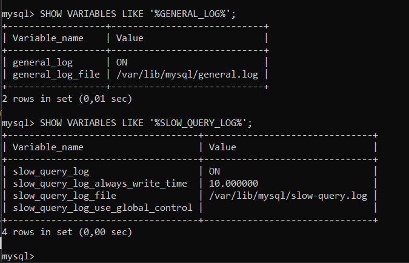
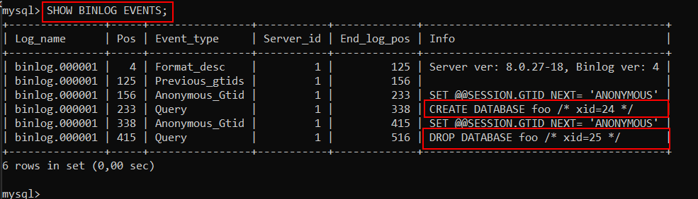
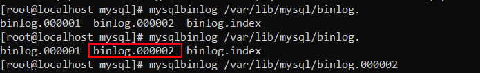

# Configuracions i comprovacions de logs en el MySQL (Percona Server8.0) 

## Connexió per SSH al Sistema
Primer de tot, ens connectarem a la màquina per **SSH** desde CMD (ho tenim prèviament instal·lat).
```
ssh machineuser@ip 
```
<details open>
<summary><b>Connexió per SSH</b></summary>

</details>

<hr>

## Tasques de Configuració i Comprovació de Logs

### Veure Logs Activats per Defecte

A MySQL treballarem els diferents 4 tipus de logs:

> - Logs d'Errors.
> - Log General de Consultes.
> - Log de Consultes Lentes.
> - Log de Binaris.
 
Per poder veure si venen activats per defecte o no, la manera més fàcil i ràpida és mitjançant sentències `SHOW VARIABLES LIKE '%NomLog%' ` (encara que també podem mirar-ho dintre de l'arxiu de configuració `/etc/my.cnf` però mitjançant sentències sabem que no ens deixarem cap, perquè hi ha configuracions que no venen en el /etc/my.cnf i venen per defecte activats). Llavors optarem la manera de saber-ho mitjançant sentències.

```
mysql> SHOW VARIABLES LIKE '%LOG_ERROR%';
```

<details open>
<summary><b>Log d'Errors: ACTIVAT sempre per DEFECTE </b></summary>

</details>

```
mysql> SHOW VARIABLES LIKE '%GENERAL_LOG%';
```
<details open>
<summary><b>Log General: DESACTIVAT per DEFECTE </b></summary>

</details>

```
mysql> SHOW VARIABLES LIKE '%SLOW_QUERY_LOG%';
```
<details open>
<summary><b>Log de Consultes Lentes: DESACTIVAT per DEFECTE </b></summary>

</details>

```
mysql> SHOW VARIABLES LIKE '%SLOW_QUERY_LOG%';
```
<details open>
<summary><b>Log de Consultes Lentes: DESACTIVAT per DEFECTE </b></summary>

</details>

```
mysql> SHOW VARIABLES LIKE '%LOG_BIN%';
```
<details open>
<summary><b>Log de Binaris: ACTIVAT per DEFECTE (Depèn de la versió.)</b></summary>

</details>

## Activar els logs que no venen activats per Defecte en un fitxer de configuració de logs

Ara, crearem un fitxer de configuració de logs `/etc/percona/logs.cnf`, si no existeix la carpeta percona la creem. I ara dins del fitxer de configuració de logs que hem creat, només configurarem els que no vinguin activats per defecte, en aquest cas el Slow Query Log, i General Log, depenent de la versió també hauriem de configurar el Bin Log, però com es pot veure anteriorment ja ve activat per defecte.

1. Crearem la estructura de path on crearem aquest fitxer de logs

    ```
    # mkdir /etc/percona
    # touch logs.cnf
    ```

    <details open>
    <summary><b>Creació de la estructura de PATH</b></summary>
    
    </details>

2. Obrirem el fitxer de configuració amb l'editor nano, i activarem els logs que no ens venen activats per defecte, en el meu cas el Log General de Consultes i el Log de Consultes Lentes, posarem el path que té per defecte /var/lib/mysql/ pero canviarem el nom del fitxer del log per a que sigui més intuïtiu la seva funció. El fitxer .log ho crearà ell mateix. En cas de que el Path del log que li posem, no tingui accéss el MySQL li hauriem de donar permisos.

    ```
    # nano /etc/percona/logs.cnf

    [mysqld]
    #GENERAL LOG AMB EL PATH QUE VE PER DEFECTE
    general_log = 1
    log_output = FILE
    general_log_file = /var/lib/mysql/general.log

    #LOG DE CONSULTES LENTES AMB EL PATH QUE VE PER DEFECTE I SI EL TEMPS D'EXECUCIÓ PASSA DE 2 SEGONS ES REGISTRA LA CONSULTA.
    slow_query_log = 1
    slow_query_log_file = /var/lib/mysql/slow-query.log
    long_query_time = 2
    ```
    <details open>
    <summary><b>Fitxer logs.cnf</b></summary>
    
    </details>

3. Un cop configurat el fitxer de logs, hem d'anar al fitxer de configuració de MySQL i des d'aquest fitxer cridar el fitxer creat de logs. D'aquesta manera, cada cop que s'inicia el sistema, es crida al my.cnf i des del my.cnf cridem al fitxer de configuració de logs afegirem la linea següent.

    ```
    # nano /etc/my.cnf
    [mysqld]
    !includedir /etc/percona
    ```

    <details open>
    <summary><b>Incloure directori de configuració de logs des del fitxer de configuració principal /etc/my.cnf</b></summary>
    
    </details>

4. Reiniciarem el servei i comprovarem que no hi ha cap fallada.

    ```
    # systemctl restart mysqld

    # systemctl status mysqld
    ```
    <details open>
    <summary><b>Reiniciar i comprovar Servei</b></summary>
    
    </details>

## Comprovació de la activació i funcionament dels logs.

Un cop activats els logs, que no teniem activats, ho podem verificar tornant a fer les sentències i consultant si està en OFF o en ON el log.

1. Accedirem al MySQL i comprovarem per cada log activat que estigui en ON.

    ```
    mysql> SHOW VARIABLES LIKE '%GENERAL_LOG%';

    mysql> SHOW VARIABLES LIKE '%SLOW_QUERY_LOG%';
    ```
    <details open>
    <summary><b>Comprovar que estan actius aquests logs</b></summary>
    
    </details>


2. També mirarem si ha creat aquests fitxers de log i que el propietari sigui mysql o que tingui permisos d'escriptura i lectura.

    ```
    # ls -alis /var/lib/mysql/*.log
    ```

    <details open>
    <summary><b>Mirar la creació dels logs i permisos</b></summary>
    
    </details>

3. Farem proves amb el General Log per veure si realment guarda les sentències.

    ```
    mysql> CREATE DATABASE provaLogs;
    Query OK, 1 row affected (0,01 sec)

    mysql> USE provaLogs;
    Database changed

    mysql> CREATE TABLE taulaProves (pepe INT);
    Query OK, 0 rows affected (0,02 sec)    
    ```

    I amb la comanda cat veurem el contingut del log general, on en teoria ens hauria de gravar les sentències anteriors.

    ```
    # cat /var/lib/mysql/general.log
    ```

    <details open>
    <summary><b>Mirar el contingut de General Log</b></summary>
    
    </details>

4. Ara farem proves però amb el Slow Query Log, per veure si realment guarda les sentències lentes, utilitzarem la funció sleep per a que la sentència trigui més del temps mínim i registri la sentència com a lenta (La funció sleep triga 4 segons per cada registra que troba a la select).

    ```
    mysql> SELECT sleep(4), user FROM mysql.user;
    +----------+------------------+
    | sleep(4) | user             |
    +----------+------------------+
    |        0 | asix             |
    |        0 | grigor           |
    |        0 | mysql.infoschema |
    |        0 | mysql.session    |
    |        0 | mysql.sys        |
    |        0 | root             |
    +----------+------------------+
    6 rows in set (24,01 sec)
    ```

    I verificarem si ha enregistrat la consulta fent un cat al fitxer del Slow Query Log.

    ```
    # cat /var/lib/mysql/slow-query.log
    ```
    <details open>
    <summary><b>Mirar Contingut Slow Query</b></summary>
    
    </details>

## Desactivar els Logs binary, slow query i general
Ara per desactivar aquests logs (no borrar-los) sinó desactivar i que no es gravin més canvis ni en el fitxer de log Binary, Slow Query ni general.

1. Accedirem al fitxer de configuració de logs creat i configurat anteriorment `/etc/percona/logs.cnf`. 
    ```
    # nano /etc/percona/logs.cnf
    ```

2. Localitzarem l'apartat de General Log i el posarem en OFF/0.
    ```
    general_log = 0
    ```
    <details open>
    <summary><b>Desactivar el Log General</b></summary>
    
    </details>

3. Localitzarem l'apartat de Slow Query i el posarem en OFF/0
    ```
    slow_query_log = 0
    ```
    <details open>
    <summary><b>Desactivar el Log de Consultes Lentes</b></summary>
    
    </details>

4. Desactivarem el log de Binaris. Com no ho hem configurat per activar-ho perquè ja venia per defecte activat, haurem d'afegir els següents paràmetres per desactivar-ho.
    ```
    disable_log_bin
    ```
    <details open>
    <summary><b>Desactivar el Log Binary</b></summary>
    
    </details>

5. Reiniciarem el Servei MySQLD comprovarem que el servei s'ha aixecat i comprovarem que els canvis s'han realitzat correctament.
    ```
    # systemctl restart mysqld

    # systemctl status mysqld
    ```
    <details open>
    <summary><b>Reiniciar Servei</b></summary>
    
    </details>

    ```
    mysql> SHOW VARIABLES LIKE '%log';

    mysql> SHOW VARIABLES LIKE '%bin_log%';
    ```
    <details open>
    <summary><b>Comprovar que s'han desactivat els logs</b></summary>
    
    </details>

## Activar els Logs a Nivell de Sessió

Ara activarem els logs, però a nivell de sessió, a nivell de sessió vol dir que quan es reinici el servidor tornarà a l'estat anterior (com està configurat en el fitxer de configuracions de logs)

1. El log de Binaris, funciona diferent a la resta. Té una configuració **Master-Slave**. Hi ha un paràmetre pare (Master) que si no està activat, el paràmetre Slave no té utilitat, i aquest log és el únic log que **no es pot activar el Master a nivell de sessió**, només es pot activar a nivell de fitxer. 
Però si tenim activat el Master a nivell de fitxer, sí que podem activar i desactivar el slave a nivell de sessió i tendria sentit.

- Per activar el paràmetre Slave per tenir el Log de Binaris a nivell de sessió es faria de la següent manera:

    Nota: Hem de tenir el Master activat si volem canviar el Slave a nivell de sessió (si no, no té sentit).

    Paràmetre Màster = `log_bin`

    Paràmetre Slave = `sql_log_bin`

    ```
    mysql> SET sql_log_bin = ON;
    ```
    <details open>
    <summary><b>Activar el log de binaris (Slave) a nivell de sessió, (No podem activar el log_bin (Master) a nivell de sessió. Llavors en aquest cas no té cap utilitat.</b></summary>
    
    </details>

2. Ara, activarem el Slow Query Log a nivell de sessió:

- Alguns logs s'activen amb SET GLOBAL perquè són variables globals de sessió (per tots els usuaris) i sense globals només per la sessió corrents.

    ```
    mysql> SET GLOBAL slow_query_log = 'ON';
    ```
    <details open>
    <summary><b>Activar els Slow Query Log a nivell de sessió</b></summary>
    
    </details>

3. Ara activarem el General Log amb el tipus de guardat de taula a nivell de sessió, (compte perquè el slow_query_log també s'haurà posat en format taula)

    ```
    mysql> SET GLOBAL log_output = "TABLE";
    ```
    <details open>
    <summary><b>Activar el guardar de logs tipus taula</b></summary>
    
    </details>

4. Activarem els logs generals a nivell de sessió

    ```
    mysql> SET GLOBAL general_log = ON;
    ```

    <details open>
    <summary><b>Activar el general log a nivell de taula</b></summary>
    
    </details>

- I farem qualsevol consulta perquè s'enregistri.

    <details open>
    <summary><b>Fer proves d'enregistrament</b></summary>
    
    </details>

5. Si ara consultem a la taula on es guarden els logs en format taula, podrem veure que es van registrant querys.

    Comprovarem que es guardin (però d'aquesta manera estan en format hexadecimal)
    ```
    mysql> SELECT * FROM mysql.general_log;
    ```

    <details open>
    <summary><b>Taula General_Log (Hexadecimal Arguments)</b></summary>
    
    </details>

    Si volem veure les Selects en format String i no en format hexadecimal amb la següent select ho podrem veure, posant un \G ens ho mostrarà més ordenat.

    ```
    mysql> select a.*, convert(a.argument using utf8) from mysql.general_log a \G;
    ```

    <details open>
    <summary><b>Taula General_Log (En format Text Arguments)</b></summary>
    
    </details>

    Si volem veure-ho d'una manera encara millor ho podrem fer de la següent manera:
    ```
    mysql> SELECT convert(argument using utf8) FROM mysql.general_log \G;
    ```
    <details open>
    <summary><b>Taula General_Log (En format Text Arguments) Alternativa 2 (La Millor)</b></summary>
    
    </details>

    En cas de que vulguéssim comprovar els Slow Query Logs en format taula també, la consulta seria semblant.
    ```
    mysql> SELECT CONVERT(sql_text using utf8) FROM mysql.slow_log;
    ```

6. Ara si reiniciem el servei de mysqld totes les configuracions de sessió no estarán ja actives, i es tornarien a carregar les configuracions de nivell de fitxer.

    ```
    # systemctl restart mysqld
    ```
    <details open>
    <summary><b>Reiniciar Servei</b></summary>
    
    </details>

## Carregar la BBDD Sakila 
Arribat, en aquest punt, carregarem la BBDD Sakila per fer proves en el nostre SGBD, la BBDD Sakila és una BBDD de proves que proporciona MySQL.

1. Clicant [aqui](https://dev.mysql.com/doc/index-other.html) et rederigirà a la pàgina per descarregar aquesta base de dades.

    <details open>
    <summary><b>Apartat on hi ha aquesta base de dades de prova</b></summary>
    </details>

    Podem pasar-lo manualment el .sql de Sakila, però ho podrem fer amb un WGET.

    Llavors per descarregar el .TAR del Sakila haurem de fer lo següent:

    ```
    # wget https://downloads.mysql.com/docs/sakila-db.tar.gz
    ```

    <details open>
    <summary><b>Descarregar la BBDD Sakila</b></summary>
    </details>

2. Un cop descarregat haurem de descomprimir la carpeta on tenim la BBDD.
    ```
    # tar xzvf sakila-db.tar.gz
    ```
    <details open>
    <summary><b>Descomprimir carpeta on tenim la BBDD</b></summary>
    </details>

3. Ara carregarem el fitxer `sakila-schema.sql` del Sakila que és el que ens interessa. Per fer això accedirem al MySQL i amb la sentència `source` i la ruta del fitxer l'importarem, en el meu cas el tinc a `/root/sakila-db/sakila-schema.sql`. Al carregar-ho veuriem diferents respostes de part de MySQL informant-nos de que les sèntencies estan OK i s'han carregat.

    ```
    mysql> SOURCE /root/sakila-db/sakila-schema.sql
    ```
    <details open>
    <summary><b>Carreguem el fitxer sakila-schema.sql</b></summary>
    </details>

    Un cop fet això ja tindriem la nostra BBDD per fer proves.

## Comptar el numero de sentències CREATE TABLE dins del general log mitjançant una sentència SQL.

Si per estadística volem saber quantes sentències amb CREATE TABLE o altra sentència SQL s'han executat contra la nostre Base de Dades ho podrem comprovar de la següent manera. Hem de tenir el `log_output a Table` i tenir els `logs generals activats`. Obviament cada cop que executem la sentència tindrem +1 al Count ja que com la nostra sentència conté filtre 'CREATE TABLE' s'enregistra es suma 1 al valor total.
Internament ja converteix l'argument a Text i pot trobar resultats.

```
mysql> SELECT COUNT(argument) 
FROM mysql.general_log 
WHERE argument RLIKE 'CREATE TABLE';
```
<details open>
<summary><b>Comptar el número de sentències</b></summary>
</details>

## Tractament amb el Binary Log

1. Primer de tot ens assegurarem que el log de Binaris estigui activat, tant la configuració a nivell de fitxer tant la de sessió. Podrem seguir els passos de l'apartat on s'explica com activar aquest tipus de Logs.

    Primer de tot ens assegurarem que el binary log estigui activat 
    ```
    mysql> SHOW VARIABLES LIKE '%log_bin%';
    ```

    <details open>
    <summary><b>Assegurar que tenim el log bin activat</b></summary>
    </details>

2. Ara amb la sentència `RESET MASTER` eliminarem tots el fitxers binary log que estan en el `/var/lib/mysql/`, i acaba deixant només 1 fitxer binary log amb el sufix .000001 i el index.

    Comprovarem els fitxers binary log abans d'esborrar.
    ```
    # ls /var/lib/mysql/binlog.*
    ```
    <details open>
    <summary><b>Comprovar els fitxers bin log abans de borrar-ho</b></summary>
    </details>

    Farem el reset master per borrar aquests logs menys el 000001 i el del index
    ```
    mysql> RESET MASTER;
    ```
    <details open>
    <summary><b>Reset Master</b></summary>
    </details>

    Tornarem a comprovar els fitxers de la ruta anterior (del log bin). I podrem veure que només tenim el 00001 i el del index.
    ```
    # ls /var/lib/mysql/binlog.*
    ```
    <details open>
    <summary><b>Comprovació d'esborrat dels fitxers binary log</b></summary>
    </details>

3. Crearem una base dades anomenada foo i l'esborrarem.

    ```
    mysql> CREATE DATABASE foo;
    Query OK, 1 row affected (0,00 sec)

    mysql> DROP DATABASE foo;
    Query OK, 0 rows affected (0,02 sec)
    ```
    <details open>
    <summary><b>Crear i esborrar BBDD foo</b></summary>
    </details>

4. Amb la sentència SHOW BINLOG EVENTS llistarem els events que s'han produit, ens hauria d'aparèixer el CREATE I DROP DATABASE FOO que hem fet.

    ```
    mysql> SHOW BINLOG EVENTS;
    ```
    <details open>
    <summary><b>Mostrar Events</b></summary>
    </details>

    Si ho volem veure a nivell de fitxer, haurem de fer un mysqlbinlog (per veure formats de fitxer binari en text pla) a la següent ruta, sabem el fitxer ja que la consulta anterior ens diu el nom del fitxer del log. Veure-ho d'aquesta manera ens sortirà molt de text que no ens interessa i haurem de trobar el que necessitem a mà...

    Ruta del fitxer: `/var/lib/mysql/binlog.000001`
    ```
    # mysqlbinlog /var/lib/mysql/binlog.000001
    ```
    <details open>
    <summary><b>Mostrar Contingut Fitxer binari log 000001</b></summary>
    </details>

5. Arribat en aquest punt farem un rotate log mitjançant mitjançant la sentència FLUSH LOGS; 

    Aquesta sentència es pot utilitzar posant FLUSH LOGS; o també podrem especificar el tipus de log.

    > - FLUSH BINARY LOGS;
    > - FLUSH GENERAL LOGS;
    > - FLUSH SLOW LOGS;

    En el cas de FLUSH BINARY LOGS; el que fa és un rotate log, és a dir si estava escrivint en el fitxer binari.000001 passarà a escriure al fitxer binari.000002 i així succesivament.

    En els altres casos, el que farà serà un cop executat el Flush Logs, en la pròxima escriptura sobreescriuria sobre el fitxer de log començant des de 0.

    En aquest cas utilitzarem el `FLUSH BINARY LOGS;`

    ```
    mysql> FLUSH BINARY LOGS;
    ```
    <details open>
    <summary><b>Flush Binary Logs</b></summary>
    </details>

    Ara si fem un SHOW BINLOG EVENTS podrem veure que s'ha afegit una fila de ROTATE cap a binlog.000002 indicant que a partir d'ara escriurà a binlog.000002
    ```
    mysql> SHOW BINLOG EVENTS;
    ```
    <details open>
    <summary><b>Fila Rotate Show Binlog Events</b></summary>
    </details>

6. Ara si creem una altre base de dades de prova i l'eliminem
    ```
    mysql> CREATE DATABASE bar;

    mysql> DROP DATABASE bar;
    ```
    <details open>
    <summary><b>Crear segona BD de Prova</b></summary>
    </details>

    I mirem el contingut del fitxer de binari.000002 podrem veure aquest canvis.

    On la creació de la BD s'ha produït en el Event Nº338

    I l'esborrat s'ha produït en el Event Nº415
    ```
    # mysqlbinlog /var/lib/mysql/binlog.000002
    ```
    <details open>
    <summary><b>Es pot veure que s'ha creat el binlog.000002</b></summary>
    </details>

    <details open>
    <summary><b>Es pot veure que ara escriu dins de binlog.000002</b></summary>
    </details>

    La comanda SHOW BINLOG EVENTS per defecte mostra nomès el primer binlog. Llavors com podem veure els altres binlogs?

    Si ho volem veure en format taula com en el binlog.000001 ho farem de la següent manera:
    ```
    mysql> SHOW BINLOG EVENTS IN 'binlog.000002';
    ```
    <details open>
    <summary><b>Veure events binlog.000002</b></summary>
    </details>

7. Si volem llistar tots els fitxers de logs binaris ho podem fer de la següent manera:

    ```
    mysql> ls /var/lib/mysql/binlog.*
    ```
    <details open>
    <summary><b>Tots els binlogs</b></summary>
    </details>
    
8. Si volem esborrar el primer fitxer de log binari o qualsevol fitxer binari ho podem fer de la següent manera.

    ```
    # rm -r /var/lib/mysql/binlog.000001
    ```
    <details open>
    <summary><b>Borrar fitxer de log</b></summary>
    </details>

## Desactivar Binary Log en una Sessió
Aquesta part ja s'ha fet anteriorment, però es podrà tornar a veure com es fa.

Si tenim el `logbin` activat, hi ha un altre paràmetre que és el `sql_log_bin` que si el desactivem, el tindrem desactivat en la sessió, però al obrir una nova sessió es tornarà a activar.

```
mysql> SHOW VARIABLES LIKE '%log_bin%';
```
<details open>
<summary><b>Activat log_bin i sql_log_bin</b></summary>
</details>

Llavors, podrem desactivar el sql_log_bin per la sessió mitjançant la següent sentència:

```
mysql> SET sql_log_bin = OFF;
```
<details open>
<summary><b>Desactivat Log Bin per la sessió</b></summary>
</details>

Però si ens sortim de la sessió i tornem a entrar es tornarà a posar en ON.

SET GLOBAL (paràmetre) = ON/OFF --> L'actives per totes les sessions però al reiniciar el servidor es tornaria en l'estat anterior

SET (paràmetre) = ON/OFF --> L'actives només per la sessió, tornant a entrar en la sessió o reiniciant el servidor es tornaria a l'estat anterior.

**Nota:** Alguns paràmetres no admeten ser activats globalment.