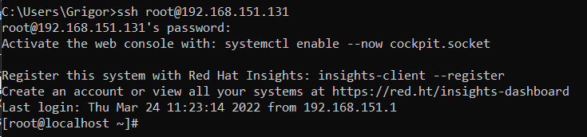

# Configuració Percona Server per fer Connexions Remotes Segures (SSL) 

## Connexió per SSH al Sistema
Primer de tot, ens connectarem a la màquina per **SSH** desde CMD (ho tenim prèviament instal·lat).
```
ssh machineuser@ip 
```
<details open>
<summary><b>Connexió per SSH</b></summary>

</details>

<hr>

## [Extra] Accedir en Remot
Arribat al punt anterior, ja estaria la instal·lació i configuració del Percona Server, però aquest punt és per poder accedir-hi remotament.

Tal com ho tenim ara configurat:
- Port MySQL 3306 **escoltant**. ✔️
- Firewall Configurat. ❌
- Usuari MySQL amb el qual poder accedir-hi des de qualsevol màquina. ❌

1. Procedirem a configurar el Firewall per poder accedir al MySQL del Percona Server Remotament, configurarem la regla i reiniciarem el servei per a que s'apliquin els canvis.

```
# sudo firewall-cmd --zone=public --add-port=3306/tcp --permanent

# sudo systemctl restart firewalld.service
```
<details open>
<summary><b>Configurar Firewall</b></summary>

</details>
<details open>
<summary><b>Veure configuració Firewall</b></summary>

</details>

2. Ara procedirem a crear un usuari que pugui accedir des de qualsevol màquina al MySQL i li donarem els màxims privilegis possibles (per comprobar que funciona.)
```
# mysql -u root -p
[root password]

mysql> CREATE USER 'new_user'@'%' IDENTIFIED BY 'P4SSW0RD';

mysql> GRANT ALL PRIVILEGES ON *.* TO 'new_user'@'%';

mysql> FLUSH PRIVILEGES;
```
<details open>
<summary><b>Accés al MySQL</b></summary>

</details>

<details open>
<summary><b>Crear Usuari MySQL</b></summary>

</details>

<details open>
<summary><b>Permisos Usuari MySQL</b></summary>

</details>

<details open>
<summary><b>Flush Privileges perquè els canvis s'apliquin ara.</b></summary>

</details>

3. Crearem una connexió cap a aquesta màquina des del Workbench
<details open>
<summary><b>Creant connexió</b></summary>

</details>
<details open>
<summary><b>Accedint al MySQL</b></summary>

</details>
<details open>
<summary><b>Testejant el SGBD</b></summary>

</details>
<hr>

## Comprovar amb el programa WireShark que la connexió d'autentificació al SGBD no és segura    


Abans de les versions de MySQL 8.0, per defecte les connexions estaven desencriptats, i s'havien de configurar a mà per encriptar-los.

Ara, la versió que tenim de MySQL (8.0), posteriors a aquesta està per defecte activat amb encriptació TLS per raons de seguretat. Però no obstant això per defecte el Client pot triat si fer connexions segures o no.

A més a més, SSL es quedarà en desús, a partir d'ara quan veiem informació parlant de SSL es refereix a TLS.

Llavors el que farem, serà amb el client Workbench realitzar una connexió insegura, que ens donen una opció per fer això i amb el Wireshark capturarem les diferents sentències realitzades contra la BD.

1. El primer pas que haurem de fer serà descarregar el Wireshark. [Fent clic aquí podràs descarregar el Wireshark](https://www.wireshark.org/download.html)

    <details open>  
    <summary><b>Descarregar el WireShark per Windows x64</b></summary>
    
    </details>

2. Realitzarem una connexió remota amb el Workbench amb la opció de no SSL no encriptat, per veure que sense la encriptació es poden veure les selects. 
    <details open>  
    <summary><b>Crear Connexió no SSL</b></summary>
    
    </details>

3. Obrirem el Wireshark i començarem a esnifar la xarxa. Com estem virtualitzant, haurem de seleccionar el adaptador virtual de xarxa que ens fa connectar amb la màquina virtual. En el meu cas la NAT VMNET19.
    <details open>  
    <summary><b>Seleccionar l'adaptador Wifi</b></summary>
    
    </details>

4. Un cop dins veurem tots els missatges de la xarxa de l'adaptador que s'envien que es reben dels diferents dispositius, totes les peticions que es fan, amb les respotes...
    <details open>  
    <summary><b>Visió General Wireshark</b></summary>
    
    </details>

5. Ara, no volem veure tots els paquets, perquè en una xarxa gran hauriem d'estar hores buscant el paquet corresponent i resposta de la comunicació amb el MySQL llavors el Wireshark permet molts filtres de paquets, un d'ells és el d'especificar el port que utilitzarem. En aquest cas amb el filtre `tcp.port eq 3306` ens filtrarà per les comunicacions del MySQL. (En entorns de proves no ens apareixerà res perquè encara no hem fet la consulta, ve en el següent punt.)
    <details open>  
    <summary><b>Filtrar per comunicacions MySQL</b></summary>
    
    </details>

6. Ara amb el client farem una consulta contra la BD de Sakila un d'exemple.
    <details open>  
    <summary><b>Consulta de Prova</b></summary>
    
    </details>

7. Ara en el Wireshark buscarem els `REQUEST QUERY` i `RESPONSE TABULAR`, el que l'usuari demana, i el que respon. On tenim el port filtrat hauria de ser més fàcil trobar-ho. Teòricament el Response estarà en la següent trama després de fer la consulta.
    <details open>  
    <summary><b>Request QUERY (Consulta que Fem)</b></summary>
    
    </details>

    <details open>  
    <summary><b>Response TABULAR (El que BD Retorna)</b></summary>
    
    </details>

    I com s'ha pogut veure podem veure el contingut i això no és res segur ja que si fossin consultes i comunicacions de bancs ens poden robar diners.

    També amb una variable de sessió podem assegurar-nos de que no tenim encriptació en la nostra connexió
    <details open>  
    <summary><b>Veure que la connexió no utilitza encriptació</b></summary>
    
    </details>

    
<hr>

## Connexió per SSL (TLS) amb Certificats
Ara, ens connectarem per SSL (TLS) a la Base de Dades mitjançant certificats que ens proporcionarà el Servidor.

1. Tots els certificats del servidor MySQL per defecte estarán en la següent ruta `/var/lib/mysql` els podrem veure mitjançant la següent comanda. Els certificats acaben amb `.pem`

    ```
    # ls /var/lib/mysql/*.pem
    ```
    <details open>  
    <summary><b>Llistar els certificats que té el nostre Servidor MySQL per defecte</b></summary>
    
    </details>

2. Hem de passar els certificats necessaris per fer la connexió del servidor cap al Client.

    Necessitem els següents certificats:

    > - Clau del Client (Client Key File for SSL) --> `client-key.pem`
    > - Certificat del Client (Client Certificate File for SSL) --> `client-cert.pem`
    > - Certificat d'Autoritat (Certificate Authority File for SSL) --> `ca.pem`

    Per passar els certificats des d'un Ubuntu Server sense entorn cap a un Windows Client, una de les maneres és amb el programa WinSCP que ens permet fer transferències d'arxius amb connexions segures.
    
    Fes [clic aqui](https://winscp.net/eng/download.php) per anar a la pàgina de descarrega de WinSCP

    <details open>  
    <summary><b>Descarregar WinSCP</b></summary>
    
    </details>

    Un cop descarregat realitzarem la connexió a la màquina servidor mitjançant el protocol TFTP.
    <details open>  
    <summary><b>Connexió WinSCP</b></summary>
    
    </details>

    Navegarem al directori del Ubuntu des del programa WinSCP on es troben aquestes certificats `/var/lib/mysql/` i els pasarem a la màquina del client, en aquest cas tinc una carpeta per aquests certificats i claus.
    <details open>  
    <summary><b>Passar certificats a la màquina Client</b></summary>
    
    </details>

3. Ara en la connexió del Workbench - MySQL, l'editarem o en crearem una de nova, configurant-lo de la següent manera.

    - A l'apartat de Connexions, el mètode el posarem en `Standard TCP/IP`
    - Posarem que verifiqui SSL i el Certificat d'Autoritat `Require and Verify CA`
    - Posarem la `Clau del Client`
    - Posarem el `Certificat del Client`
    - Posarem el `Certificat d'Autoritat`
    
    I després testejarem la connexió.

    <details open>  
    <summary><b>Configuració per la connexió amb SSL</b></summary>
    
    </details>

    Posarem les credencials del compte d'usari.
    <details open>  
    <summary><b>Credencials de l'usuari</b></summary>
    
    </details>

    I ens sortirà que la connexió s'ha realitzat correctament i que el SSL està activat amb `TLS`
    <details open>  
    <summary><b>Connexió realitzada correctament amb SSL</b></summary>
    
    </details>

4. Ara, entrarem a una sessió de MySQL, realitzarem una consulta i comprovarem que ara amb el SSL activat no es poden llegir els paquets.

    Abans de la consulta tornarem a comprovar amb les variables de sessió que tenim el SSL actiu.
    ```
    SHOW SESSION STATUS LIKE 'Ssl_Cipher';
    ```
    <details open>  
    <summary><b>Comprovar estat SSL</b></summary>
    
    </details>

    Realització de Consulta de Prova
    ```
    SELECT * 
	    FROM actor;
    ```
    <details open>  
    <summary><b>Consulta de Prova</b></summary>
    
    </details>

    I si amb el Wireshark intentem mirar el contingut dels paquets (amb el filtre), no podrem, perquè estan encriptats.
    <details open>  
    <summary><b>Ara la connexió està encriptada i no es poden llegir els paquets</b></summary>
    
    </details>

    I sense filtre podem veure paquets TLS
    <details open>  
    <summary><b>Sense Filtre es poden veure paquets TLS</b></summary>
    
    </details>
    
    

