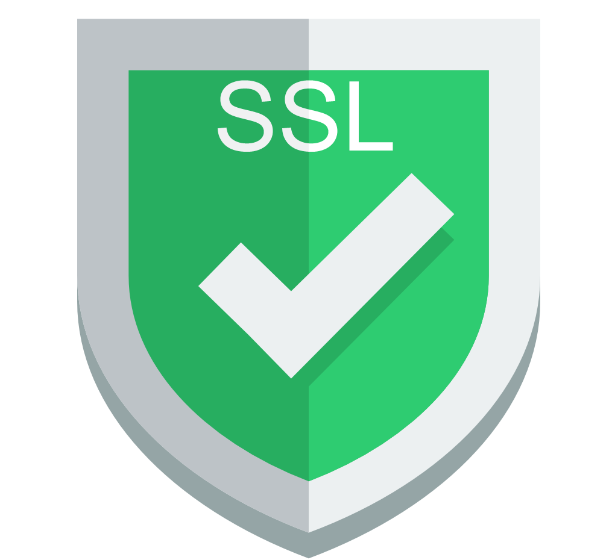

# Configuració Percona Server per fer Connexions Remotes Segures (SSL) 

## Connexió per SSH al Sistema
Primer de tot, ens connectarem a la màquina per **SSH** desde CMD (ho tenim prèviament instal·lat).
```
ssh machineuser@ip 
```
<details open>
<summary><b>Connexió per SSH</b></summary>

</details>

<hr>

## [Extra] Accedir en Remot
Arribat al punt anterior, ja estaria la instal·lació i configuració del Percona Server, però aquest punt és per poder accedir-hi remotament.

Tal com ho tenim ara configurat:
- Port MySQL 3306 **escoltant**. ✔️
- Firewall Configurat. ❌
- Usuari MySQL amb el qual poder accedir-hi des de qualsevol màquina. ❌

1. Procedirem a configurar el Firewall per poder accedir al MySQL del Percona Server Remotament, configurarem la regla i reiniciarem el servei per a que s'apliquin els canvis.

```
# sudo firewall-cmd --zone=public --add-port=3306/tcp --permanent

# sudo systemctl restart firewalld.service
```
<details open>
<summary><b>Configurar Firewall</b></summary>

</details>
<details open>
<summary><b>Veure configuració Firewall</b></summary>

</details>

2. Ara procedirem a crear un usuari que pugui accedir des de qualsevol màquina al MySQL i li donarem els màxims privilegis possibles (per comprobar que funciona.)
```
# mysql -u root -p
[root password]

mysql> CREATE USER 'new_user'@'%' IDENTIFIED BY 'P4SSW0RD';

mysql> GRANT ALL PRIVILEGES ON *.* TO 'new_user'@'%';

mysql> FLUSH PRIVILEGES;
```
<details open>
<summary><b>Accés al MySQL</b></summary>

</details>

<details open>
<summary><b>Crear Usuari MySQL</b></summary>

</details>

<details open>
<summary><b>Permisos Usuari MySQL</b></summary>

</details>

<details open>
<summary><b>Flush Privileges perquè els canvis s'apliquin ara.</b></summary>

</details>

3. Crearem una connexió cap a aquesta màquina des del Workbench
<details open>
<summary><b>Creant connexió</b></summary>

</details>
<details open>
<summary><b>Accedint al MySQL</b></summary>

</details>
<details open>
<summary><b>Testejant el SGBD</b></summary>

</details>
<hr>

## Comprovar amb el programa WireShark que la connexió d'autentificació al SGBD no és segura    


Abans de les versions de MySQL 8.0, per defecte les connexions estaven desencriptats, i s'havien de configurar a mà per encriptar-los.

Ara, la versió que tenim de MySQL (8.0), posteriors a aquesta està per defecte activat amb encriptació TLS per raons de seguretat. A més a més, SSL es quedarà en desús, a partir d'ara quan veiem informació parlant de SSL es refereix a TLS.

Llavors el que farem, serà amb el client Workbench realitzar una connexió insegura, que ens donen una opció per fer això i amb el Wireshark capturarem les diferents sentències realitzades contra la BD.

1. El primer pas que haurem de fer serà instal·lar-nos el Wireshark.