# InnoDB
## Connexió per SSH al Sistema
Primer de tot, ens connectarem a la màquina per **SSH** desde CMD (ho tenim prèviament instal·lat).
```
ssh machineuser@ip 
```
<details open>
<summary><b>Connexió per SSH</b></summary>

</details>

<hr>

## Desactivar opció  innodb_file_per_table
Aquesta opció en els SGBD actuals ve per defecte activat, i la seva funció és que per cada taula creada de la meva base de dades tindrà el seu propi Table Space, és a dir cada taula tindrà el seu propi fitxer de dades que aquest conté tota la informació de la taula, son fitxers .ibd

Per desactivar aquesta opció i dir que ara no volem un fitxer per cada taula, sinó un fitxer per totes les taules haurem de desactivar aquesta opció.

Lo primer que hem de fer és anar al nostre fitxer de configuració de MySQL i afegir el següent paràmetre en OFF: `innodb_file_per_table=OFF`

```
# nano /etc/my.cnf
```
```
[mysqld]
innodb_file_per_table=OFF
```
<details open>
<summary><b>Desactivar innodb_file_per_table</b></summary>

</details>

Guardarem els canvis i reiniciarem el Servei de MySQLD.

```
# systemctl restart mysqld && systemctl status mysqld
```
<details open>
<summary><b>Reiniciar i veure l'estat del Servei</b></summary>
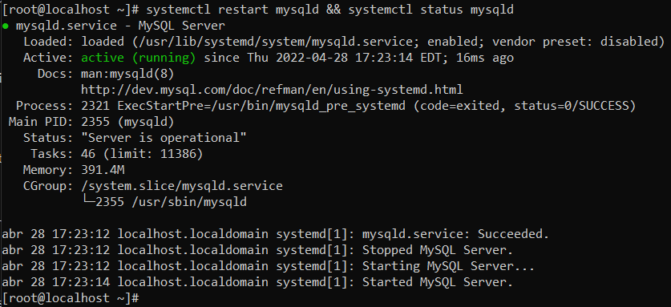
</details>

Ara comprovarem que està desactivat consultant-ho a la variable des del MySQL.
```
mysql> SHOW VARIABLES LIKE '%file_per%';
```
<details open>
<summary><b>Verificar que l'hem desactivat</b></summary>
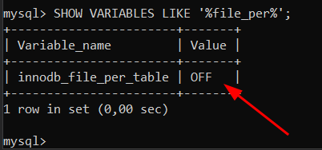
</details><br>

## Permisos, Usuari i Grup de la carpeta Datadir
Ara, veurem els permisos, l'usuari i el grup de la carpeta del directori de dades (datadir).

Si no sabem quin és el nostre directori de dades, també el podrem consultar via SQL.
```
mysql> SHOW VARIABLES LIKE '%datadir%';
```
<details open>
<summary><b>Consultar el nostre directori de dades</b></summary>
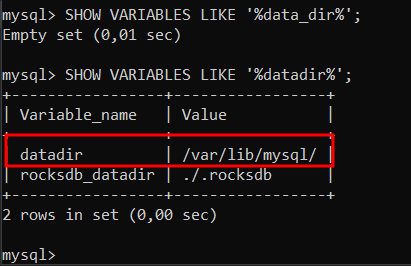
</details>

En aquest cas la ruta del path del directori de dades és `/var/lib/mysql`.

Per veure els permisos el usuari i el grup d'aquesta carpeta fariem lo següent:
```
# ls -alis /var/lib/mysql
```
<details open>
<summary><b>Veure permisos, usuari i grup del directori de dades</b></summary>
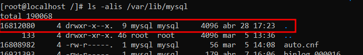
</details>

Veient això podem arribar a la següent conclusió.

- Propietari del directori ➡️​ `mysql` (usuari)
- Grup del directori ➡️​ `mysql` (grup)
* Permisos:
    - Permisos per el propietari (`mysql`) ➡️​ RWX (lectura, escriptura i execució)
    - Permisos per el grup (`mysql`) ➡️​ RX (lectura i execució)
    - Altres ➡️​ X (Execució)
<br><br>

## Mida System TableSpace
Per veure la mida del nostre System TableSpace (fitxers ibdata), primer hem de saber on estan localitzats en el nostre SO. Per saber-ho, ho farem mitjançant una consulta SQL.
```
mysql> SHOW VARIABLES LIKE 'innodb_data_file_path';
```
<details open>
<summary><b>Saber la ruta per defecte del nostre System TableSpace i la mida inicial</b></summary>
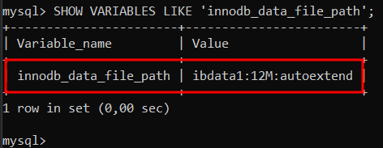
</details>

El value anterior, indica que dins de la carpeta de MySQL, hi ha un fitxer que es diu `ibdata1`, i que de mida inicial té `12M`, reservarà aquests 12M inicials aquest arxiu.

També ho podem comprovar la mida des del directori.
```
# ls -lh /var/lib/mysql/ibdata1
```
<details open>
<summary><b>Mida del arxiu ibdata1</b></summary>
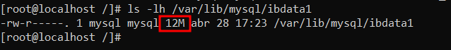
</details>

Té aquests 12M inicials, però quan s'omplin anirà, en aquests 12M se li sumarà la mida del valor del paràmetre `innodb_autoextend_increment`. Que per defecte son `64M`, llavors en total tindriem `76M` i en cas de que s'ompli aquesta mida, es tornaria a sumar a la mida `64M` que és el que tenim configurat en el paràmetre `innodb_autoextend_increment`, d'aquesta manera succesivament anirà creixent la mida del fitxer. I a més d'aquesta manera, estarem estalviant espai en el nostre disc, i no pas reservant des d'un principi 100M o el que pensem que ens faria falta.

```
mysql> SHOW VARIABLES LIKE 'innodb_autoextend_increment';
```
<details open>
<summary><b>Consultar la mida en Megabytes que se li sumarà a cada fitxer configurat amb autoextend.</b></summary>
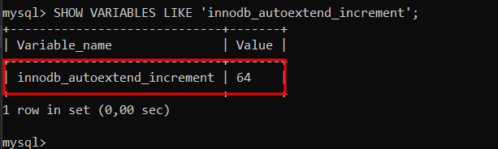
</details>
En resum té aquesta mida perquè està definida en la variable, i funciona d'aquesta manera, per no començar a reservar 10000M de cop quan realment no ens fa falta. Per això està el autoextend que és el que farà que el nostre fitxer augmenti de mida.

## Importar BD Sakila com a taules InnoDB
Ara, importarem la BD Sakila que ens proporciona MySQL per fer proves com a taules InnoDB.

Tenim sort i MySQL ja ha definit l'engine a cada sentència de creació de taules i ens ha estalviat feina, no obstant això hi ha taula/les que no tenen definit cap Storage Engine i això vol dir que en les taules que no hi ha especificat el Storage Engine utilitzaria el Storage Engine per defecte que tenim configurat en el nostre SGBD.

Llavors el que farem serà posar InnoDB com a Storage Engine per defecte.
```
# nano /etc/my.cnf
```
```
[mysqld]
default-storage-engine=InnoDB
```
<details open>
<summary><b>InnoDB default Storage Engine</b></summary>
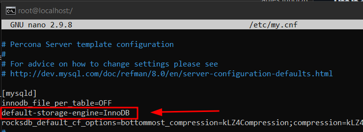
</details>

I seguit reiniciariem el servei de MySQL
```
# systemctl restart mysqld && systemctl status mysqld
```
<details open>
<summary><b>Reiniciar i veure l'estat del Servei</b></summary>

</details>

Ara, ja tenim configurat InnoDB com al motor d'emmagatzematge per defecte, ara hem de descarregar-nos la BD Sakila [d'aquesta pàgina](https://dev.mysql.com/doc/index-other.html)

<details open>
<summary><b>Pàgina per descarregar Sakila</b></summary>
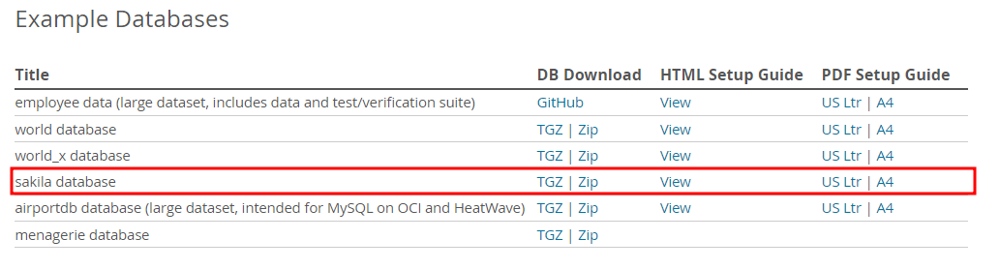
</details>

Nosaltres des de linux, farem un `wget` per descarregar-ho.
```
# wget https://downloads.mysql.com/docs/sakila-db.tar.gz
```
<details open>
<summary><b>Descarregar Sakila</b></summary>
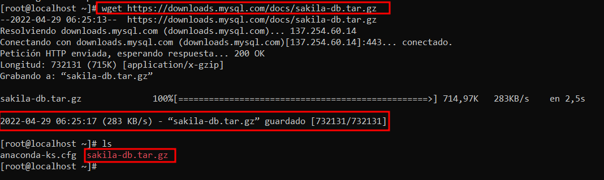
</details>

Ara, descomprimirem el .tar.gz obtingut de Sakila
```
# tar xzvf sakila-db.tar.gz
```
<details open>
<summary><b>Descomprimir Sakila</b></summary>
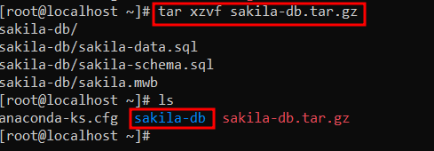
</details>

Ara mirarem les sentències DDL sakila-schema.sql del Sakila que és el que ens interessa, per veure si hi ha alguna contradicció de Storage Engine, perquè volem que tot estigui en InnoDB.

Al fer la següent comprovació podem veure que una taula no té especificat el Storage Engine, (també podem mirar-ho manualment en el fitxer).
```
# cat sakila-db/sakila-schema.sql | grep "CREATE TABLE" -c
16
# cat sakila-db/sakila-schema.sql | grep "ENGINE=InnoDB" -c
15
```
<details open>
<summary><b>Comparació de sentències CREATE TABLE i veure si tenen especificat Engine</b></summary>
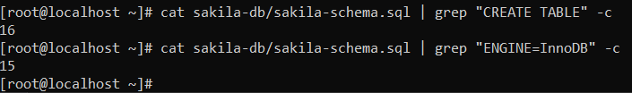
</details>

Si revisem el fitxer manualment, podrem veure quina taula és. Si no especifica l'engine utilitzarà el que té per defecte el SGBD des del qual s'importa la BD.
Però si ens fixem bé, ells canviem la variable global del Storage Engine per defecte a MyIsam abans d'executar la taula on no té definida cap Storage Engine, i encara nosaltres tinguem definits a nivell de configuració que per defecte és InnoDB, en el fitxer es modifica aquesta variable per MyISAM, llavors hem de treure aquesta linea o especificar el Storage Engine InnoDB en aquesta taula.

Millor definir-lo en la sentència DDL.

```
Engine = InnoDB
```

<details open>
<summary><b>Com es veuria abans d'especificar InnoDB</b></summary>
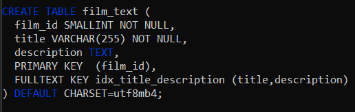
</details>
<details open>
<summary><b>Com es veuria després d'especificar InnoDB</b></summary>

</details>

Ara quan sabem que tenim totes les taules amb el Storage Engine InnoDB, procedirem a importar-les en el nostre MySQL.

Entrarem a MySQL en local, i importarem el Schema. I les dades del Schema
```
mysql> SOURCE /root/sakila-db/sakila-schema.sql
```
<details open>
<summary><b>Importar BD Sakila (Schema)</b></summary>
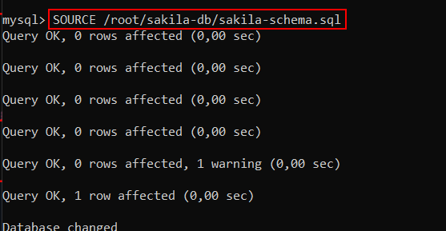
</details>

```
mysql> SOURCE /root/sakila-db/sakila-schema.sql
```
<details open>
<summary><b>Importar BD Sakila (Schema)</b></summary>

</details>

```
mysql> SOURCE /root/sakila-db/sakila-data.sql
```
<details open>
<summary><b>Importar BD Sakila (Data)</b></summary>
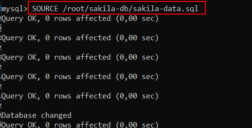
</details>

I ja ho tindriem importat

## Fitxers de dades, Ruta i Mida
Ara, com tenim el paràmetre `innodb_file_per_table` desactivat, ja no crea fitxers per cada taula de BD, ara les crea tot en un únic fitxer juntament amb els altres BD. 
Antigament, si anessim a `/var/lib/mysql/sakila` veuriem els diferents fitxers en format .ibd de les diferents taules, però ara estarà buit aquesta carpeta i tot ho tindrem en el fitxer ibdata1 en binari, on la seva ruta completa seria `/var/lib/mysql/ibdata1`.

Si mirem la ruta `/var/lib/mysql/sakila` podrem veure que està buida.
```
mysql> SOURCE /root/sakila-db/sakila-data.sql
```
<details open>
<summary><b>Verificar que ja no crea els .ibd</b></summary>
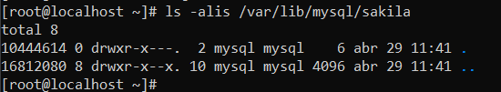
</details>

I si mirem ara el fitxer ibdata1 que és on es guarda tota la informació de totes les bases de dades podrem veure que ha crescut, i el autoextend li ha sumat els `64M` que tenia configurat per defecte. Ara el fitxer té `76M` reservats, això vol dir que ha superat els `12M` inicials.

<details open>
<summary><b>Veure que ha crescut la mida del nostre System TableSpace ibdata1 degut a les importacions de dades anteriors</b></summary>
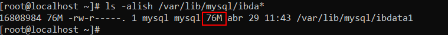
</details>

## Canviar la configuració de dades de MySQL
En aquest apartat farem els següents canvis en el nostre MySQL.

> - Canviar la localització del directori de dades.
>- Tenir 2 fitxers de System Tablespace complint lo següent:
>   - Tots 2 fitxers amb 50MB de mida inicial.
>   - El tablespace ha de créixer de 5MB en 5MB
>       - Situarem aquests fitxers en un disc diferent cadascun que insertarem i montarem en la nostra màquina vitual

### Canviar Localització del directori de Dades
En aquest punt canviarem la localització de dades del MySQL a la ruta `/hd-mysql`, és a dir a l'arrel. Ho farem sense passar els arxius de l'antiga ruta, farem que ho torni a generar ell.

Llavors crearem el directori.
```
# mkdir /hd-mysql/
```
<details open>
<summary><b>Crear el directori</b></summary>
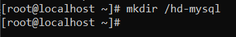
</details>

Ara, hem de posar els permisos corresponents al directori per a que MySQL pugui accedir correctament i no tingui cap problema. Els permisos chmod 751, volen dir RWX al propietari RX al grup i X als altres.

```
# chown -R mysql:mysql /hd-mysql
# chmod 751 /hd-mysql
```
<details open>
<summary><b>Permisos del nou directori del MySQL</b></summary>
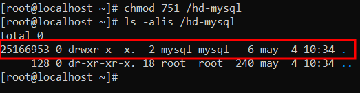
</details>

Ara, procedirem a canviar el directori de dades del MySQL des del fitxer de configuració `/etc/my.cnf`. Haurem de tocar els paràmetres `datadir` i `datadir` i deixar els paràmetres `log-error` i `pid-file` tal com ens venen per defecte. Aquests paràmetres els posarem a sota del `[mysqld]`. Els paràmetres que fan referència per exemple a MyRocks que l'hem hagut d'instal·lar, les hem de treure perquè al canviar de directori i generar nous fitxers de configuració les instal·lacions externes que hem fet per exemple del MyRocks els perdriem. 

També, en la primera vegada que hem de reiniciar el servei del MySQL per a que ens generi tota l'estructura de fitxers, bd etc... Hem de tenir el my.cnf pelat, és a dir totes les variables que hem configurat de tipus: `innodb_file_per_table`, `default-storage-engine=InnoDB` les hem de comentar perquè sinó ens donarà error al reiniciar el servei, sempre al primer cop quan ha de crear l'estructura de fitxers al reiniciar el servei només hem de tenir sense comentar les variables `datadir`,`datadir`,`log-error`,`pid-file`. Després de que es reinici el servei i es crei l'estructura de fitxers, ja podem descomentar les linies anteriors que teniem. Però compte perquè tota la configuració ja sigui Storage Engine o un altre configuració instal·lat externament haurem de tornar-les a instal·lar si les volem tenir, perquè al generar-se nous fitxers de configuració aquestes externes es perden.

Llavors obrirem el fitxer de configuració de MySQL
```
# nano /etc/my.cnf
```
I borrarem / comentarem totes les lineas de configuració de variables que tenen a veure amb característiques instal·lades externs, en aquest cas de MyRocks, perquè al generar-se un nou directori de dades sense fer còpia de l'anterior, totes les instal·lacions externes es perden i no té sentit intentar configurar una variable d'una característica (Storage Engine en aquest cas però podria ser un altre) que no en tenim instal·lada.

També comentarem les lineas de configuració (si en tenim), d'altres paràmetres de MySQL, com per exemple el `default-storage-engine`, `innodb_file_per_table` perquè en el primer reinici que farem més endavant hem de tenir només especificat `datadir`, `socket`, `pid-file (el deixarem per defecte)` i `log-error (el deixarem per defecte)`
```
[mysqld]
datadir=/hd-mysql
socket=/hd-mysql/mysql.sock
```
<details open>
<summary><b>Comentar les lineas sobrants i canviar el directori de dades i socket</b></summary>
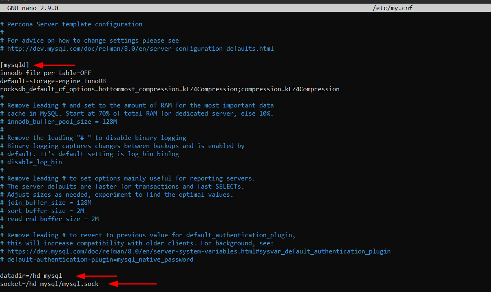
</details>

Guardem el fitxer de configuració i sortim.

Ara, si estem utilitzant RHEL / CentOS , si no tenim el `SELINUX` desactivat hem de afegir el `SELinux Security Context` a la nova ubicació, per a que funcioni
```
# semanage fcontext -a -t mysqld_db_t "/hd-mysql(/.*)?"
# restorecon -R /hd-mysql
```
<details open>
<summary><b>Afegir el SELinux Security Context a la nova ubicació</b></summary>

</details>

Un cop fet això, si reiniciem el servei de MySQL i mirem l'estatus no hi hauriem de tenir cap problema.
```
# systemctl restart mysqld && systemctl status mysqld
```
<details open>
<summary><b>Reiniciar i veure l'estat del Servei</b></summary>

</details>

I si mirem en el nou directori, podrem veure com ha reproduït tota la estructura.
<details open>
<summary><b>Comprovar que ha creat els fitxers (tota la estructura)</b></summary>
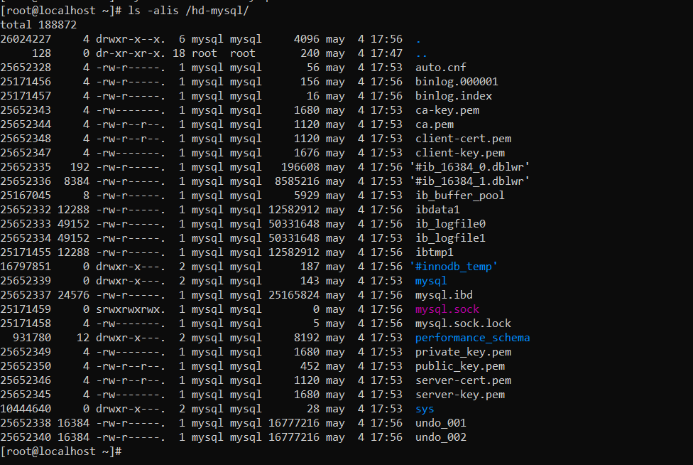
</details>

Ara, tornarem al `my.cnf`, i descomentarem les linies comentades anteriorment, on modificavem algunes variables del MySQL, excepte les variables que fan referència a una característica instal·lada, que ara al ser nova estructura no el tenim i per tant l'hem d'instal·lar de nou si el volem fer servir.

També afegirem una configuració extra per a que ens funcioni els Sockets i poder fer login localment, si no l'afegim no podrem fer login al tornar a posar la contrasenya del MySQL.

Llavors descomentarem les linies (si en teniem abans o volem tenir) i afegirem les linies per a que funcioni els Sockets a l'hora de fer login.
```
# nano /etc/my.cnf
```
```
[client]
socket=/hd-mysql/mysql.sock
```
<details open>
<summary><b>Descomentar les linies de variables que utilitzem, i configurar per a que funcioni el socket per part del client</b></summary>
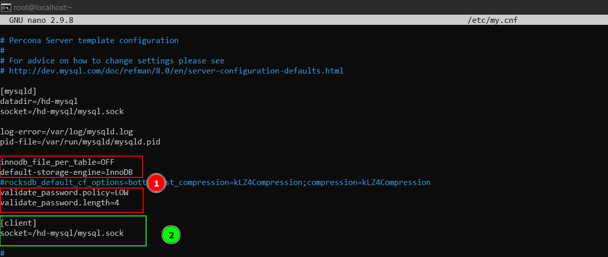
</details>

Guardarem i reiniciarem el Servei.
```
# systemctl restart mysqld && systemctl status mysqld
```
<details open>
<summary><b>Reiniciar i veure l'estat del Servei</b></summary>
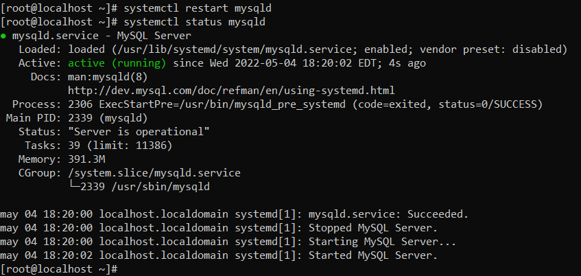
</details>

Ara, hem d'anar a l'arxiu de logs i buscar la contrasenya que ens haurà generat del Root
```
# cat /var/log/mysql.log | grep "Generated"
```
<details open>
<summary><b>Obtenir la contrasenya del Root</b></summary>
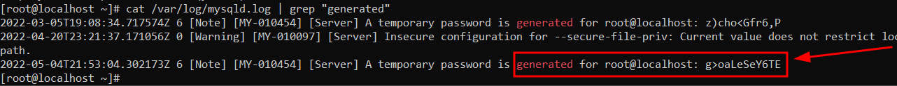
</details>

Ara, iniciarem sessió amb root i canviarem la contrasenya.
```
# mysql -u root -p"pwd_generat"
```
```
mysql> ALTER USER 'root'@'localhost' IDENTIFIED BY 'N3wP4ssw0rd'; flush privileges;
```
<details open>
<summary><b>Iniciar sessió i canviar contrasenya</b></summary>
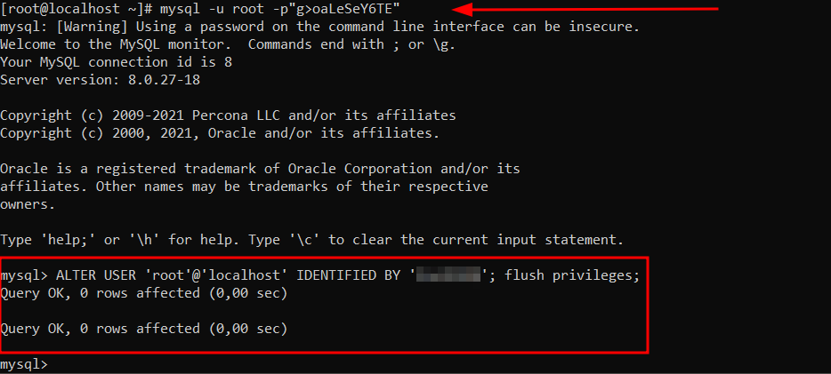
</details>
