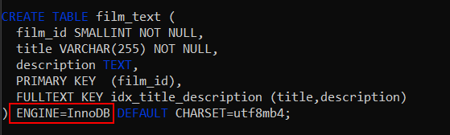
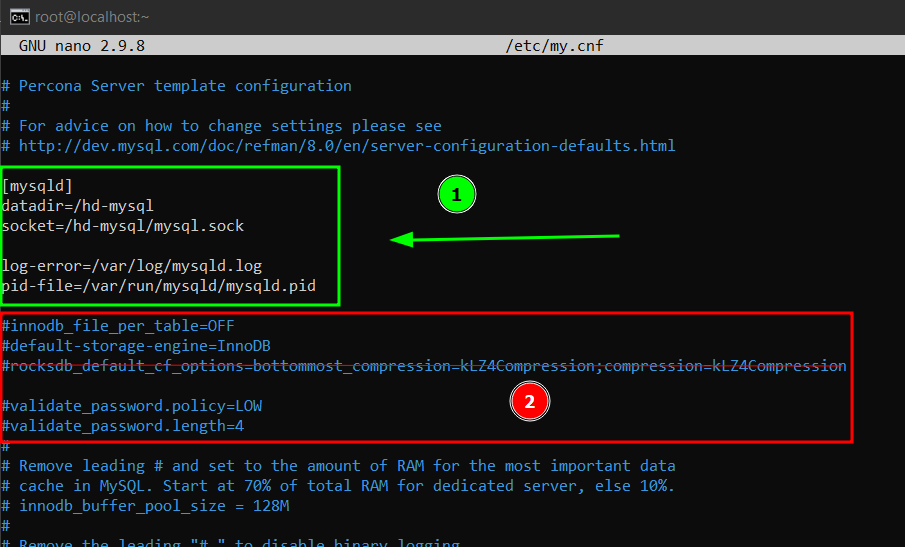
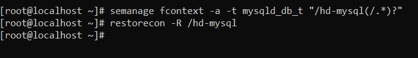
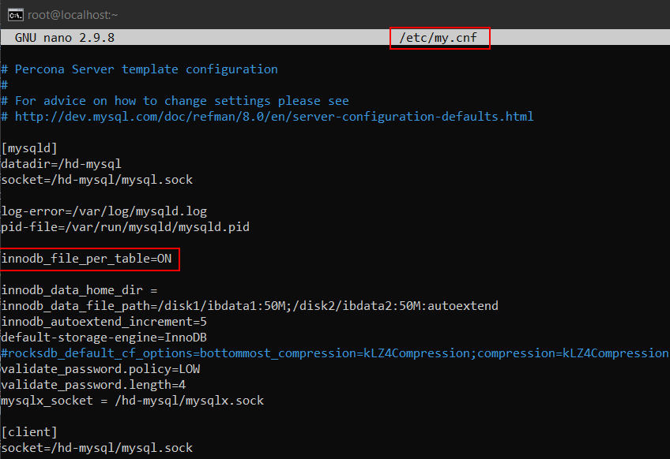

# InnoDB
## Connexió per SSH al Sistema
Primer de tot, ens connectarem a la màquina per **SSH** desde CMD (ho tenim prèviament instal·lat).
```
ssh machineuser@ip 
```
<details open>
<summary><b>Connexió per SSH</b></summary>

</details>

<hr>

## Desactivar opció  innodb_file_per_table
Aquesta opció en els SGBD actuals ve per defecte activat, i la seva funció és que per cada taula creada de la meva base de dades tindrà el seu propi Table Space, és a dir cada taula tindrà el seu propi fitxer de dades que aquest conté tota la informació de la taula, son fitxers .ibd

Per desactivar aquesta opció i dir que ara no volem un fitxer per cada taula, sinó un fitxer per totes les taules haurem de desactivar aquesta opció.

Lo primer que hem de fer és anar al nostre fitxer de configuració de MySQL i afegir el següent paràmetre en OFF: `innodb_file_per_table=OFF`

```
# nano /etc/my.cnf
```
```
[mysqld]
innodb_file_per_table=OFF
```
<details open>
<summary><b>Desactivar innodb_file_per_table</b></summary>

</details>

Guardarem els canvis i reiniciarem el Servei de MySQLD.

```
# systemctl restart mysqld && systemctl status mysqld
```
<details open>
<summary><b>Reiniciar i veure l'estat del Servei</b></summary>

</details>

Ara comprovarem que està desactivat consultant-ho a la variable des del MySQL.
```
mysql> SHOW VARIABLES LIKE '%file_per%';
```
<details open>
<summary><b>Verificar que l'hem desactivat</b></summary>

</details><br>

## Permisos, Usuari i Grup de la carpeta Datadir
Ara, veurem els permisos, l'usuari i el grup de la carpeta del directori de dades (datadir).

Si no sabem quin és el nostre directori de dades, també el podrem consultar via SQL.
```
mysql> SHOW VARIABLES LIKE '%datadir%';
```
<details open>
<summary><b>Consultar el nostre directori de dades</b></summary>

</details>

En aquest cas la ruta del path del directori de dades és `/var/lib/mysql`.

Per veure els permisos el usuari i el grup d'aquesta carpeta fariem lo següent:
```
# ls -alis /var/lib/mysql
```
<details open>
<summary><b>Veure permisos, usuari i grup del directori de dades</b></summary>

</details>

Veient això podem arribar a la següent conclusió.

- Propietari del directori ➡️​ `mysql` (usuari)
- Grup del directori ➡️​ `mysql` (grup)
* Permisos:
    - Permisos per el propietari (`mysql`) ➡️​ RWX (lectura, escriptura i execució)
    - Permisos per el grup (`mysql`) ➡️​ RX (lectura i execució)
    - Altres ➡️​ X (Execució)
<br><br>

## Mida System TableSpace
Per veure la mida del nostre System TableSpace (fitxers ibdata), primer hem de saber on estan localitzats en el nostre SO. Per saber-ho, ho farem mitjançant una consulta SQL.
```
mysql> SHOW VARIABLES LIKE 'innodb_data_file_path';
```
<details open>
<summary><b>Saber la ruta per defecte del nostre System TableSpace i la mida inicial</b></summary>

</details>

El value anterior, indica que dins de la carpeta de MySQL, hi ha un fitxer que es diu `ibdata1`, i que de mida inicial té `12M`, reservarà aquests 12M inicials aquest arxiu.

També ho podem comprovar la mida des del directori.
```
# ls -lh /var/lib/mysql/ibdata1
```
<details open>
<summary><b>Mida del arxiu ibdata1</b></summary>

</details>

Té aquests 12M inicials, però quan s'omplin anirà, en aquests 12M se li sumarà la mida del valor del paràmetre `innodb_autoextend_increment`. Que per defecte son `64M`, llavors en total tindriem `76M` i en cas de que s'ompli aquesta mida, es tornaria a sumar a la mida `64M` que és el que tenim configurat en el paràmetre `innodb_autoextend_increment`, d'aquesta manera succesivament anirà creixent la mida del fitxer. I a més d'aquesta manera, estarem estalviant espai en el nostre disc, i no pas reservant des d'un principi 100M o el que pensem que ens faria falta.

```
mysql> SHOW VARIABLES LIKE 'innodb_autoextend_increment';
```
<details open>
<summary><b>Consultar la mida en Megabytes que se li sumarà a cada fitxer configurat amb autoextend.</b></summary>

</details>
En resum té aquesta mida perquè està definida en la variable, i funciona d'aquesta manera, per no començar a reservar 10000M de cop quan realment no ens fa falta. Per això està el autoextend que és el que farà que el nostre fitxer augmenti de mida.

## Importar BD Sakila com a taules InnoDB
Ara, importarem la BD Sakila que ens proporciona MySQL per fer proves com a taules InnoDB.

Tenim sort i MySQL ja ha definit l'engine a cada sentència de creació de taules i ens ha estalviat feina, no obstant això hi ha taula/les que no tenen definit cap Storage Engine i això vol dir que en les taules que no hi ha especificat el Storage Engine utilitzaria el Storage Engine per defecte que tenim configurat en el nostre SGBD.

Llavors el que farem serà posar InnoDB com a Storage Engine per defecte.
```
# nano /etc/my.cnf
```
```
[mysqld]
default-storage-engine=InnoDB
```
<details open>
<summary><b>InnoDB default Storage Engine</b></summary>

</details>

I seguit reiniciariem el servei de MySQL
```
# systemctl restart mysqld && systemctl status mysqld
```
<details open>
<summary><b>Reiniciar i veure l'estat del Servei</b></summary>

</details>

Ara, ja tenim configurat InnoDB com al motor d'emmagatzematge per defecte, ara hem de descarregar-nos la BD Sakila [d'aquesta pàgina](https://dev.mysql.com/doc/index-other.html)

<details open>
<summary><b>Pàgina per descarregar Sakila</b></summary>

</details>

Nosaltres des de linux, farem un `wget` per descarregar-ho.
```
# wget https://downloads.mysql.com/docs/sakila-db.tar.gz
```
<details open>
<summary><b>Descarregar Sakila</b></summary>

</details>

Ara, descomprimirem el .tar.gz obtingut de Sakila
```
# tar xzvf sakila-db.tar.gz
```
<details open>
<summary><b>Descomprimir Sakila</b></summary>

</details>

Ara mirarem les sentències DDL sakila-schema.sql del Sakila que és el que ens interessa, per veure si hi ha alguna contradicció de Storage Engine, perquè volem que tot estigui en InnoDB.

Al fer la següent comprovació podem veure que una taula no té especificat el Storage Engine, (també podem mirar-ho manualment en el fitxer).
```
# cat sakila-db/sakila-schema.sql | grep "CREATE TABLE" -c
16
# cat sakila-db/sakila-schema.sql | grep "ENGINE=InnoDB" -c
15
```
<details open>
<summary><b>Comparació de sentències CREATE TABLE i veure si tenen especificat Engine</b></summary>

</details>

Si revisem el fitxer manualment, podrem veure quina taula és. Si no especifica l'engine utilitzarà el que té per defecte el SGBD des del qual s'importa la BD.
Però si ens fixem bé, ells canviem la variable global del Storage Engine per defecte a MyIsam abans d'executar la taula on no té definida cap Storage Engine, i encara nosaltres tinguem definits a nivell de configuració que per defecte és InnoDB, en el fitxer es modifica aquesta variable per MyISAM, llavors hem de treure aquesta linea o especificar el Storage Engine InnoDB en aquesta taula.

Millor definir-lo en la sentència DDL.

```
Engine = InnoDB
```

<details open>
<summary><b>Com es veuria abans d'especificar InnoDB</b></summary>

</details>
<details open>
<summary><b>Com es veuria després d'especificar InnoDB</b></summary>

</details>

Ara quan sabem que tenim totes les taules amb el Storage Engine InnoDB, procedirem a importar-les en el nostre MySQL.

Entrarem a MySQL en local, i importarem el Schema. I les dades del Schema
```
mysql> SOURCE /root/sakila-db/sakila-schema.sql
```
<details open>
<summary><b>Importar BD Sakila (Schema)</b></summary>

</details>

```
mysql> SOURCE /root/sakila-db/sakila-data.sql
```
<details open>
<summary><b>Importar BD Sakila (Data)</b></summary>

</details>

I ja ho tindriem importat

## Fitxers de dades, Ruta i Mida
Ara, com tenim el paràmetre `innodb_file_per_table` desactivat, ja no crea fitxers per cada taula de BD, ara les crea tot en un únic fitxer juntament amb els altres BD. 
Antigament, si anessim a `/var/lib/mysql/sakila` veuriem els diferents fitxers en format .ibd de les diferents taules, però ara estarà buit aquesta carpeta i tot ho tindrem en el fitxer ibdata1 en binari, on la seva ruta completa seria `/var/lib/mysql/ibdata1`.

Si mirem la ruta `/var/lib/mysql/sakila` podrem veure que està buida.
```
mysql> SOURCE /root/sakila-db/sakila-data.sql
```
<details open>
<summary><b>Verificar que ja no crea els .ibd</b></summary>

</details>

I si mirem ara el fitxer ibdata1 que és on es guarda tota la informació de totes les bases de dades podrem veure que ha crescut, i el autoextend li ha sumat els `64M` que tenia configurat per defecte. Ara el fitxer té `76M` reservats, això vol dir que ha superat els `12M` inicials.

<details open>
<summary><b>Veure que ha crescut la mida del nostre System TableSpace ibdata1 degut a les importacions de dades anteriors</b></summary>

</details>

## Canviar la configuració de dades de MySQL
En aquest apartat farem els següents canvis en el nostre MySQL.

> - Canviar la localització del directori de dades.
>- Tenir 2 fitxers de System Tablespace complint lo següent:
>   - Tots 2 fitxers amb 50MB de mida inicial.
>   - El tablespace ha de créixer de 5MB en 5MB
>       - Situarem aquests fitxers en un disc diferent cadascun que insertarem i montarem en la nostra màquina vitual

### Canviar Localització del directori de Dades
En aquest punt canviarem la localització de dades del MySQL a la ruta `/hd-mysql`, és a dir a l'arrel. Ho farem sense passar els arxius de l'antiga ruta, farem que ho torni a generar ell.

Llavors crearem el directori.
```
# mkdir /hd-mysql/
```
<details open>
<summary><b>Crear el directori</b></summary>

</details>

Ara, hem de posar els permisos corresponents al directori per a que MySQL pugui accedir correctament i no tingui cap problema. Els permisos chmod 751, volen dir RWX al propietari RX al grup i X als altres.

```
# chown -R mysql:mysql /hd-mysql
# chmod 751 /hd-mysql
```
<details open>
<summary><b>Permisos del nou directori del MySQL</b></summary>

</details>

Ara, procedirem a canviar el directori de dades del MySQL des del fitxer de configuració `/etc/my.cnf`. Haurem de tocar els paràmetres `datadir` i `datadir` i deixar els paràmetres `log-error` i `pid-file` tal com ens venen per defecte. Aquests paràmetres els posarem a sota del `[mysqld]`. Els paràmetres que fan referència per exemple a MyRocks que l'hem hagut d'instal·lar, les hem de treure perquè al canviar de directori i generar nous fitxers de configuració les instal·lacions externes que hem fet per exemple del MyRocks els perdriem. 

També, en la primera vegada que hem de reiniciar el servei del MySQL per a que ens generi tota l'estructura de fitxers, bd etc... Hem de tenir el my.cnf pelat, és a dir totes les variables que hem configurat de tipus: `innodb_file_per_table`, `default-storage-engine=InnoDB` les hem de comentar perquè sinó ens donarà error al reiniciar el servei, sempre al primer cop quan ha de crear l'estructura de fitxers al reiniciar el servei només hem de tenir sense comentar les variables `datadir`,`datadir`,`log-error`,`pid-file`. Després de que es reinici el servei i es crei l'estructura de fitxers, ja podem descomentar les linies anteriors que teniem. Però compte perquè tota la configuració ja sigui Storage Engine o un altre configuració instal·lat externament haurem de tornar-les a instal·lar si les volem tenir, perquè al generar-se nous fitxers de configuració aquestes externes es perden.

Llavors obrirem el fitxer de configuració de MySQL
```
# nano /etc/my.cnf
```
I borrarem / comentarem totes les lineas de configuració de variables que tenen a veure amb característiques instal·lades externs, en aquest cas de MyRocks, perquè al generar-se un nou directori de dades sense fer còpia de l'anterior, totes les instal·lacions externes es perden i no té sentit intentar configurar una variable d'una característica (Storage Engine en aquest cas però podria ser un altre) que no en tenim instal·lada.

També comentarem les lineas de configuració (si en tenim), d'altres paràmetres de MySQL, com per exemple el `default-storage-engine`, `innodb_file_per_table` perquè en el primer reinici que farem més endavant hem de tenir només especificat `datadir`, `socket`, `pid-file (el deixarem per defecte)` i `log-error (el deixarem per defecte)`
```
[mysqld]
datadir=/hd-mysql
socket=/hd-mysql/mysql.sock
```
<details open>
<summary><b>Comentar les lineas sobrants i canviar el directori de dades i socket</b></summary>

</details>

Guardem el fitxer de configuració i sortim.

Ara, si estem utilitzant RHEL / CentOS , si no tenim el `SELINUX` desactivat hem de afegir el `SELinux Security Context` a la nova ubicació, per a que funcioni. També el podrem deshabilitar per evitar problemes
```
# semanage fcontext -a -t mysqld_db_t "/hd-mysql(/.*)?"
# restorecon -R /hd-mysql
```
<details open>
<summary><b>Afegir el SELinux Security Context a la nova ubicació</b></summary>

</details>

Un cop fet això, si reiniciem el servei de MySQL i mirem l'estatus no hi hauriem de tenir cap problema.
```
# systemctl restart mysqld && systemctl status mysqld
```
<details open>
<summary><b>Reiniciar i veure l'estat del Servei</b></summary>

</details>

I si mirem en el nou directori, podrem veure com ha reproduït tota la estructura.

⚠️ ATENCIÓ ⚠️ : SI FEM AQUEST PAS DE REINICIAR, DESPRÉS HEM DE TORNAR A BORRAR TOT I CREAT TOT DE NOU PERQUÈ EN L'APARTAT DE IBDATA CANVIAREM EL DIRECTORI I NO MANTINDREM EL IBDATA1 QUE ENS CREARÀ ARA A `/HD-MYSQL`. LLAVORS TORNAREM A GENERAR LA ESTRUCTURA PERÒ LOCALITZANT ELS IBDATA EN UN LLOC DIFERENT. LLAVORS SI NO CANVIARÀS ELS PATH DEL IBDATA POTS FER AQUEST PAS TRANQUILAMENT.

<details open>
<summary><b>Comprovar que ha creat els fitxers (tota la estructura)</b></summary>

</details>

Ara, tornarem al `my.cnf`, i descomentarem les linies comentades anteriorment, on modificavem algunes variables del MySQL, excepte les variables que fan referència a una característica instal·lada, que ara al ser nova estructura no el tenim i per tant l'hem d'instal·lar de nou si el volem fer servir.

Llavors descomentarem les linies (si en teniem abans o volem tenir) i també afegirem una configuració extra, per a que ens funcioni el login per MySQL i no ens doni error de `Socket` més endavant, perquè aquestruta del Socket si no l'especifiques en la secció de `[Client]` utilitza la que té per defecte, i com hem canviat de directori hem d'especificar el del nou directori.
```
# nano /etc/my.cnf
```
```
[client]
socket=/hd-mysql/mysql.sock
```
<details open>
<summary><b>Descomentar les linies de variables que utilitzem, i configurar per a que funcioni el socket per part del client</b></summary>

</details>

Guardarem i reiniciarem el Servei.
```
# systemctl restart mysqld && systemctl status mysqld
```
<details open>
<summary><b>Reiniciar i veure l'estat del Servei</b></summary>

</details>

Ara, hem d'anar a l'arxiu de logs i buscar la contrasenya que ens haurà generat del Root
```
# cat /var/log/mysql.log | grep "Generated"
```
<details open>
<summary><b>Obtenir la contrasenya del Root</b></summary>

</details>

Ara, iniciarem sessió amb root i canviarem la contrasenya.
```
# mysql -u root -p"pwd_generat"
```
```
mysql> ALTER USER 'root'@'localhost' IDENTIFIED BY 'N3wP4ssw0rd'; flush privileges;
```
<details open>
<summary><b>Iniciar sessió i canviar contrasenya</b></summary>

</details>

Si volem, també podem comprovar que s'ha canviat mirant les variables pel MySQL.
```
mysql> SHOW VARIABLES WHERE Value LIKE '%/hd%';
```
<details open>
<summary><b>Comprovar nova ruta de les variables</b></summary>

</details>

Ara, per últim lloc, si ens volem assegurar que el nostre MySQL ja no depén dels fitxers de l'antiga ruta podem renombrar l'antiga ruta i reiniciar el MySQL, si no dona error és que ho tenim bé i hem canviat la localització correctament.

Després tornarem a posar el nom antic per si volem tornar a la ruta.
<details open>
<summary><b>Comprovar que el nostre MySQL ja no depén de l'antiga ruta</b></summary>

</details>

### Configuració System Tablespace en 2 Discos
En aquest apartat, configurarem 2 System TablesSpace. Els dos amb mida 50MB inicial, fent-los creixent de 5 MB en 5 MB i el `ibdata1` estàra en `/disk1/` i el `ibdata2` estarà en `/disk2/`.

Llavors començem insertant els discos virtuals en la nostra màquina virtual / real si estem fent-ho en un cas real.

Els discos en aquest cas de prova són de 2GB cadascún.
<details open>
<summary><b>Disk 1 creat i insertat</b></summary>

</details>
<details open>
<summary><b>Disk 2 creat i insertat</b></summary>

</details>

Ara iniciarem la màquina.
Comprovarem que tenim més discos insertats amb la comanda lsblk
```
# lsblk
```
<details open>
<summary><b>Veure que el sistema reconeix els 2 discos</b></summary>

</details>

Ara accedirem al menu del programa `fdisk` indicant el disk1, és a dir que els canvis realitzats dins d'aquest menú es realitzaràn sobre el disk1

```
# sudo fdisk /dev/sdb
``` 
Després premem la lletra `M` i `Intro` per veure les opcions que tenim amb el disk
<details open>
<summary><b>Accedir al menu fdisk indicant el disc /dev/sdb (Disk1)</b></summary>

</details>

Ara, crearem una partició primaria.
<details open>
<summary><b>Crear partició primària</b></summary>

</details>

Mirarem com ha quedat la particií i després, guardarem els canvis realitzats i sortirem del menu.
<details open>
<summary><b>Veurem els canvis com han quedat, els guardarem i sortirem.</b></summary>

</details>

Ara, hem de formatar la partició en el sistema de fitxers de linux `ext4`. Com abans hem consultat la partició sabem com es diu, en aquest cas `dev/sdb1`
```
# sudo mkfs -t ex4 /dev/sdb1
```
<details open>
<summary><b>Formatar la partició a ext4</b></summary>

</details>

I ara si consultem la partició podem veure que ja està preparat per ser montat
```
# lsblk -o NAME,FSTYPE,SIZE /dev/sdb1
```
<details open>
<summary><b>Veure com ha quedat la partició del primer disc</b></summary>

</details>

Informació de creació de particions extreta [d'aquesta pàgina](https://www.sapalomera.cat/moodlecf/apunts/smx/sox/index.html?cap=100&ref=2232).

**LLAVORS FARIEM LO MATEIX PERÒ PER L'ALTRE DISC (DISC2)**

I així es veuria el segon disc al fer els passos anteriors.
<details open>
<summary><b>Veure com ha quedat la partició del segon disc</b></summary>

</details>

Arribat en aquest punt tenim preparat lo següent:

- Disc 1 Partició 1 --> `/dev/sdb1` fs=ext4
- Disc 2 Partició 1 --> `/dev/sdc1` fs=ext4

Ara, crearem els directoris de /disk1 i /disk2 a l'arrel que és on muntarem els discs amb els permisos adients per el MySQL. Encara que després de montar el disc sobre la carpeta pot ser que els permisos configurats ara desapareixin i es posin els de root
```
# mkdir /disk1
# chown -R mysql:mysql /disk1
# chmod 751 /disk1

# mkdir /disk2
# chown -R mysql:mysql /disk2
# chmod 751 /disk2
```
<details open>
<summary><b>Creació de carpetes i permisos on muntarem els discs</b></summary>

</details>

Ara, muntarem les particions temporalment en el seu directori corresponent per veure si hi ha algún problema i veure com ho monta.
```
# sudo mount -t ext4 /dev/sdb1 /disk1
# sudo mount -t ext4 /dev/sdc1 /disk2
# df -lh
```
<details open>
<summary><b>Muntar les particions manualment i veure si hi ha algun problema</b></summary>

</details>


Un cop sabem que pot muntar-ho sense problema, en comptes de muntar-ho manualment afegirem unes linies en `etc/fstab` per a que cada vegada que s'inicii el sistema operatiu ell ho monti automàticament i no tinguem cap problema.

```
# nano /etc/fstab
```

I afegirem les següents lineas per a que ho monti.
```
# Muntar /dev/sdb1 en /disk1
/dev/sdb1   /disk1     ext4    defaults        0       3

# Muntar /dev/sdc1 en /disk2
/dev/sdc1   /disk2     ext4    defaults        0       3
```
<details open>
<summary><b>Montar les particions en els directoris des d'el Fstab de manera que al iniciar el sistema es montin automàticament</b></summary>

</details>

Ara guardarem i reiniciarem la màquina.
<details open>
<summary><b>Reiniciar la màquina</b></summary>

</details>

Un cop que s'inicii amb la comanda `mount` mirarem si ens ha montat el disc i després amb la comanda df -lh ho tornarem a verificar, així estarem segurs al 100%.
```
# mount | grep "disk"
# df -lh
```
<details open>
<summary><b>Comprobació de que s'ha montat automàticament correctament</b></summary>

</details>

Ara, al montar el disc sobre la carpeta, pot ser que es canviin els permisos a root automàticament.
Si passa això tornem a posar els permisos, propietari i grup d'aquestes carpetes.
```
# chown -R mysql:mysql /disk1
# chmod 751 /disk1

# chown -R mysql:mysql /disk2
# chmod 751 /disk2
```
<details open>
<summary><b>Permisos Discs</b></summary>

</details>

Arribat en aquest punt ja tenim preparat els discs, el directori amb els permisos adients.

⚠️ATENCIÓ⚠️: EN AQUEST PAS CANVIAREM LA RUTA DELS IBDATA SENSE MANTENIR L'ANTERIOR QUE ENS HA GENERAT, AIXÒ VOL DIR RE GENERAREM LA ESTRUCTURA DEL `/hd-mysql` LOCALITZANT EN UN LLOC DIFERENTS ELS IBDATA I PERDREM LES DADES ANTERIORS, SI VOLEM QUE LES DADES ANTIGUES ES MANTINGUIN HAUREM D'ESPECIFICAR 3 IBDATA, L'ANTIC, EL NOU I EL SEGON NOU PERÒ EN AQUEST CAS FAREM LA VERSIÓ DE RE GENERAR-LOS.

Ara el que farem serà canviar la ruta dels `ibdata` cap a discos externs.

Primer, desactivarem el `SE LINUX` si estem utilitzant un SO `RHEL` o `CENTOS`, podriem afegir la regla a la nova ubicació, però per evitar més problemes el desactivem.
```
# nano /etc/selinux/config
SELINUX=disabled
```
<details open>
<summary><b>Desactivar SELINUX</b></summary>

</details>

Posteriorment, guardarem els canvis i reiniciarem la màquina.

```
# init 6
```

Com s'ha dit anteriorment, com regenerarem el contingut i perdrem les dades, hem de buidar el contingut de `/hd-mysql` o la ruta del destí que tinguem per a que torni a generar tots els fitxers, si canviem de destí no fa falta aquest pas.

```
# rm -r -R -f /hd-mysql/*
```

<details open>
<summary><b>Borrar el contingut de la carpeta destí per generar els fitxers</b></summary>

</details>


Anirem a l'arxiu de configuració de MySQL situat a `/etc/my.cnf`.
```
# nano /etc/my.cnf
```
I afegirem les següents linies en la secció de `[mysqld]`.

La següent linia treiem el path del data_home_dir, perquè després en el ibdata especificarem la ruta absoluta on guardarem els ibdata. Sinó concatenara la ruta d'aquest paràmetres més la ruta que es posi en el ibdata.
- `innodb_data_home_dir =`  

La següent linia especificarem la ruta absoluta de cada ibdata, amb la mida inicial de 50M, i el segon ibdata creixerà automàticament a mesura que ho necessiti. Si en el paràmetre anterior especifiquem alguna ruta, utilitzarà la ruta anterior + la que es posi en aquest paràmetre
`
- `innodb_data_file_path=/disk1/ibdata1:50M;/disk2/ibdata2:50M:autoextend`

La següent linia indicarà de quina mida anirà creixent el ibdata que tingui autoextend.
- `innodb_autoextend_increment = 5`

```
[mysqld]
datadir=/hd-mysql
socket=/hd-mysql/mysql.sock

log-error=/var/log/mysqld.log
pid-file=/var/run/mysqld/mysqld.pid

innodb_file_per_table=OFF

innodb_data_home_dir = 
innodb_data_file_path=/disk1/ibdata1:50M;/disk2/ibdata2:50M:autoextend
innodb_autoextend_increment=5

mysqlx_socket = /hd-mysql/mysqlx.sock

[client]
socket=/hd-mysql/mysql.sock
```

També si mirem en els apartats anterior s'explica que en el fitxer de configuracio `my.cnf` en la secció de `[mysqld]` haviem de comentar els paràmetres opcionals que teniem posats per a que la primera vegada que regenerra l'estructura no doni error, per exemple el paràmetre de `default-storage-engine` s'ha de comentar (després de que monti la estructura podem descomentar aquestes linees). També posarem la secció de `[client]` especificant la nova ruta del `Socket` per a que ens deixi loguejar-nos.
També podem especificar el socket del `Plugin X` de MySQL, que es diu `mysqlx.sock`.

<details open>
<summary><b>Configuració per regenerar la estructura i tenir 2 System Tablespace en llocs diferents</b></summary>

</details>

Ara, reinicirem el servei de MySQL i si tot va bé haurà reiniciat amb èxit. Si no funciona amb éxit, borra els fitxers que ha generat al directori de dades, i torna a provar de reiniciar.

```
# systemctl restart mysqld
# systemctl status mysqld
```
<details open>
<summary><b>Reiniciar servei MySQL</b></summary>

</details>

Si mirem el directori de dades podrem veure que ha generat tot.
```
# ls -alis /hd-mysql
```
<details open>
<summary><b>Directori de dades generat</b></summary>

</details>

I si mirem els discos en cada disc ha creat el seu ibdata amb `50MB` inicials.
```
# ls -alish /disk1
# ls -alish /disk2
```
<details open>
<summary><b>Veure els ibdata generat i la seva mida</b></summary>

</details>

Ara, com s'ha fet en l'apartat de canviar el directori de MySQL, hem de tornar a buscar la contrasenya del Root en els logs, i tornar-la a canviar.
```
# cat /var/log/mysqld.log | grep "generated"
```
```
# mysql -u root -p"passwordgenerated"
```
```
mysql> ALTER USER 'root'@'localhost' IDENTIFIED BY 'N3WP4SSW0RD';
mysql> FLUSH PRIVILEGES;
```
<details open>
<summary><b>Canviar contrasenya del Root</b></summary>

</details>

I ara també podem mirar per les variables del MySQL les rutes dels paràmetres que hem canviat.
```
mysql> SHOW VARIABLES WHERE VALUE LIKE '%/hd-mysql%';
mysql> SHOW VARIABLES WHERE VALUE LIKE '%/dis%';
mysql> SHOW VARIABLES LIKE '%autoextend%';
mysql> SHOW VARIABLES LIKE '%innodb_data_h%';
```
<details open>
<summary><b>Veure que han canviat els path dels variables com a comprovació</b></summary>

</details>

Ara, tornarem a importar la BD de Sakila el Schema com a taules InnoDB, (ens assegurarem que tenim per defecte el Storage Engine InnoDB). 
```
mysql> SOURCE /root/sakila-db/sakila-schema.sql;
mysql> SOURCE /root/sakila-db/sakila-data.sql;
```
<details open>
<summary><b>Importar BD Sakila (Schema)</b></summary>

</details>
<details open>
<summary><b>Importar BD Sakila (Data)</b></summary>

</details>
<hr>

## Tablespace per cada taula en una ruta especificada.
Partint del punt anterior, modificarem la configuració del MySQL, per a que cada taula generi el seu propi tablespace dins d'una carpeta que crearem preparada per aquests tablespaces.

Llavors començarem creant la carpeta que es dirà `tspaces` i estarà situada a `/tspaces`, la ruta d'aquest arxiu serà `/tspaces`, hem de crear la carpeta de tspaces en un lloc diferent del directori de dades, perquè per raons de seguretat no ens deixarà posar el data directory de la taula a una ruta descendent del directori de dades.

Crearem la carpeta i li posarem els permisos adients de MySQL
```
# mkdir /tspaces
# chown mysql:mysql -R /tspaces
# chmod 751 -R /tspaces
```
<details open>
<summary><b>Crear i preparar el directori dels tablespaces</b></summary>

</details>

Anirem al `my.cnf` i posarem en ON o treiem la variable de `innodb_file_per_table` d'aquesta manera cada taula generarà el seu propi tablespace, per defecte si no hi ha aquest paràmetre especificat en el `my.cnf`, genera el seu propi tablespace.
```
# nano /etc/my.cnf

[mysqld]
innodb_file_per_table=ON
```
<details open>
<summary><b>Activar el paràmetre innodb_file_per_table</b></summary>

</details>

Posteriorment reiniciarem i comprobarem el servei de MySQLD
```
# systemctl restart mysqld && systemctl status mysqld
```
<details open>
<summary><b>Reiniciar i comprovar el servei de MySQL</b></summary>

</details>

Si volem que per defecte els tablespaces de les taules es generin en un data directori diferent a la del `datadir`, no podem fer-ho, no hi ha cap opció. El que si que podem fer és alhora de crear la taula especificar en la mateixa sentència el data directori d'aquella taula i d'aquesta manera canviar-li la ruta en aquesta taula. Perquè per defecte la carpeta de la BD i el tablespace de les taules les genera en el directori `datadir` del `MySQL`, no hi ha cap paràmetre de tipus: bd_data_dir, ni table_data_dir, ho haurem d'especificar amb el paràmetre `TABLESPACE` `DATA DIRECTORY` en la sentència DDL alhora de crear la taula, o també podem modificar taules anteriors amb la sentència ALTER i modificar el path.

Llavors ara, entrarem al MySQL i crearem nostra BD de prova.
```
mysql>CREATE DATABASE provaSpace;
mysql>CREATE TABLE taulaProves (id INT PRIMARY KEY, nom VARCHAR(30)) TABLESPACE=innodb_file_per_table DATA DIRECTORY="/tspaces/";
```
En la comanda anterior, tornem a especificar que el `tablespace` sigui `innodb_file_per_table` segons les fonts de MySQL amb aquest paràmetre t'estalvies activar el paràmetre per el `my.cnf`, però l'especificarem de totes maneres, i el paràmetre `DATA DIRECTORY` tindrà com a valor la ruta on volem guardar el tablespace.

<details open>
<summary><b>Creació de la taula especificant el directori del tablespace</b></summary>

</details>

⚠️Atenció: Si es posa el paràmetre `DATA DIRECTORY` sense que acompanyi el paràmetre `TABLESPACE` (encara que estigui ON a nivell de fitxer), posiblement doni un error, la solució del error en molts casos és posant el paràmetre `TABLESPACE`

<details open>
<summary><b>Posible error i solució</b></summary>

</details>

I si mirem la ruta del DATA DIRECTORY que hem especificat abans podem trobat el tablespace de la taula. Cada taula estarà dins d'una carpeta que es dirà amb el nom de la BD que pertany la taula.
```
# ls -alish /tspaces/provaSpace/
```
<details open>
<summary><b>Verificar que guarda el tablespace en la carpeta tspaces</b></summary>

</details>

I mirarem també com ha quedat la carpeta de la BD de la taula en el directori de dades que en teoria ha de quedar buida perquè la única taula que té l'hem creat en una ruta diferent.
```
# ls -alish /hd-mysql/provaSpace
```
<details open>
<summary><b>Verificar que la carpeta del directori de dades ha quedat buida</b></summary>

</details>


