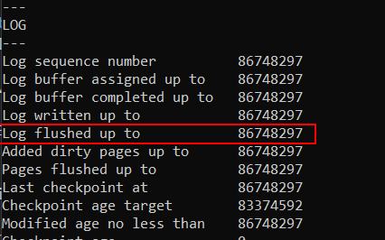

# Redolog
## Connexió per SSH al Sistema
Primer de tot, ens connectarem a la màquina per **SSH** desde CMD (ho tenim prèviament instal·lat).
```
ssh machineuser@ip 
```
<details open>
<summary><b>Connexió per SSH</b></summary>

</details>

<hr>

## Comprovacions Redolog
En aquest apartat, visualitzarem la informació que tenim sobre els Redologs en el nostre storage engine InnoDB i un exemple de cas d'ús.

### LSN 
El LSN (Log Sequence Number) és el número identificatiu únic seqüencial que se li assigna a la escriptura dels canvis que s'han realitzat en la nostra BD que aquests estan en el REDO LOG (`ib_logfile0`).

Per poder veure en quin LSN estem situats actualment podem fer-ho amb la següent sentència. Gairabé tots els paràmetres estarán en el mateix número perque en teoria totes les escriptures cap a disk s'han fet ja que no hi ha tanta càrrega en aquest SGBD de prova:
```
mysql> SHOW ENGINE INNODB STATUS\G
```
<details open>
<summary><b>Veure el LSN</b></summary>

</details>

### Últim LSN actualitzat a Disc
Ara, per saber quin és el últim LSN actualitzat el disc podem mirar el paràmetre de `Log flushed up to`, on ens diu el LSN del últim canvi escrit del caché al disc
```
mysql> SHOW ENGINE INNODB STATUS\G
```
<details open>
<summary><b>Veure el últim LSN actualitzat a disc </b></summary>

</details>

I si volem veure últim LSN que s'ha escrit en el Redolog ens hem de fixar en el paràmetre `Log written up to`
<details open>
<summary><b>Veure el últim LSN escrit a Redolog </b></summary>

</details>

### Últim Checkpoint realitzat
Ara, per mirar el últim Checkpoint, que és el LSN en el que es fa un salvaguarda, és a dir, si s'esta escrivint les dades del Redolog al disc i es va la llum, al tornar a engegar el servidor qué és el que garantitza que es reprendi el procés de passar les dades al disc? Doncs el checkpoint és el que determina en des de quin LSN ha de tornar a guardar les dades en disc en un cas de recuperació de sistema (fallada de sistema).
Mentres que es guarda les dades, el checkpoint reprén el número de LSN d'aquella dada.
```
mysql> SHOW ENGINE INNODB STATUS\G
```
<details open>
<summary><b>Veure el últim Checkpoint </b></summary>

</details>

### Exemple d'Ús Redolog
Doncs, tenim un cas en el que una empresa a la hora genera molts milers d'euros, i les dades s'han d'emmagatzemar constantment en una BD.

Llavors resulta que per tenir les dades integres en cas de fallades de disc i/o altres fallades, tenen els ibdata repartits en diferents discos per repartir la càrrega i tenir accessos ràpids, i tenen 2 fitxers de redologs, i també tenen el tamany del buffer pool bastant elevat.

Llavors, ara totes les dades que es modifiquen o afegeixen es guarda en els redologs, i qualsevol consulta que es faci sobre les dades, primer busca les dades als redologs i després al disc si no els troba prèviament, i després quan el sistema sgbd creu que pot passar les dades dels redologs al disc "a la seva manera tranquilament" les fa, i l'usuari no veu res d'això que passa. I ara diguem-ne que a mig procés de passar les dades s'apaga el sistema o passa alguna cosa que fa parar el servei del MySQL, no passa res perquè aquests sistemes de redologs són tant potents que amb els checkpoints saben quina és la última dada passada al disc i poden reprendre el procés de passar les dades sense cap problema.

Si no hi haguéssin els Redologs, i s'haguéssin de passar les dades directament al disc, els discos tindrien molta càrrega i anirien lents perquè també per l'altra banda tindríem consultes a la mateixa hora que es guarden dades etc. I sempre els discos anirien plens de rendiment empitjorant la seva vida útil.

Llavors és com si estiguéssim donant més treball a la part de la caché i la RAM per repartir la càrrega entre RAM i Disc.

### Dirty Pages i Total Pages
Ara, veurem les pàgines brutes, que són totes les pàgines modificades a memòria que encara no s'han escrit a disc i també veurem el número total de pàgines.

Veure els dirty i total pages
```
mysql> SHOW ENGINE INNODB STATUS\G
```
<details open>
<summary><b>Veure el últim Checkpoint </b></summary>

</details>
