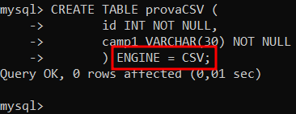
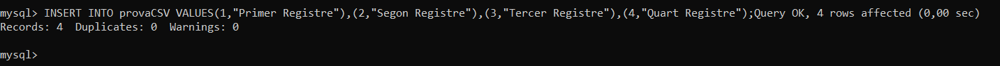
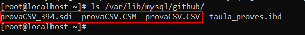

# STORAGE ENGINES CSV 
## Connexió per SSH al Sistema
Primer de tot, ens connectarem a la màquina per **SSH** desde CMD (ho tenim prèviament instal·lat).
```
ssh machineuser@ip 
```
<details open>
<summary><b>Connexió per SSH</b></summary>

</details>

<hr>

## Ús del Storage Engine CSV
Si volem crear una taula en la nostra Base de Dades amb el Motor d'Emmagatzematge CSV, haurem d'afegir `ENGINE = CSV` abans del final de la sentència DDL al crear les taules.
```
mysql> CREATE TABLE provaCSV (
       id INT NOT NULL,
       camp1 VARCHAR(30) NOT NULL
       ) ENGINE = CSV;
```
<details open>
<summary><b>Creació d'una taula de prova amb el Storage Engine CSV</b></summary>

</details>

Ara, insertarem dades en aquesta taula
```
mysql> INSERT INTO provaCSV VALUES(1,"Primer Registre"),(2,"Segon Registre"),(3,"Tercer Registre"),(4,"Quart Registre");
```
<details open>
<summary><b>Insertar Dades en la Taula amb l'Engine CSV</b></summary>

</details>

Si volem on s'ha guardat la informació de la taula haurem d'anar a la ruta on es guarda la base de dades, que per defecte és `/var/lib/mysql/base_de_dades/`

Crea 3 fitxers per cada taula CSV:

> - nomtaula_394.sdi   🡺 Fitxer on guarda les metadades i altres dades de la taula del .CSV
> - nomtaula.CSM  🡺 Fitxer on guarda 
> - nomtaula.CSV  🡺 Fitxer on conté les dades separades per el delimitador de la taula.

```
mysql> ls /var/lib/mysql/github
```

<details open>
<summary><b>Fitxers CSV</b></summary>

</details>

Si obrim el fitxer .csv podrem veure les dades insertades anteriorment.
```
# nano /var/lib/mysql/github/provaCSV.CSV
```
<details open>
<summary><b>Informació fitxer .CSV</b></summary>

</details>