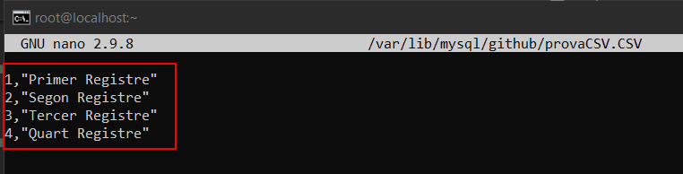

# STORAGE ENGINE CSV 
## Connexió per SSH al Sistema
Primer de tot, ens connectarem a la màquina per **SSH** desde CMD (ho tenim prèviament instal·lat).
```
ssh machineuser@ip 
```
<details open>
<summary><b>Connexió per SSH</b></summary>

</details>

<hr>

## Ús del Storage Engine CSV
Si volem crear una taula en la nostra Base de Dades amb el Motor d'Emmagatzematge CSV, haurem d'afegir `ENGINE = CSV` abans del final de la sentència DDL al crear les taules indicant quin Storage Engine volem utilitzar en aquella taula.

```
mysql> CREATE TABLE provaCSV (
       id INT NOT NULL,
       camp1 VARCHAR(30) NOT NULL
       ) ENGINE = CSV;
```
<details open>
<summary><b>Creació d'una taula de prova amb el Storage Engine CSV</b></summary>

</details>

Ara, insertarem dades en aquesta taula
```
mysql> INSERT INTO provaCSV VALUES(1,"Primer Registre"),(2,"Segon Registre"),(3,"Tercer Registre"),(4,"Quart Registre");
```
<details open>
<summary><b>Insertar Dades en la Taula amb l'Engine CSV</b></summary>

</details>

Si volem veure on i com s'ha guardat la informació de la taula haurem d'anar a la ruta on es guarda la base de dades, que per defecte és `/var/lib/mysql/base_de_dades/` ho podrem fer amb la comanda següent

Nota: Crea 3 fitxers per cada taula CSV:

> - nomtaula_394.sdi   🡺 Fitxer on guarda les metadades i altres dades de la taula del .CSV 
> - nomtaula.CSV  🡺 Fitxer on conté les dades separades per el delimitador de la taula.

```
mysql> ls /var/lib/mysql/github
```

<details open>
<summary><b>Fitxers que genera</b></summary>

</details>

Si obrim el fitxer .csv podrem veure les dades insertades anteriorment.
```
# nano /var/lib/mysql/github/provaCSV.CSV
```
<details open>
<summary><b>Informació fitxer .CSV</b></summary>

</details>

Si volem consultar aquesta informació des del MySQL ho podrem fer mitjançant una simple select.
```
mysql> SELECT * FROM provaCSV;
```
<details open>
<summary><b>Select amb un fitxer CSV</b></summary>

</details>

## Importacions CSV
Ara, ens agradaria poder importar dades a la nostra taula a partir d'un fitxer CSV exportat d'excel o de qualsevol lloc.

Llavors per fer-ho, primer de tot entrariem al nostre MySQL utilitzant el paràmetre `--local_infile`
```
# mysql -u root -p --local_infile
```
<details open>
<summary><b>Entrar al MySQL</b></summary>

</details>

Després seleccionarem la base de dades on volem fer la importació.
```
mysql> USE github;
```
<details open>
<summary><b>Canviar la BD</b></summary>

</details>

[OPCIONAL] Si ja tenim la taula creada i preparada per la importació ens podem saltar aquest pas, però si no hem de crear la taula. Crearè un per fer proves. L'estorage engine que utilitzem podem fer servir el InnoDB mateix o el CSV com volguem.
```
mysql> CREATE TABLE importacions(id INT NOT NULL, nom VARCHAR(30) NOT NULL )ENGINE=CSV;
```
<details open>
<summary><b>Crear la taula</b></summary>

</details>

Ara exportariem el nostre CSV que volem importar en la BD, en aquest cas crearè un a mà, i situariem el CSV en un lloc accessible al MySQL és a dir un lloc on tingui accéss de lectura el MySQL per poder-ho importar, com per exemple a `/tmp`
```
# nano /tmp/provaImportar.csv
```
<details open>
<summary><b>Crear CSV</b></summary>

</details>

Posariem dades dins del fitxer.
<details open>
<summary><b>Dades en el fitxer</b></summary>

</details>

Ara, activarem la variable global que permet per importacions, perquè per defecte hi ha una variable desactivada per seguretat per a que no es puguin per importacions. El podrem també desactivar a nivell de fitxer, però de moment ens interessa a nivell de sessió.
```
mysql> SET GLOBAL local_infile=1;
```
<details open>
<summary><b>Activar variable per poder importar</b></summary>

</details>

I ara importarem el fitxer de la ruta `/tmp/provaImportar.csv` a la taula `importacions` de la BD github.

Per importar-ho la sintaxis és la següent:
>- LOAD DATA LOCAL INFILE '/tmp/provaImportar.csv' --> Ruta del fitxer a importar (MySQL ha de tenir permisos de lectura en aquesta ruta) 
>- INTO TABLE discounts  --> Taula de Destí
>- FIELDS TERMINATED BY ',' --> Delimitador que utilitzem
>- ENCLOSED BY '"' --> Estem dient que hi han valors que estan entre cometes
>- LINES TERMINATED BY '\n' --> Cada registre acaba quan hi ha un salt de línia
>- IGNORE 1 ROWS; --> Ignorem la primera linea per a que no ens importi el text del encapçalat

En el meu cas just, seria el següent:
```
mysql>LOAD DATA LOCAL INFILE '/tmp/provaImportar.csv' 
INTO TABLE importacions 
FIELDS TERMINATED BY ',' 
ENCLOSED BY '"'
LINES TERMINATED BY '\n'
IGNORE 1 ROWS;
```
<details open>
<summary><b>Importació</b></summary>

</details>

I ara per comprovar que s'han importat, podem fer una consulta la taula i veuriem les mateixes dades que en el fitxer csv
```
mysql> SELECT * FROM importacions;
```
<details open>
<summary><b>Select de la taula importacions</b></summary>

</details>


