# STORAGE ENGINE MyRocks 

## Connexió per SSH al Sistema
Primer de tot, ens connectarem a la màquina per **SSH** desde CMD (ho tenim prèviament instal·lat).
```
ssh machineuser@ip 
```
<details open>
<summary><b>Connexió per SSH</b></summary>

</details>

<hr>

## Ús del Storage Engine MyRocks
### Introducció a MyRocks
MyRocks és un motor d'emmagatzematge basat en RocksDB. És de tipus Clau-Valor.

L'utilitza Facebook i han fet un estudi de rendiment amb InnoDB i han trobat diferents ventatges.

Les Advantatges a sobre del InnoDB són:

- <b><span style="color:green">Eficiència de Compressió:</span></b> Comprimeix millor perquè no utilitza mides de paginació fixes. Si en MyRocks una pàgina es comprimeix en 5 KB només utilitzarà aquest 5 KB d'emmagatzematge. Estalvia espai en disc i indirectament estalvia diners.

- <b><span style="color:green">Annexació i Compactació:</span></b> Utilitza menys quantitat de lectures i escriptures perquè els patrons d'accés a les dades estan emmagatzemats de manera persistents i són de clau-valor.

- <b><span style="color:green">Replicació més ràpida:</span></b> MyRocks no necessita lectures aleatories per actualitzar les claus primàries i no necessita verificar la integritat (replicació sense lectura)

- <b><span style="color:green">Carrega de dades més ràpid:</span></b> Activat aquesta opció a nivell de sessió MyRocks escriu dades directament en el nivell més baix, i evita tots els gastos de compactació que aquests utilitzen CPU, E/S per comprimir i descomprimir dades.

    [Més informació](https://www.codetd.com/es/article/12032793)

    [Més informació+](https://engineering.fb.com/2016/08/31/core-data/myrocks-a-space-and-write-optimized-mysql-database/)

    [Més informació++](https://rimzy.net/category/myrocks/)

### Casos d'Ús

RocksDB s'utilitza àmpliament per emmagatzemar dades persistents en SSD a Facebook, i també l'utilitzen diversos serveis que serveixen consultes en línia als discs durs.

Com que MyRocks és un motor d'emmagatzematge basat en arbres LSM construït sobre RocksDB. Té moltes ventatges sobre els B+Tree tradicionals com els que té el InnoDB, utilitzant menys espai en el disc i una escriptura reduïda això a nivell comercial produeix:
> - Disminució del cost d'emmagatzematge al núvol/HDFS per a còpies de seguretat
>- L'amplificació d'escriptura reduïda dóna com a resultat una vida útil més llarga del disc
>- L'espai reduït requereix menys divisions i augmenta la pista.

### Creació de BD amb Taules de Storage Engine MyRocks
Ara, crearem una BD on posteriorment crearem Taules fent servir el Storage Engine MyRocks.

```
mysql> CREATE DATABASE myRocks;
USE myRocks;
```
<details open>
<summary><b>Crear BD per myRocks (on farem les proves)</b></summary>
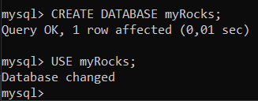
</details>

Ara crearem un seguit de taules utilitzant aquest Storage Engine, també crearem un índex per les claus primàries.
```
mysql> CREATE TABLE taula1(
    id INT, nom VARCHAR(30),
    PRIMARY KEY (id) COMMENT 'cfname=cf1')ENGINE=RocksDB;
```

```
mysql> CREATE TABLE taula2(
    id INT, nom VARCHAR(30), cognom VARCHAR(40),
    PRIMARY KEY (id) COMMENT 'cfname=cf1')
    ENGINE=RocksDB;
```

```
mysql> CREATE TABLE numbers(
a INT, b INT,
PRIMARY KEY (a) COMMENT 'cfname=cf1')
ENGINE = RocksDB;
```
<details open>
<summary><b>Creació de taules amb l'engine MyRocks</b></summary>
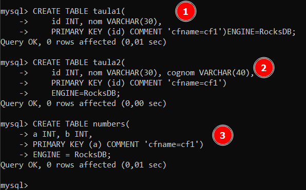
</details>

Ara, inserirem dades en aquestes taules, amb 2 registres per cada taula en tenim prou
```
mysql> INSERT INTO taula1 VALUES (1,"Pere"),(2,"Marta");
```
```
mysql> INSERT INTO taula2 VALUES (1,"Carla","Gómez"),(2,"Pere","Pi");
```
```
mysql> INSERT INTO numbers VALUES (10,20),(30,40),(50,60);
```
<details open>
<summary><b>Inserció de dades a taules amb storage engine MyRocks</b></summary>
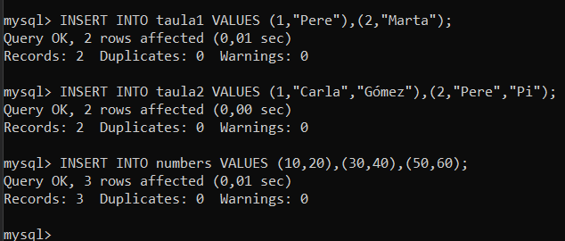
</details>

### Directori Fitxers de Dades i Metadades
Un cop creada i feta les insercions en aquestes taules, tota aquesta informació (metadades i contingut de taules) es guarda en algun lloc en el nostre sistema gestor de base de dades d'una certa manera. Llavors anem a analitzar-los.

- El directori dels `fitxers de metadades` es a `/var/lib/mysql/nomBD/fitxerTaula`. En el meu cas per poder veure aquests fitxers es faria de la següent manera:
    ```
    mysql> ls /var/lib/mysql/myRocks/
    ```
    <details open>
    <summary><b>Llistar el directori de les metadades de les taules amb l'engine myRocks</b></summary>
    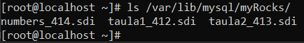
    </details>

- El directori dels `fitxers de dades` és una carpeta oculta nomenada `.rocksdb` i aquesta carpeta oculta es troba a `/var/lib/mysql/`.

    Ho podrem saber també buscant per la variable global %dir%, i fixant-nos en la variable `rocksdb_datadir`. Ens indicarà segurament que per defecte és `./.rocksdb`, aquest "." vol dir que dins d'aquell mateix directori que es troba ara mateix, hi ha una carpeta oculta, i quin és aquell directori que es troba ara mateix? És `/var/lib/mysql` i a partir d'això deduïm que la ruta sencera dels fitxers de dades és `/var/lib/mysql/.rocksdb`

    ```
    mysql> SHOW VARIABLES LIKE %dir%;
    ```
    <details open>
    <summary><b>Saber el directori dels fitxers de dades</b></summary>
    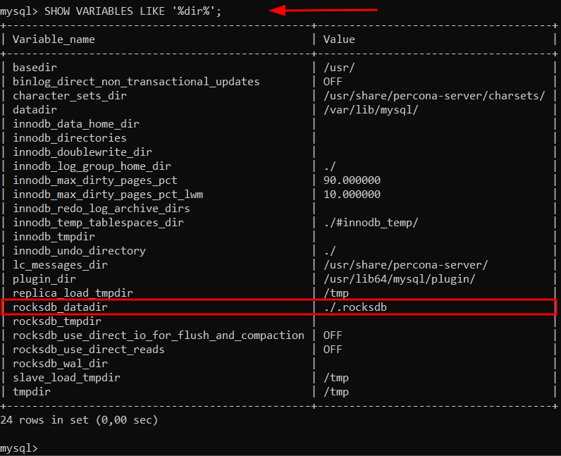
    </details>

    Per llistar tots aquests fitxers i veure el que ocupen ho podem fer de la següent manera:

    `--block-size=K` --> Estem indicant que volem que la mida per tots els arxius ens ho mostri amb KiloBytes, perquè si no posem mida, depenent de l'arxiu sempre ens ho mostra amb la unitat més petita que pot per a cada arxiu, llavors per tenir tots en una única unitat l'especificarem.

    ```
    # ls -l --block-size=K /var/lib/mysql/.rocksdb/
    ```
    <details open>
    <summary><b>Veure el que ocupen els fitxers en KiloBytes</b></summary>
    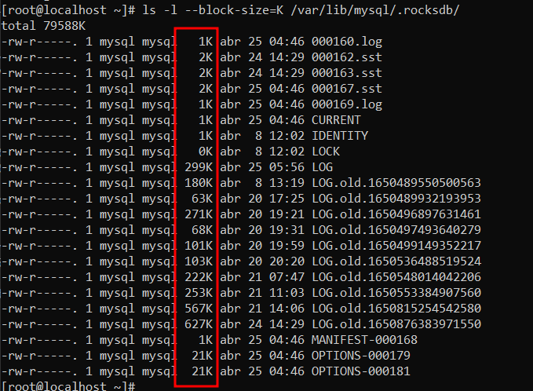
    </details>

    I si volem que ens mostri per a cada arxiu amb la unitat més petita que pot ho farem de la següent manera:

    ```
    # ls -lh /var/lib/mysql/.rocksdb/
    ```
    <details open>
    <summary><b>Veure el que ocupen els fitxers en la mida més petita possible (ho decideix el Linux)</b></summary>
    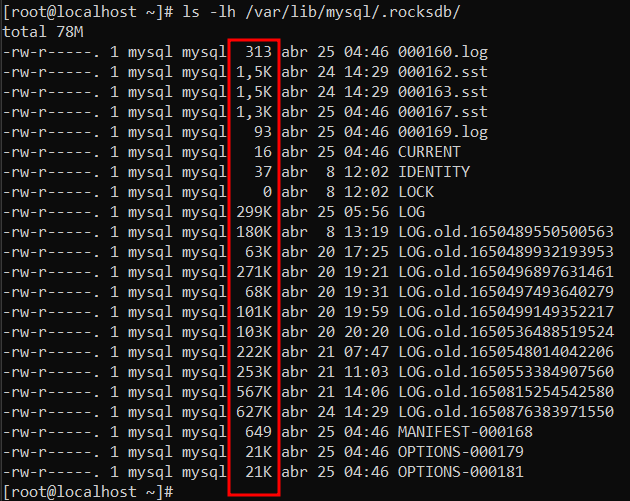
    </details>

### Compressions RocksDB (MyRocks)
#### Format de Compressions per defecte
Tota la informació corresponent a dades de les taules les va guardant en fitxers .sst repartidament vists anteriorment, aquests fitxers si intentem obrir-los veurem que estan en binari, i aquest fitxers de binari a més, estan comprimits per el format per defecte `LZ4`.

Per saber quin format de compressió per defecte utilitza, ho podrem saber realitzant la següent consulta des del MySQL:
```
mysql> SELECT *
FROM information_schema.rocksdb_cf_options
WHERE option_type LIKE '%compression%'
AND cf_name='default';
```
<details open>
<summary><b>Format per defecte per compressió (kLZ4 (LZ4))</b></summary>
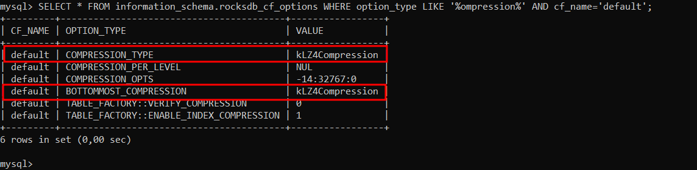
</details>

A més si mirem el contingut de qualsevol .sst, podrem veure que hi ha en algun lloc escrit les sigles LZ4 o el format que tingui.
```
# cat /var/lib/mysql/.rocksdb/000183.sst
```
<details open>
<summary><b>Forma alternativa de veure format de compressió (LZ4)</b></summary>
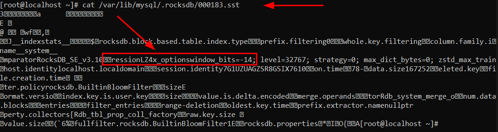
</details>

#### Canviar el format de compressió
RocksDB admet els següents formats de compressió:

> - Snappy
> - Zlib
> - LZ4 (per defecte)
> - LZ4HC
> - ZSTDNotFinal
> - Sense Compressió

##### 🟢 ZLIB 🟢
Ara, canviarem el format de compressió i utilitzarem el Zlib.

Anirem al fitxer de configuració de MySQL que la ruta és `/etc/my.cnf` i modificarem el paràmetre de la compressió de MyRocks (RocksDB), aplicant-ho al dimoni del MySQL (mysqld, servei que utilitza).

```
# nano /etc/my.cnf
```
Modificarem els paràmetres `bottommost_compression` i `compression` seguit especificant el mètode de `compressió` que volguem. Cada paràmetre finalitza amb un `;` i l'altre comença després d'aquest `;`
```
[mysqld]
rocksdb_default_cf_options=bottommost_compression=kZlibCompression;compression=kZlibCompression
```
<details open>
<summary><b>Canviar el format de compressió a Zlib</b></summary>
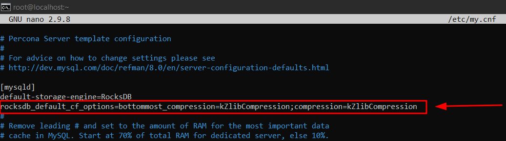
</details>

Seguit reiniciarem el servei de MySQL. Si ens dona un error o el status està en vermell és que algun paràmetre està malament configurat.
```
# systemctl restart mysqld && systemctl status mysqld
```
<details open>
<summary><b>Reiniciar i comprovar el servei de MySQLD</b></summary>
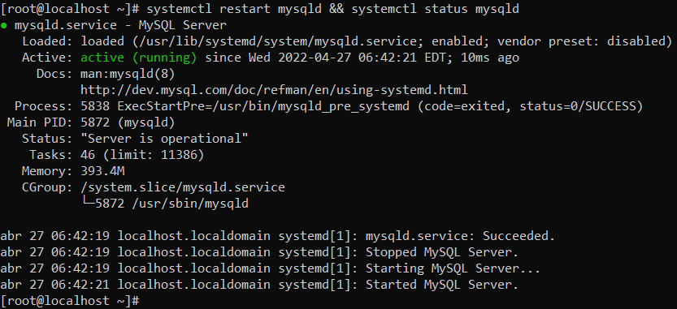
</details>

Ara des de MySQL comprovarem que a partir d'ara el format de compressió és el que hem configurat (Zlib).
Farem servir la següent sentència de consulta utilitzada anteriorment.
```
mysql> SELECT *
FROM information_schema.rocksdb_cf_options
WHERE option_type LIKE '%compression%'
AND cf_name='default';
```
<details open>
<summary><b>Compressió Zlib per defecte</b></summary>
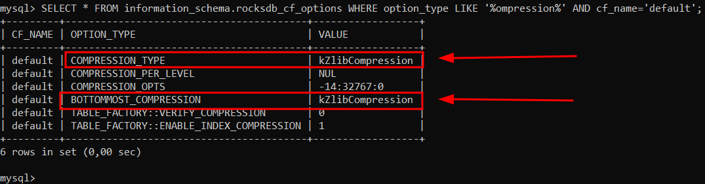
</details>

##### 🟢 ZSTD 🟢
Ara, canviarem el format de compressió i utilitzarem el ZSTD.

Anirem al fitxer de configuració de MySQL que la ruta és `/etc/my.cnf` i modificarem el paràmetre de la compressió de MyRocks (RocksDB), aplicant-ho al dimoni del MySQL (mysqld, servei que utilitza).

```
# nano /etc/my.cnf
```
Modificarem els paràmetres `bottommost_compression` i `compression` seguit especificant el mètode de `compressió` que volguem. Cada paràmetre finalitza amb un `;` i l'altre comença després d'aquest `;`
```
[mysqld]
rocksdb_default_cf_options=bottommost_compression=kZSTD;compression=kZSTD
```
<details open>
<summary><b>Canviar el format de compressió a ZSTD</b></summary>
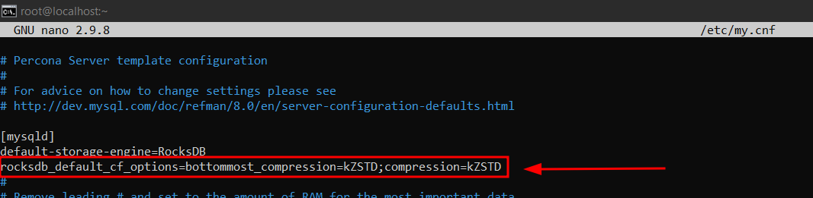
</details>

Seguit reiniciarem el servei de MySQL. Si ens dona un error o el status està en vermell és que algun paràmetre està malament configurat.
```
# systemctl restart mysqld && systemctl status mysqld
```
<details open>
<summary><b>Reiniciar i comprovar el servei de MySQLD</b></summary>

</details>

Ara des de MySQL comprovarem que a partir d'ara el format de compressió és el que hem configurat (ZSTD).
Farem servir la següent sentència de consulta utilitzada anteriorment.
```
mysql> SELECT *
FROM information_schema.rocksdb_cf_options
WHERE option_type LIKE '%compression%'
AND cf_name='default';
```
<details open>
<summary><b>Compressió ZSTD per defecte</b></summary>
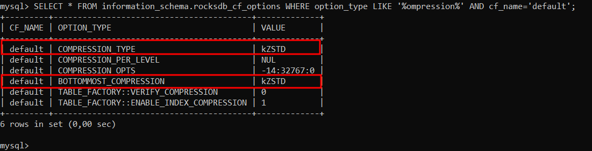
</details>

##### 🟢 SENSE COMPRESSIÓ 🟢
Ara, deshabilitarem la compressió per defecte.

Anirem al fitxer de configuració de MySQL que la ruta és `/etc/my.cnf` i modificarem el paràmetre de la compressió de MyRocks (RocksDB), aplicant-ho al dimoni del MySQL (mysqld, servei que utilitza).

```
# nano /etc/my.cnf
```
Modificarem els paràmetres `bottommost_compression` i `compression` seguit especificant el mètode de `compressió` que volguem. Cada paràmetre finalitza amb un `;` i l'altre comença després d'aquest `;`
```
[mysqld]
rocksdb_default_cf_options=bottommost_compression=kDisableCompressionOption;compression=kNoCompression
```
<details open>
<summary><b>Deshabilitar la compressió</b></summary>
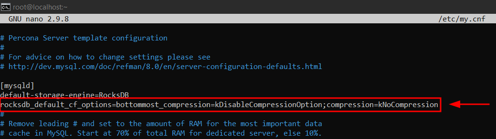
</details>

Seguit reiniciarem el servei de MySQL. Si ens dona un error o el status està en vermell és que algun paràmetre està malament configurat.
```
# systemctl restart mysqld && systemctl status mysqld
```
<details open>
<summary><b>Reiniciar i comprovar el servei de MySQLD</b></summary>

</details>

Ara des de MySQL comprovarem que a partir d'ara no utilitza cap format de compressió.
Farem servir la següent sentència de consulta utilitzada anteriorment.
```
mysql> SELECT *
FROM information_schema.rocksdb_cf_options
WHERE option_type LIKE '%compression%'
AND cf_name='default';
```
<details open>
<summary><b>No utilitza Compressió per defecte</b></summary>
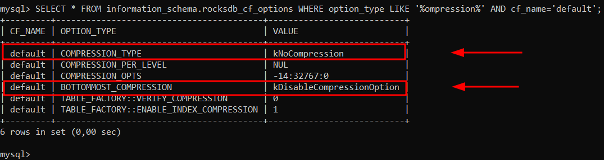
</details>

##### 🟢 LZ4 (Per Defecte) 🟢
Per defecte si no configurem la opció de compressió utilitza aquesta.

Llavors treiem la linea configurada anteriorment i tindriem el format LZ4 per defecte.

En cas de que al instal·lar el MyRocks hi hagi un altre format per defecte, el podrem especificar en el MySQL també.

```
# nano /etc/my.cnf
```
```
[mysqld]
rocksdb_default_cf_options=bottommost_compression=kLZ4Compression;compression=kLZ4Compression
```
<details open>
<summary><b>Canviar el métode de compressió a LZ4 en cas de tenir un altre per defecte</b></summary>

</details>

Seguit reiniciarem el servei de MySQL. Si ens dona un error o el status està en vermell és que algun paràmetre està malament configurat.
```
# systemctl restart mysqld && systemctl status mysqld
```
<details open>
<summary><b>Reiniciar i comprovar el servei de MySQLD</b></summary>

</details>

Ara des de MySQL comprovarem que a partir d'ara utilitza LZ4 per defecte.
```
mysql> mysql> SELECT *
FROM information_schema.rocksdb_cf_options
WHERE option_type LIKE '%compression%'
AND cf_name='default';
```
<details open>
<summary><b>Format de compressió LZ4 per defecte.</b></summary>

</details>


