# STORAGE ENGINES DEL MYSQL 

## Connexió per SSH al Sistema
Primer de tot, ens connectarem a la màquina per **SSH** desde CMD (ho tenim prèviament instal·lat).
```
ssh machineuser@ip 
```
<details open>
<summary><b>Connexió per SSH</b></summary>
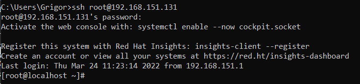
</details>

<hr>

## Motors d'Emmagatzematge Utilitzables
Per veure la informació de l'estat dels Storage Engines, és a dir per veure els motors suportats o no per defecte i veure quin és el que ve per defecte al crear noves taules, ho podrem fer de la següent manera des del MySQL.

El valor support indica si un motor d'emmagatzematge en particular està suportat o no i quin és el motor per defecte.

En aquest cas els que el support és NO, no podrem per defecte utilitzar aquest storage engine, haurem de fer un procés extra per activar-los.

Els que són support YES sí que els podrem utilitzar per defecte (actius).

I en el que posa DEFAULT és el que ve per defecte.

```
mysql> SHOW STORAGE ENGINES\G
```
<details open>
<summary><b>Veure Storage Engines</b></summary>
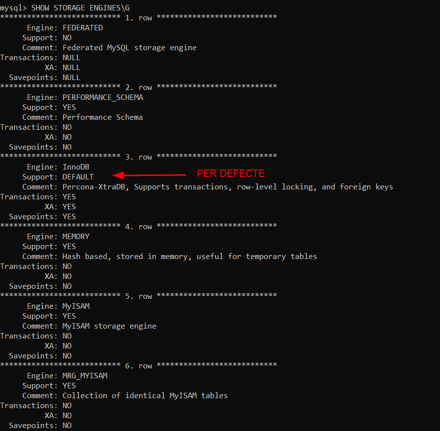
</details>
<details open>
<summary><b>Veure Storage Engines 2</b></summary>
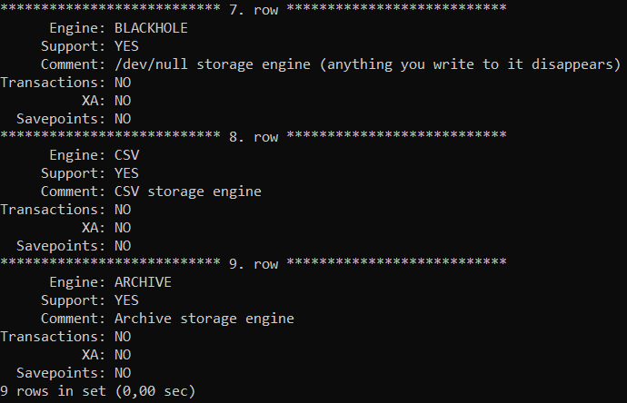
</details>
<hr>

## Canviar el Motor d'Emmagatzematge per Defecte
Per veure ràpidament la informació dels Storage Engines, ho podem fer de la següent manera:

On podem veure que el Storage Engine per Defecte és el `InnoDB`.
```
mysql> SHOW ENGINES;
```
<details open>
<summary><b>Storage Engine per Defecte</b></summary>
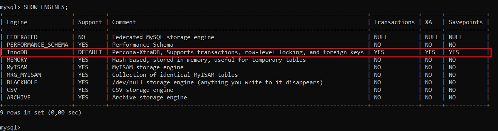
</details>

Si vulgúessim canviar el Storage Engine per defecte, és a dir, que a partir d'ara totes les taules que es crein a la meva BBDD siguin per defecte amb un altre motor d'emmagatzematge, ho podrem fer de la següent manera.

Accedirem al fitxer de configuració de MySQL que es troba a la ruta `/etc/my.cnf`
```
# nano /etc/my.cnf
```

I afegiriem el següent paràmetre de configuració en les següents línies del `[MYSQLD]` indicant que estem configurant el dimoni del MySQL indicant quin és el Storage Engine per defecte (si no posem res per defecte és InnoDB). En aquest cas volem que per defecte utilitzi `MyISAM`
```
default-storage-engine=MyISAM
```
<details open>
<summary><b>Canviar el Storage Engine per defecte a MyISAM</b></summary>
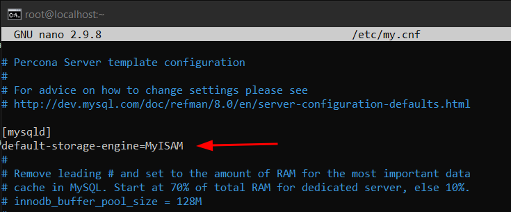
</details>

I reiniciariem el servei de MySQL
```
# systemctl restart mysqld
```
<details open>
<summary><b>Reiniciar i Comprovar l'estat del MySQL</b></summary>
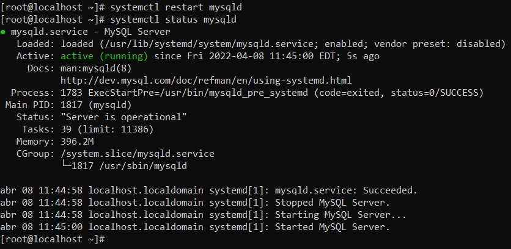
</details>

I ara si tornem a comprovar el Storage Engine per defecte, hauria de canviar el DEFAULT del InnoDB i s'ho posaria al Engine que hem configurat, en aquest cas el MyISAM.
```
mysql> SHOW ENGINES;
```
<details open>
<summary><b>Comprovació del canvi de Storage Engine per defecte a MyISAM</b></summary>
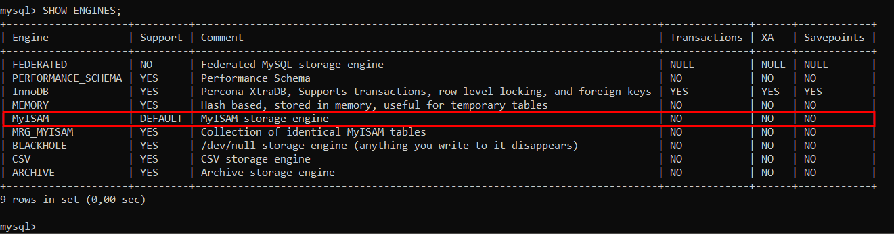
</details>
<hr>

# Instal·lació i Activació del Storage Engine MyRocks
Per instal·lar el Storage Engine MyRocks, l'instal·larem fent servir els administradors de paquets corresponents
```
# sudo yum install percona-server-rocksdb
```
<details open>
<summary><b>Instal·lació MyRocks</b></summary>
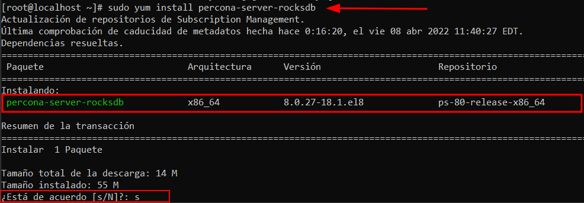
</details>

Un cop instal·lat al final de la instal·lació ens hauria de sortir lo següent
<details open>
<summary><b>Text que surt al final de la Instal·lació</b></summary>
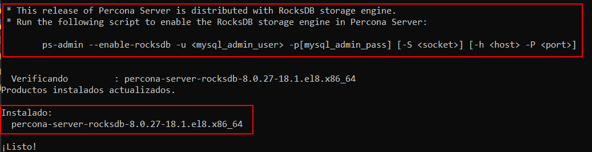
</details>

Llavors ara, guiant-nos per el text haurem d'activar aquest Engien, on ho farem amb el script `ps-admin` indicant l'usuari i contrasenya root del nostre MySQL perquè el script ens activi el MyRocks.

```
# sudo ps-admin --enable-rocksdb -u root -pPassw0rd
```
<details open>
<summary><b>Activant el MyRocks</b></summary>
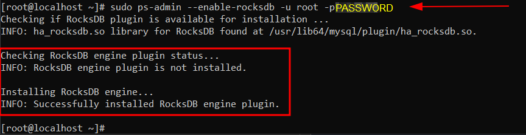
</details>

I si tornem a llistar els Storage Engines ens sortirà que el tenim actiu (`Support = YES`)
```
mysql> SHOW ENGINES;
```
<details open>
<summary><b>Comprovar que tenim Actiu el MyRocks (RocksDB)</b></summary>
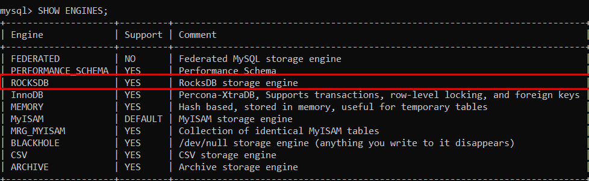
</details>

### Posar MyRocks com a Storage Engine per Defecte
Per posar MyRocks com a motor d'emmagatzematge per defecte, anirem al fitxer de configuració de MySQL `/etc/my.cnf`, i canviarem el MyIsam per defecte que teniem abans per RocksDB que és el MyRocks.
```
# nano /etc/my.cnf

[mysqld]
default-storage-engine=RocksDB
```
<details open>
<summary><b>Activar el RocksDB per defecte desde el fitxer de configuració de MySQL</b></summary>
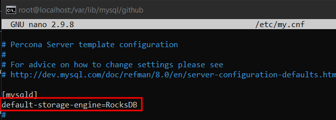
</details>

Ara si tornem al MySQL i mirem els engines, veurem que per defecte és el MyRocks i a partir d'ara qualsevol taula que es crees es crearia amb l'engine MyRocks.
```
mysql> SHOW ENGINES;
```
<details open>
<summary><b>MyRocks (RocksDB) Storage Engine per defecte</b></summary>
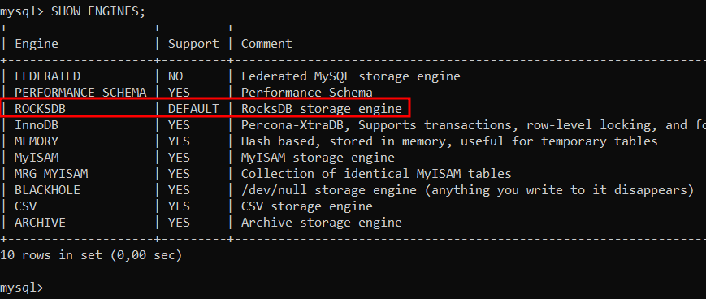
</details>


