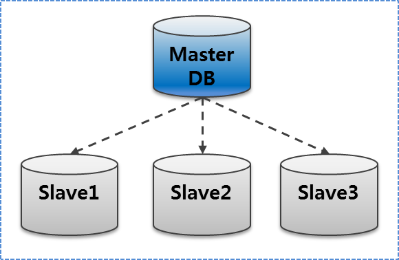

# Configuració Sistemes de Rèplica
## Connexió per SSH al Sistema (Opcional)
Ara, si al començar aquesta guía tenim configurada alguna IP en les nostres màquines i instal·lat el SSH. Accedirem en remot per una correcta administració del Sistema.
```
ssh usuarimaquina@ip
```
<details open>
<summary><b>Connexió per SSH al Master</b></summary>

</details>

<details open>
<summary><b>Connexió per SSH al Slave</b></summary>

</details>


## Introducció
En aquesta guía aprendrem a crear un sistema de rèpliques amb Percona MySQL.
La tipologia que utilitzarem que és **Master Slave** en un entorn real podem d'utilitzar `1 Master` i `1 o més slaves` però per aquesta pràctica s'utilitzarà `1 Master` i `1 Slave`.

## Rèplica Master i Slave
El primer pas que hauriem de fer és configurar la xarxa dels servidors, per a que es vegin entre ells.
En el entorn virtual el propi VMWARE en mode NAT per DHCP ens proporciona connexió a Internet i visibilitat entre les màquines llavors ja ens estalviem aquest pas.

En un entorn real fent [click aqui](https://www.tecmint.com/set-static-ip-address-in-rhel-8/) podem veure com configurar la xarxa en els servidor Redhat 8.0 (RHEL85)
    

El següent pas que s'hauria de fer és tenir preparat les màquines amb Percona Server 8.0 amb el MySQL instal·lat. [Fent clic aqui](https://github.com/GrigorPogosyan/M02-Base-de-Dades/tree/main/Ac1-Instal%C2%B7lacions-SGBD/Percona-Server8.0) podràs veure la guia d'instal·lació de Percona-Server MySQL, necessitarem connexió a Internet en les màquines.

En aquesta pràctica la `IP: 192.168.151.142` correspon a la màquina `Slave`, i la `IP 192.168.151.143` correspon la màquina `Master`

Ara, desactivarem el `SELINUX` en les `dues màquines` per estalviar problemes, en un cas real s'haurien de fer servir les regles. SELINUX és el Firewall de processos que té Red Hat per mesures de seguretat.

Anirem a l'arxiu del SELINUX i posarem en `disable` el valor.
```
# nano /etc/selinux/config
```
<details open>
<summary><b>Desactivarem SELINUX</b></summary>

</details>

I posteriorment reiniciarem la màquina per aplicar els canvis.
```
# init 6
```

Ara, `desactivarem el Firewall` en les `dues màquines` per evitar més problemes, en un cas real s'haurien de configurar correctment les regles per seguretat.
```
# systemctl disable firewalld
```
<details open>
<summary><b>Desactivar el Firewall</b></summary>

</details>

Ara, en cas de que estiguem virtualitzant i dupliquem màquines de Percona, aquest té un UUID del server que serà el mateix i no hauria de ser-ho perquè ens donarà problemes. Si volem comprovar si tenen el mateix UUID o no, haurem de mirar-ho en el fitxer `auto.cnf` del MySQL en els dos servidors i comparar-los
```
# cat /var/lib/mysql/auto.cnf
```
<details open>
<summary><b>Comparar els UUID dels servidors</b></summary>

</details>

En cas de que tinguem UUID iguals haurem de borrar el fitxer `auto.cnf` del MySQL d'una de les dues màquines, reiniciar el servei i que torni a generar un nou `UUID`.
```
# rm /var/lib/mysql/auto.cnf
```
<details open>
<summary><b>Eliminar el fitxer auto.cnf</b></summary>

</details>

I ara reiniciarem i comprovarem el servei.

```
# systemctl restart mysqld && systemctl status mysqld
```
<details open>
<summary><b>Reiniciar i comprovar el servei de MySQL</b></summary>

</details>

Ara, tornarem a comprovar el UUID dels dos servidors i si tot ha anat bé tindrem `diferent UUID`
```
# cat /var/lib/mysql/auto.cnf
```
<details open>
<summary><b>Comparar els UUID dels servidors i assegurar-nos que són diferents</b></summary>

</details>


Ara, lo primer que hem de fer és tenir el `LOG BIN` del `Servidor Master Activat`, per defecte ve activat en aquest sistema, però si no el tenim per defecte activat afegirem la linia `log-bin=mysqld-bin` en la secció de `[mysqld]` del MySQL.

També haurem de posar identificador de servidor en el Servidor Mestre `server-id=1`, aquest valor estar entre 1 i 232.

Llavors obrirem l'arxiu de configuració de MySQL del servidor `Mestre` i configurarem aquestes opcions.

```
# nano /etc/my.cnf
```
```
[mysqld]
log-bin=mysql-bin
server-id=1 
```
<details open>
<summary><b>Activar el log bin (si no ho tenim per defecte activat), i assignar l'identificador de servidor al servidor Mestre</b></summary>

</details>

MASTER:
Miramos los logs y los rotamos y veremos que el binlog ha rotado al 2
mysql -u root -pSox2020$
SHOW MASTER LOGS;
SHOW MASTER STATUS;
FLUSH LOGS;
SHOW MASTER STATUS;

CREAMOS USUARIO DE REPLICA POR DEFECTO CON ENCRIPTACION SHA2
CREATE USER 'replication'@'192.168.151.142' IDENTIFIED BY 'Sox2020$';


LE DAMOS PERMISOS DE REPLICA A ESTE USUARIO QUE HEMOS CREAEDO
GRANT REPLICATION SLAVE ON *.* TO 'replication'@'192.168.151.142';
FLUSH PRIVILEGES;

DEL MASTER HACEMOS UNA COPIA DE TODAS LAS BASES DE DATOS Y LO GUARDAMOS UN ARCHIVO
mysqldump -u root -pSox2020$ --all-databases --master-data > dbdump.db

MIRAMOS HASTA DONDE LLEGA LA COPIA, PARA QUE EL SLAVE LUEGO COMIENZA D ESE APARTADO DEL LOGFILE Y NO DESDE 0 PORQEU SINO ESTARA QUERIENDO REPLICAR CONTENIDO QUE YA TIENE
BUSCAMOS EN DBDUMP.DB por el valor MASTER_LOG_FILE:

ESTA ES LA LINIA
CHANGE MASTER TO MASTER_LOG_FILE='mysql-bin.000002', MASTER_LOG_POS=899;

LE PONEMOS AL SLAVE IDENTIFICADOR 2 Y LE QUITAMOS LOS LOGBIN, YA QUE SI ES SLAVE Y EN PRINCIPIO NO TIENE K PASAR SU LOGFILE PARA REPLICAR MAS ABAJO, ES INUTIL TENER EL LOGFILE ACTIVADO
[mysqld]
server-id=2 
disable_log_bin

REINICIAR SERVER

IMPORTAMOS LA COPIA DE TODAS LAS BASES DE DATOS HECHAS ANTERIORMENTE, UN APARTADO DA ERROR... PERO SIGUE FUNCIONANDO, SI TENEMOS 1 BASE DE DATOS PODEMOS HACE COPIA DE ESA BASE DE DATOS
SLAVE: 
desde mysql import source dbdump.bd


HACEMOS EL CHANGE MASTER TO, EL GET_MASTER_PUBLIC_KEY HAY QEU PONERLO PORQE SI NO NOS DICE ERROR DE USUARIO QUE NO PUEDE LOGUEARSE USANDO SHA256, PORQUE? PORQUE NO OBTIENE LA CLAVE PUBLICA PARA QUE EL SERVIDOR PUBLICO LO DESENCRIPTE EN LA PRIVADA Y POR ESO DA ERROR, OTRA SOLUCION SERIA QUE PUSIERAMOS PASSWORD EN NATIVO
CHANGE MASTER TO
MASTER_HOST='192.168.151.143',
MASTER_USER='replication',
MASTER_PASSWORD='Sox2020$',
MASTER_PORT=3306,
MASTER_LOG_FILE='mysql-bin.000002',
MASTER_LOG_POS=899,
GET_MASTER_PUBLIC_KEY=1,
MASTER_CONNECT_RETRY=10;

COMENZAMOS EL SLAVE  Y EN TEORIA TIENE K IR
START SLAVE;

SHOW SLAVE STATUS \G

------------------------------

PERCONA TOOLKIT

SI EN RHEL TENEMOS PORBLEMA DE REPOSITORIO, HACER LO SIGUIENTE:

dnf clean all
rm -frv /var/cache/dnf
subscription-manager refresh
dnf update

INSTALAMOS PERCONA TOOLKIT
sudo yum install percona-toolkit

Hacemos pt checksum, QUE LO QUE HACE ÉS MIRAR LA INTEGRIDAD DE LOS DATOS ENTRE MASTER Y SLAVE Y NOS DICE SI HAY ALGUNA DIFERENCIA ENTRE LA TABLA DEL MASTER Y SERVER
miramos el documentar perldoc y miramos el manual k tenems en linux
--nocheck-binlog-format

-d github    (--databases)

-h localhost
-u root
-p Sox2020$

--slave-user
--slave-password

 pt-table-checksum -u root -pSox2020$ -h localhost --no-check-binlog-format --slave-user=replication --slave-password=Sox2020$ --databases=github

 Si no pones --slave user ni slave password da error diiend k no se puede conectar

 ahora importamos sakila y hacemos esto 
  pt-table-checksum -u root -pSox2020$ -h localhost --no-check-binlog-format --slave-user=replication --slave-password=Sox2020$ --databases=sakila

  En el slave hacemos un update de actor por ejemplo, y luego volvemos a poner la comanda y nos dice que hay una diferencia al hacer checsum
  pt-table-checksum -u root -pSox2020$ -h localhost --no-check-binlog-format --slave-user=replication --slave-password=Sox2020$ --databases=sakila

TS ERRORS  DIFFS     ROWS  DIFF_ROWS  CHUNKS SKIPPED    TIME TABLE
05-25T06:33:00      0      1      200          0       1       0   0.317 sakila.actor

CLARO AHORA COMO ARREGLAMOS LOS DIFFS? PUES TENEMS LA EINA PT TALBE SYNC QUE PODEMOS DECIR QUE EL EN E CASO QUE HAYA DIFS QUE EL SLAVE VUELVA A SINCRONIZAR PERÒ HACIENDO CASO AL MASTER Y ESA TABLA SE HABRA ARREGLADO DE LOS DIFFS.

Ahora con  table sync miraremos en el servidor de replicacion que cambios han hecho que no estan en el master
pt-table-sync --sync-to-master h=192.168.151.142,u=replication,p=Sox2020$,P=3306 --databases=sakila --tables=actor --print

una vez que miramos los cambios, hacemos la sync, no miramos check de cpnstraint ni tablas de hijos:

pt-table-sync --sync-to-master h=192.168.151.142,u=replication,p=Sox2020$,P=3306 --databases=sakila --tables=actor --replicate=percona.checksums --no-check-child-tables --no-foreign-key-check
s --execute

sino nos da este problema, aunque bueno, estando en el master no tenemos que tenre los datos mal y nos podemos fiar y hacer quen o compruebe las foraneas ya qeu en el master me lo habran introducido bien

pt-table-sync --sync-to-master h=192.168.151.142,u=replication,p=Sox2020$,P=3306 --databases=sakila --tables=actor --execute
Cannot delete or update a parent row: a foreign key constraint fails (`sakila`.`film_actor`, CONSTRAINT `fk_film_actor_actor` FOREIGN KEY (`actor_id`) REFERENCES `actor` (`actor_id`) ON DELETE RESTRICT ON UPDATE CASCADE) [for Statement "REPLACE INTO `sakila`.`actor`(`actor_id`, `first_name`, `last_name`, `last_update`) VALUES ('1', 'PENELOPE', 'GUINESS', '2006-02-15 04:34:33') /*percona-toolkit src_db:sakila src_tbl:actor src_dsn:P=3306,h=192.168.151.143,p=...,u=replication dst_db:sakila dst_tbl:actor dst_dsn:P=3306,h=192.168.151.142,p=...,u=replication lock:1 transaction:1 changing_src:1 replicate:0 bidirectional:0 pid:29192 user:root host:localhost.localdomain*/"] at line 10950 while doing sakila.actor on 192.168.151.142

I despres si tornem a fer checksum ja no tindrem diferencies

pt-table-checksum -u root -pSox2020$ -h localhost --no-check-binlog-format --slave-user=replication --slave-password=Sox2020$ --databases=sakila