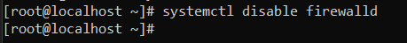
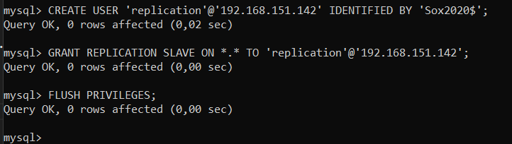
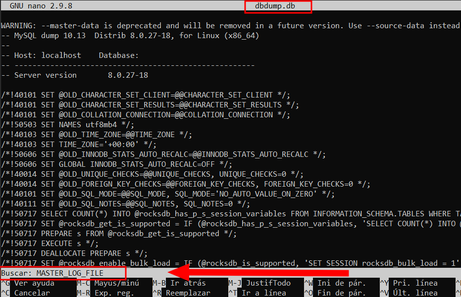
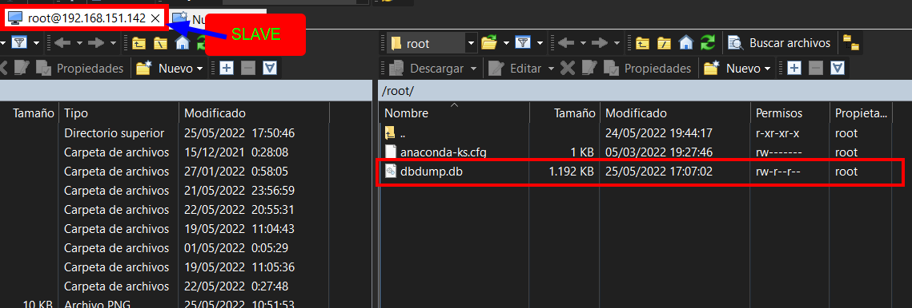
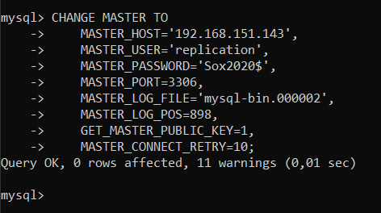

# Configuració Sistemes de Rèplica
## Connexió per SSH al Sistema (Opcional)
Ara, si al començar aquesta guía tenim configurada alguna IP en les nostres màquines i instal·lat el SSH. Accedirem en remot per una correcta administració del Sistema.
```
ssh usuarimaquina@ip
```
<details open>
<summary><b>Connexió per SSH al Master</b></summary>

</details>

<details open>
<summary><b>Connexió per SSH al Slave</b></summary>

</details>


## Introducció
En aquesta guía aprendrem a crear un sistema de rèpliques amb Percona MySQL.
La tipologia que utilitzarem que és **Master Slave** en un entorn real podem d'utilitzar `1 Master` i `1 o més slaves` però per aquesta pràctica s'utilitzarà `1 Master` i `1 Slave`.

## Rèplica Master i Slave
El primer pas que hauriem de fer és configurar la xarxa dels servidors, per a que es vegin entre ells.
En el entorn virtual el propi VMWARE en mode NAT per DHCP ens proporciona connexió a Internet i visibilitat entre les màquines llavors ja ens estalviem aquest pas.

En un entorn real fent [click aqui](https://www.tecmint.com/set-static-ip-address-in-rhel-8/) podem veure com configurar la xarxa en els servidor Redhat 8.0 (RHEL85)
    

El següent pas que s'hauria de fer és tenir preparat les màquines amb Percona Server 8.0 amb el MySQL instal·lat. [Fent clic aqui](https://github.com/GrigorPogosyan/M02-Base-de-Dades/tree/main/Ac1-Instal%C2%B7lacions-SGBD/Percona-Server8.0) podràs veure la guia d'instal·lació de Percona-Server MySQL, necessitarem connexió a Internet en les màquines.

En aquesta pràctica la `IP: 192.168.151.142` correspon a la màquina `Slave`, i la `IP 192.168.151.143` correspon la màquina `Master`

Ara, desactivarem el `SELINUX` en les `dues màquines` per estalviar problemes, en un cas real s'haurien de fer servir les regles. SELINUX és el Firewall de processos que té Red Hat per mesures de seguretat.

Anirem a l'arxiu del SELINUX i posarem en `disable` el valor.
```
# nano /etc/selinux/config
```
<details open>
<summary><b>Desactivarem SELINUX</b></summary>

</details>

I posteriorment reiniciarem la màquina per aplicar els canvis.
```
# init 6
```

Ara, `desactivarem el Firewall` en les `dues màquines` per evitar més problemes, en un cas real s'haurien de configurar correctment les regles per seguretat.
```
# systemctl disable firewalld
```
<details open>
<summary><b>Desactivar el Firewall</b></summary>

</details>

Ara, en cas de que estiguem virtualitzant i dupliquem màquines de Percona, aquest té un UUID del server que serà el mateix i no hauria de ser-ho perquè ens donarà problemes. Si volem comprovar si tenen el mateix UUID o no, haurem de mirar-ho en el fitxer `auto.cnf` del MySQL en els dos servidors i comparar-los
```
# cat /var/lib/mysql/auto.cnf
```
<details open>
<summary><b>Comparar els UUID dels servidors</b></summary>

</details>

En cas de que tinguem UUID iguals haurem de borrar el fitxer `auto.cnf` del MySQL d'una de les dues màquines, reiniciar el servei i que torni a generar un nou `UUID`.
```
# rm /var/lib/mysql/auto.cnf
```
<details open>
<summary><b>Eliminar el fitxer auto.cnf</b></summary>

</details>

I ara reiniciarem i comprovarem el servei.

```
# systemctl restart mysqld && systemctl status mysqld
```
<details open>
<summary><b>Reiniciar i comprovar el servei de MySQL</b></summary>

</details>

Ara, tornarem a comprovar el UUID dels dos servidors i si tot ha anat bé tindrem `diferent UUID`
```
# cat /var/lib/mysql/auto.cnf
```
<details open>
<summary><b>Comparar els UUID dels servidors i assegurar-nos que són diferents</b></summary>

</details>


Ara, lo primer que hem de fer és tenir el `LOG BIN` del `Servidor Master Activat`, per defecte ve activat en aquest sistema, però si no el tenim per defecte activat afegirem la linia `log-bin=mysqld-bin` en la secció de `[mysqld]` del MySQL.

També haurem de posar identificador de servidor en el Servidor Mestre `server-id=1`, aquest valor estar entre 1 i 232.

Llavors obrirem l'arxiu de configuració de MySQL del servidor `Mestre` i configurarem aquestes opcions.

```
# nano /etc/my.cnf
```
```
[mysqld]
log-bin=mysql-bin
server-id=1 
```
<details open>
<summary><b>Activar el log bin (si no ho tenim per defecte activat), i assignar l'identificador de servidor al servidor Mestre</b></summary>

</details>

I ara amb la variable del servidor comprovarem que s'ha canviat correctament.
```
mysql> SHOW VARIABLES LIKE 'server_id';
```
<details open>
<summary><b>Comprovar que s'ha canviat el id del servidor correctament</b></summary>

</details>

Ara, continuant en el `Master`, verificarem en quin estat està el nostre Binlog, hauria d'estar en `ON`

```
mysql> SHOW VARIABLES LIKE 'log_bin%';
```
<details open>
<summary><b>Comprovar que tenim el Binlog activat</b></summary>

</details>

Ara continuant en el `Master` mirarem el `status` del `Logbin`, en quin binlogfile està, la posició que es troba actualment...
```
mysql> SHOW MASTER STATUS;
```
<details open>
<summary><b>Status BinlogFile abans de rotar els logs</b></summary>

</details>

Ara, rotarem els logs, és a dir farem un `FLUSH LOGS`, per dir que en el cas del binlog file comenci a escriure en el següent `BinlogFile`. Si estava en el `mysql-bin.000001` pasarà a escriure al `mysql-bin.000002`.
```
mysql> FLUSH LOGS;
```
I tornarem a mirar el `status del BinlogFile` i veurem com ha rotat correctament.
<details open>
<summary><b>Rotar els logs i veure el status del BinlogFile</b></summary>

</details>

Ara, crearem en el `Master` un usuari específic amb permisos específics que l'utilitzarem per les rèpliques, on el `Slave` utilitzarà aquest usuari per connectar-se al `Master` i "llegir els binlog file". El compte es dirà replication, i només podrà entrar a la màquina si la IP de la màquina és `192.168.151.142` que és la IP del `Slave`
```
mysql> CREATE USER 'replication'@'192.168.151.142' IDENTIFIED BY 'Sox2020$';
```
I seguidament donarem permisos de rèplica a totes les bases de dades en aquest usuari.
```
mysql> GRANT REPLICATION SLAVE ON *.* TO 'replication'@'192.168.151.142';
```
I aplicarem els canvis ara, sense haver de reiniciar el servidor.
```
mysql> FLUSH PRIVILEGES;
```
<details open>
<summary><b>Crear i donar privilegis l'usuari que l'utilitzarem per fer rèpliques</b></summary>

</details>

El següent que hem de fer és tenir la mateixa base en el `Master` com en el `Slave`.
Continuant en el `Master`, farem un volcat de dades (còpia de dades), de totes les bases de dades que tingui el `Master` on després enviarem aquest arxiu per a que el `Slave` l'executi.

Llavors farem el volcat de dades de totes les bases de dades.
```
# mysqldump -u root -pSox2020$ --all-databases --master-data > dbdump.db
```
En futures versions s'ha de fer servir `--source-data` en comptes de `--master-data`.

<details open>
<summary><b>Farem el volcat de dades.</b></summary>

</details>

I ara dins de l'arxiu de volcat de dades que hem generat, hem de buscar la linea que contingui `MASTER_LOG_FILE` i `MASTER_LOG_POS` que més endavant en el `Slave` ens servirà. Llavors obrirem l'arxiu.
```
# nano dbdump.db
```
I ara pulsarem la combinació de tecles `CTRL + W`, buscarem el text: `MASTER_LOG_FILE`:
<details open>
<summary><b>Obrirem el menú de búsquedes i escriurem MASTER_LOG_FILE per trobar la linea que volem</b></summary>

</details>

Premem, enter i ens portarà cap a la linia. Si ens fixem adalt de la linea hi ha un text que diu que és la posició que hem de configurar al Slave quan comencem a configurar la rèplica.
<details open>
<summary><b>Obtenir la linea que ens diu els paràmetres, que hem de guardar perquè més endavant utilitzarem</b></summary>

</details>

En aquest cás la linea és la següent, la guardarem en un lloc on poguem consultar més endavant. Perquè el que farem serà dir en el `Slave` a partir de quina posició de log ha de començar a fer la rèplica, perquè si li diem que comenci desde l'inici, intentarà a fer la rèplica de les dades que ja tenia abans degut a la importació de les bases de dades del `Master` (el pas que farem ara):

`CHANGE MASTER TO MASTER_LOG_FILE='mysql-bin.000002', MASTER_LOG_POS=898;`

Abans d'importar les dades en el `Slave` del volcat que s'ha fet del `Master`, hem d'assignar l'identificador 2 a la màquina `Slave` (ha de ser un ID diferent que el Master), i també si aquest `Slave` no li proporcionarà el seu logbin a un `SubSlave` hem de desactivar el `logbin`. En cas de que aquest Slave actués com a Master d'altres Slaves, no hauriem de desactivar el `logbin` ja que els altres Slaves dependrian d'aquest Slave.

Llavors assignarem el `server-id` 2 i traurem el `log_bin` en el `Slave`:
```
# nano /etc/my.cnf
```
```
[mysqld]
server-id=2
disable_log_bin
```
<details open>
<summary><b>Posarem el identificador de servidor 2, i traurem el log_bin</b></summary>

</details>

Posteriorment reiniciarem el servei.
```
# systemctl restart mysqld && systemctl status mysqld
```
<details open>
<summary><b>Reiniciar i comprovar el servei de MySQL</b></summary>

</details>

I comprovarem que les variables s'han canviat correctament.
<details open>
<summary><b>Comprovar que les variables de server_id i log_bin s'han modificat correctament</b></summary>

</details>

Ara, amb el programa `WIN SCP` explicat en [altres apartats](https://github.com/GrigorPogosyan/M02-Base-de-Dades/tree/main/Ac2-Configuracions-Logs/PerconaServerSSL), passarem l'arxiu amb les dades que hem generat en el `Master` al `Slave`

<details open>
<summary><b>Passar l'arxiu de volcat cap al Slave</b></summary>

</details>

I comprovarem que tenim l'arxiu en el `Slave` a `/root/` que és el lloc on ho hem passat.
<details open>
<summary><b>Comprovar que el Slave té l'arxiu</b></summary>

</details>

Ara, desde la màquina del `Slave`, importarem la còpia de dades que hem passat del `Master` al `Slave`.
```
mysql> SOURCE /root/dbdump.db
```
<details open>
<summary><b>Importarem la còpia.</b></summary>

</details>

I ara arriba la part de la configuració de `CHANGE MASTER TO` en el `Slave`. On especificarem:
> - `MASTER_HOST`: Ip del Master, (nom dns si en té)
> - `MASTER_USER` : Usuari que hem creat específic per rèpliques.
> - `MASTER_PASSWORD` : Contrasenya del Usuari especific per rèpliques.
> - `MASTER_PORT` : El port del MySQL del Master. Per defecte si no especifiquem el paràmetre és 3306
> - `MASTER_LOG_FILE` : El nom del fitxer trobat en la linea del fitxer del volcat de dades
> - `MASTER_LOG_POS` : El posició del log on ha de reprendre la còpia. És el que hem trobat també en la linea del fitxer del volcat de dades (És molt important perquè si diguem que comenci a reprendre desde la posició 0, intentarà replicar dades que ja li hem passat amb l'arxiu de volcat i donaria error, llavors aquest `master_log_pos`, indica quina posició ha de reprendre el Slave, que serà a partir de la posició on s'ha acabat de fer el volcat de dades. Perquè si pensem en un cas real, després de fer el volcat de dades s'han continuat insertant dades en el Master, i el Slave ha de saber en quin punt dels binlog files reprendre la rèplica i replicar les noves dates inserides del master al slave..)
> - `GET_MASTER_PUBLIC_KEY` : Activarem aquest paràmetre perquè tingui comunicació tema encriptació amb el `Master` i al loguejar-nos al compte `replication` que per defecte s'ha creat amb encriptació `SHA2`, el Master vegi que en la comunicació s'ha fet servir la seva clau pública, i que aquest desencripti amb la seva privada permetent el logueig del `Slave` si aquestes credencials son correctes. En cas de que no posem aquest paràmetre, no podrem connectar-nos del `Slave` cap al `Master` amb cap usuari que tingui una encriptació SHA2. Si volem fer la connexió possible sense aquest paràmetre haurem de crear el compte amb el `password en mode natiu`.
> - MASTER_CONNECT_RETRY : S'especifica quants segons esperarà la rèplica entre reintents de connexió.

I la comanda per aquest cas seria:
```
mysql> CHANGE MASTER TO
    -> MASTER_HOST='192.168.151.143',
    -> MASTER_USER='replication',
    -> MASTER_PASSWORD='Sox2020$',
    -> MASTER_PORT=3306,
    -> MASTER_LOG_FILE='mysql-bin.000002',
    -> MASTER_LOG_POS=899,
    -> GET_MASTER_PUBLIC_KEY=1,
    -> MASTER_CONNECT_RETRY=10;
```
<details open>
<summary><b>Farem el change master to</b></summary>

</details>

I ara amb la sentència `START SLAVE` la màquina començarà a ser el Slave.
```
msyql> START SLAVE;
```

COMENZAMOS EL SLAVE  Y EN TEORIA TIENE K IR
START SLAVE;

SHOW SLAVE STATUS \G

------------------------------

PERCONA TOOLKIT

SI EN RHEL TENEMOS PORBLEMA DE REPOSITORIO, HACER LO SIGUIENTE:

dnf clean all
rm -frv /var/cache/dnf
subscription-manager refresh
dnf update

INSTALAMOS PERCONA TOOLKIT
sudo yum install percona-toolkit

Hacemos pt checksum, QUE LO QUE HACE ÉS MIRAR LA INTEGRIDAD DE LOS DATOS ENTRE MASTER Y SLAVE Y NOS DICE SI HAY ALGUNA DIFERENCIA ENTRE LA TABLA DEL MASTER Y SERVER
miramos el documentar perldoc y miramos el manual k tenems en linux
--nocheck-binlog-format

-d github    (--databases)

-h localhost
-u root
-p Sox2020$

--slave-user
--slave-password

 pt-table-checksum -u root -pSox2020$ -h localhost --no-check-binlog-format --slave-user=replication --slave-password=Sox2020$ --databases=github

 Si no pones --slave user ni slave password da error diiend k no se puede conectar

 ahora importamos sakila y hacemos esto 
  pt-table-checksum -u root -pSox2020$ -h localhost --no-check-binlog-format --slave-user=replication --slave-password=Sox2020$ --databases=sakila

  En el slave hacemos un update de actor por ejemplo, y luego volvemos a poner la comanda y nos dice que hay una diferencia al hacer checsum
  pt-table-checksum -u root -pSox2020$ -h localhost --no-check-binlog-format --slave-user=replication --slave-password=Sox2020$ --databases=sakila

TS ERRORS  DIFFS     ROWS  DIFF_ROWS  CHUNKS SKIPPED    TIME TABLE
05-25T06:33:00      0      1      200          0       1       0   0.317 sakila.actor

CLARO AHORA COMO ARREGLAMOS LOS DIFFS? PUES TENEMS LA EINA PT TALBE SYNC QUE PODEMOS DECIR QUE EL EN E CASO QUE HAYA DIFS QUE EL SLAVE VUELVA A SINCRONIZAR PERÒ HACIENDO CASO AL MASTER Y ESA TABLA SE HABRA ARREGLADO DE LOS DIFFS.

Ahora con  table sync miraremos en el servidor de replicacion que cambios han hecho que no estan en el master
pt-table-sync --sync-to-master h=192.168.151.142,u=replication,p=Sox2020$,P=3306 --databases=sakila --tables=actor --print

una vez que miramos los cambios, hacemos la sync, no miramos check de cpnstraint ni tablas de hijos:

pt-table-sync --sync-to-master h=192.168.151.142,u=replication,p=Sox2020$,P=3306 --databases=sakila --tables=actor --no-check-child-tables --no-foreign-key-checks --execute


sino nos da este problema, aunque bueno, estando en el master no tenemos que tenre los datos mal y nos podemos fiar y hacer quen o compruebe las foraneas ya qeu en el master me lo habran introducido bien

pt-table-sync --sync-to-master h=192.168.151.142,u=replication,p=Sox2020$,P=3306 --databases=sakila --tables=actor --execute
Cannot delete or update a parent row: a foreign key constraint fails (`sakila`.`film_actor`, CONSTRAINT `fk_film_actor_actor` FOREIGN KEY (`actor_id`) REFERENCES `actor` (`actor_id`) ON DELETE RESTRICT ON UPDATE CASCADE) [for Statement "REPLACE INTO `sakila`.`actor`(`actor_id`, `first_name`, `last_name`, `last_update`) VALUES ('1', 'PENELOPE', 'GUINESS', '2006-02-15 04:34:33') /*percona-toolkit src_db:sakila src_tbl:actor src_dsn:P=3306,h=192.168.151.143,p=...,u=replication dst_db:sakila dst_tbl:actor dst_dsn:P=3306,h=192.168.151.142,p=...,u=replication lock:1 transaction:1 changing_src:1 replicate:0 bidirectional:0 pid:29192 user:root host:localhost.localdomain*/"] at line 10950 while doing sakila.actor on 192.168.151.142

I despres si tornem a fer checksum ja no tindrem diferencies

pt-table-checksum -u root -pSox2020$ -h localhost --no-check-binlog-format --slave-user=replication --slave-password=Sox2020$ --databases=sakila