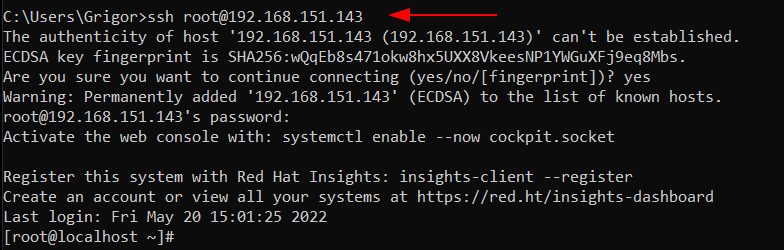

# Configuració Sistemes de Rèplica
## Connexió per SSH al Sistema (Opcional)
Ara, si al començar aquesta guía tenim configurada alguna IP en les nostres màquines i instal·lat el SSH. Accedirem en remot per una correcta administració del Sistema.
```
ssh usuarimaquina@ip
```
<details open>
<summary><b>Connexió per SSH al Master</b></summary>

</details>

<details open>
<summary><b>Connexió per SSH al Slave</b></summary>

</details>


## Introducció
En aquesta guía aprendrem a crear un sistema de rèpliques amb Percona MySQL.
La tipologia que utilitzarem que és **Master Slave** en un entorn real podem d'utilitzar `1 Master` i `1 o més slaves` però per aquesta pràctica s'utilitzarà `1 Master` i `1 Slave`.

## Rèplica Master i Slave
El primer pas que hauriem de fer és configurar la xarxa dels servidors, per a que es vegin entre ells.
En el entorn virtual el propi VMWARE en mode NAT per DHCP ens proporciona connexió a Internet i visibilitat entre les màquines llavors ja ens estalviem aquest pas.

En un entorn real fent [click aqui](https://www.tecmint.com/set-static-ip-address-in-rhel-8/) podem veure com configurar la xarxa en els servidor Redhat 8.0 (RHEL85)
    

El següent pas que s'hauria de fer és tenir preparat les màquines amb Percona Server 8.0 amb el MySQL instal·lat. [Fent clic aqui](https://github.com/GrigorPogosyan/M02-Base-de-Dades/tree/dev/Ac1-Instal%C2%B7lacions-SGBD/Percona-Server8.0) podràs veure la guia d'instal·lació de Percona-Server MySQL, necessitarem connexió a Internet en les màquines.


