# Ús de Percona Toolkit 

## Connexió per SSH al Sistema (Opcional)
Si tenim instal·lat SSH en la nostra màquina `master`. Accedirem en remot per una correcta administració del Sistema.
```
ssh usuarimaquina@ip
```
<details open>
<summary><b>Connexió per SSH al Master</b></summary>
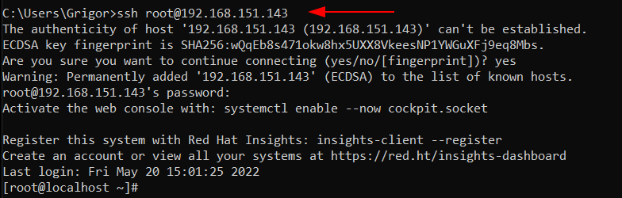
</details>

## Introducció
Les `Percona Toolkit` són un conjunt d'eines avançades en la linea de comandes, creat per `Percona` i utilitzada per realitzar una gran varietat de tasques d'administració sobre els nostres servidors de base de dades.

Aquestes eines són les alternatives als scripts privat que fa la gent per administrar la seva BD, la diferència es que les eines de Percona han sigut desenvolupades profesionalment, ben testejades i documentades.

⚠️S'ha fet aquesta guía, després de montar el sistema de replicació `Master` - `Slave` provinent del apartat anterior de [Configuració-Sistema-Replica](https://github.com/GrigorPogosyan/M02-Base-de-Dades/tree/main/Ac4-Replica-i-Backup/Configuracio-Sistema-Replica )⚠️

A continuació utilitzarem les següents eines:
  > - pt-table-checksum : Aquesta eina verifica la integritat de la replicació del MySQL, relitza una verificació de coherència de la replicació mitjançant unes comandes que utilitzarem en el Master. pt-table-checksum detecta rèpliques automàticament i es connecta a elles, moltes vegades això pot fallar i s'ha d'especificar la màquina slave, es connectarà als slaves automàticament si tenim el mateix compte (un compte d'administració per exemple) amb el mateix password i es connectarà a tots els slaves que trobi.

  > - pt-table-sync : Aquesta eina ve lligat amb l'apartat anterior, un cop que sabem que tenim una inconsistència de dades entre `Master` i `Slave`, aquesta eina serveix per sincronitzar les dades de la taula amb el paràmetre `--sync-to-master` que veurem més endavant podem dir que el Slave sincronitzi les dades que té el `Master`, i d'aquesta manera solucionariem el problema de la inconsistència de dades.

## Percona Toolkit
Començarem a instal·lar aquestes eines en el `Master`. (Hem de tenir el repositori afegit i habilitat (en teoria ho tenim degut a que hem hagut de fer aquests pasos al instal·lar Percona MySQL 8.0))
```
# yum install percona-toolkit -y
```
<details open>
<summary><b>Instal·larem les eines Percona Toolkit</b></summary>
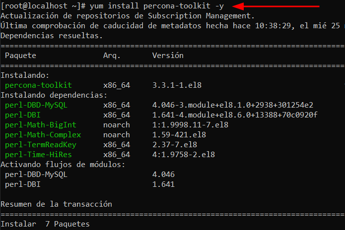
</details>

Si després d'intentar instal·lar les eines estem en un entorn RHEL85, i tenim problemes amb els paquests, podem provar aquestes comandes.
```
# dnf clean all
# rm -frv /var/cache/dnf
# subscription-manager refresh
# dnf update
```

Un cop el tenim instal·lat. Haurem de fer una configuració d'usuaris. Haurem de crear un usuari específic, que utilitzarem només quan utilitzem aquestes eines de Percona. Podem crear el compte `'percona_user'@'192.168.151.143'` on el host és el IP del Servidor de Master, o el compte `'percona_user'@'%'` hem de triar un dels dos, en aquest cas optaré per la primera. El crearem en el `Master` i aquest replicarà cap al `Slave` i aquests dos tindran el mateix compte. I li donarem tots els privilegis.
```
mysql> CREATE USER 'percona_user'@'192.168.151.143' IDENTIFIED BY 'Sox2020$';
mysql> GRANT ALL PRIVILEGES ON *.* TO 'percona_user'@'192.168.151.143';
mysql> FLUSH PRIVILEGES;
```
<details open>
<summary><b>Creació del compte amb privilegis per utilitzar-lo per les eines de Percona Toolkit</b></summary>
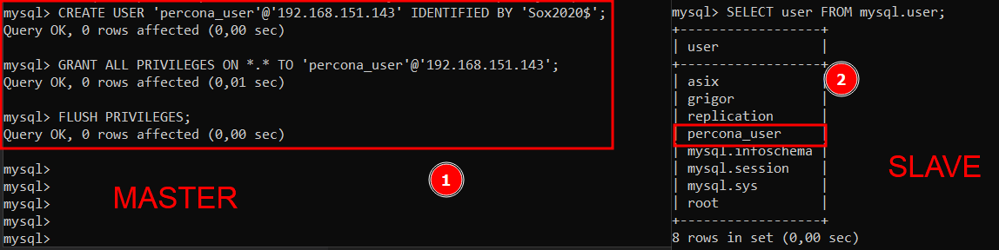
</details>

Ara, farem un `pt-table-checksum` amb la base de dades de `Sakila` que el tenim en el `Master` i replicat en el `Slave`. Si no s'especifica l'usuari i password del `Slave`, ell per defecte  busca tots els slave recursivament que depenen d'aquell master amb el mateix usuari del paràmetre `-u` i pwd `-p`, per això hem creat el mateix usuari en el `MASTER` i `SLAVE` perquè si especifiquem el del Master ell ja busca tots els Slaves que tingui, però si especifiquem l'usuari del Master i aquest no està en el Slave, no el trobarà automàticament i també haurem d'especificar les credencials del Slave.

En la sentència també especificarem el paràmetre `--no-check-binlog-format` perquè el format de Row per defecte és MIXED, i el Checksum el comprova utlitzant Statement, llavors per evitar problemes evitem que miri el format del binlog.

Si no li posem el paràmetre --databases=sakila, verificarà totes les taules en totes les bases de dades.

🟢 Manera 1: Mateix usuari en el Master i Slave i que es connecti automàticament als Slaves que trobi el script.:
```
# pt-table-checksum -u percona_user -pSox2020$ -h 192.168.151.143 --no-check-binlog-format --databases=sakila
```
<details open>
<summary><b>pt-table-checksum manera 1</b></summary>
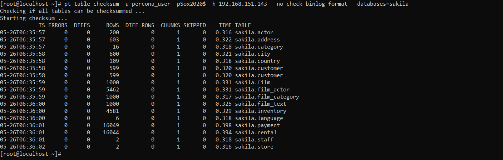
</details>

🟢 Manera 2: No tenim els usuaris replicats, i volem utilitzar un usuari específic per el Master, i un usuari específic al Slave. I per connectar-nos al Màster estarem utilitzant els valors de `-u`,`-p` i `-h`, i per al Slave `--slave-user=percona_user` i `--slave-password=PWD`:
```
# pt-table-checksum -u root -pSox2020$ -h localhost --no-check-binlog-format --slave-user=percona_user --slave-password=Sox2020$ --databases=sakila;
```
<details open>
<summary><b>pt-table-checksum manera 2</b></summary>
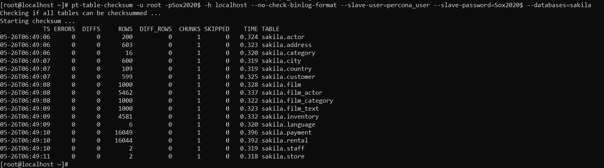
</details>

Com podem veure no tenim cap problema perquè en la columna `DIFF` és 0, llavors anirem a provocar una inconsistència de dades en el Slave per veure com ens ho mostraria el `pt-table-checksum`.

Modificarem la taula de actor de la BD de Sakila en el Slave i veurem amb una select que tenim dades diferents:
```
mysql > UPDATE sakila.actor SET first_name = "Hola";

mysql > SELECT * FROM sakila.actor LIMIT 5;
```
<details open>
<summary><b>Provocar una inconsistència i veure que tenim dades diferents</b></summary>
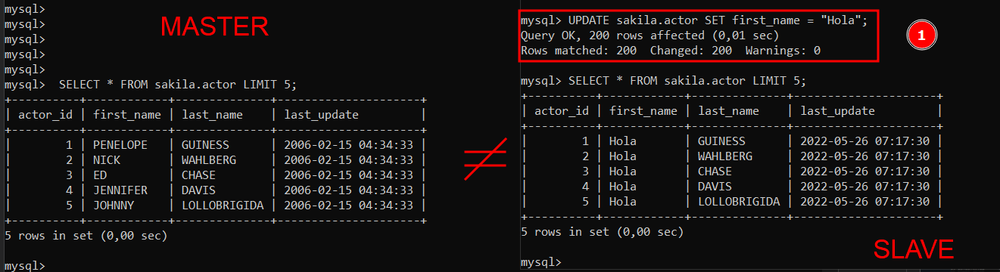
</details>

Ara, en teoria, si tornem a fer el `pt-table-checksum` en el `Master` que és on tenim instal·lat el percona toolkit, ens hauria de dir que tenim una diferència en la taula d'Actor entre el `Master i Slave`.
```
# pt-table-checksum -u percona_user -pSox2020$ -h 192.168.151.143 --no-check-binlog-format --databases=sakila;
```
<details open>
<summary><b>Veure que el pt-table-checksum ha trobat una inconsistència de dades</b></summary>
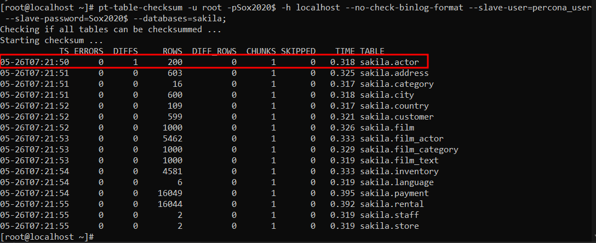
</details>

Clar, ara si volem arreglar les diferències com ho arreglem? Doncs per això està la eina `pt-table-sync` que va lligat amb l'anterior eina, perquè l'anterior eina et diu la inconsistència i aquesta te'l soluciona. 

Amb aquesta eina abans mirarem quins canvis té el `Slave` a diferència del Master, i sincronitzarem el les dades de la BD de Sakila del `Master` cap al Slave. Amb el paràmetre `--print` ens dirà els canvis que farà el Master cap al Slave, ens mostrarà que farà `REPLACE INTO` i el valor nou que posarà.
```
# pt-table-sync --sync-to-master h=192.168.151.142,u=replication,p=Sox2020$,P=3306 --databases=sakila --tables=actor --print
```
<details open>
<summary><b>Veure els canvis que es farà en el Slave per tornar a tenir consistència</b></summary>
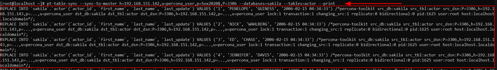
</details>

Un cop veiem els canvis i estem segurs de que volem fer aquests canvis. Amb la següent sentència, estarem sincronitzant els canvis que ha de tenir el `Slave` del `Master`. Ignorarem les claus foraneas, i que no verifiqui la integritat de les taules dels quan depén, això pot ser perillós, però si sabem que en el `Master` les dades són correctes i tenen integritat, doncs el el `Slave` podrem ignorar les claus foraneas, ja que sabem que les dades que ens venen "d'adalt" són integres.
```
# pt-table-sync --sync-to-master h=192.168.151.142,u=percona_user,p=Sox2020$,P=3306 --databases=sakila --tables=actor --no-check-child-tables --no-foreign-key-checks --execute
```
<details open>
<summary><b>Executar la sincronització del Master cap al Slave per tornar a tenir consistència</b></summary>
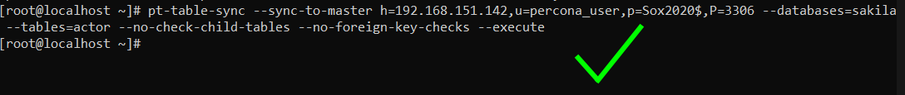
</details>

Si no ignorem les <em>taules filles</em> **( --no-check-child-tables)** i el check de les <em>foreign key</em> **(--no-foreign-key-checks)** ens donarà el següent error:
```
Cannot delete or update a parent row: a foreign key constraint fails (`sakila`.`film_actor`, CONSTRAINT `fk_film_actor_actor` FOREIGN KEY (`actor_id`) REFERENCES `actor` (`actor_id`) ON DELETE RESTRICT ON UPDATE CASCADE) [for Statement "REPLACE INTO `sakila`.`actor`(`actor_id`, `first_name`, `last_name`, `last_update`) VALUES ('1', 'PENELOPE', 'GUINESS', '2006-02-15 04:34:33') /*percona-toolkit src_db:sakila src_tbl:actor src_dsn:P=3306,h=192.168.151.143,p=...,u=replication dst_db:sakila dst_tbl:actor dst_dsn:P=3306,h=192.168.151.142,p=...,u=replication lock:1 transaction:1 changing_src:1 replicate:0 bidirectional:0 pid:29192 user:root host:localhost.localdomain*/"] at line 10950 while doing sakila.actor on 192.168.151.142
```

Ara, un cop hem sincronitzat el `Slave` al `Master` degut a la inconsistència que teniem, si tornem a fer el `Checksum` nos ens hauria de sortir cap diferència de dades.
```
# pt-table-checksum -u percona_user -pSox2020$ -h 192.168.151.143 --no-check-binlog-format --databases=sakila;
```
<details open>
<summary><b>Veure que després de la sincronització no tenim cap inconsistència</b></summary>
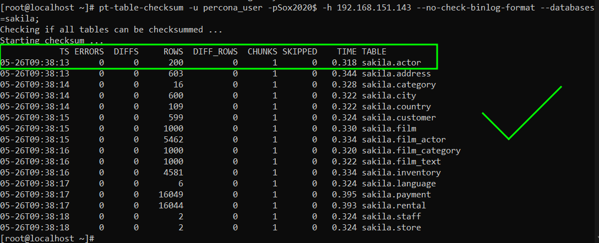
</details>

I ara, podem tornar a fer consultes sobre aquesta taula i veurem que a diferència d'abans tenim les dades iguals en ambdós servidors:
```
mysql> SELECT * FROM sakila.actor LIMIT 5;
```
<details open>
<summary><b>Comprovar que tenim les dades iguals després de fer el Sync</b></summary>
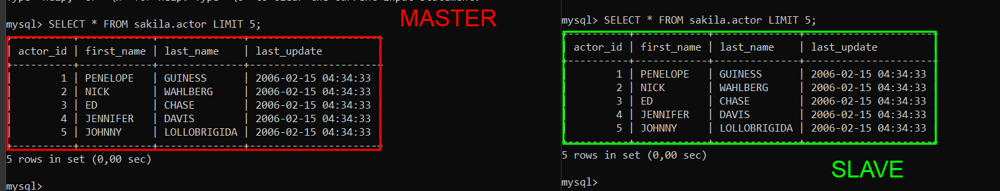
</details>

Si tenim problemes o volem afegir-hi paràmetres, podem consultar la documentació que ve quan instal·lem les percona toolkit.

Si volem consultar la documentació de l'eina `pt-table-checksum`
```
# perldoc /usr/bin/pt-table-checksum
```

Si volem consultar la documentació de l'eina `pt-table-sync`
```
# perldoc /usr/bin/pt-table-sync
```