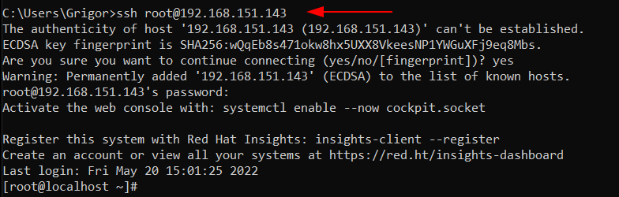
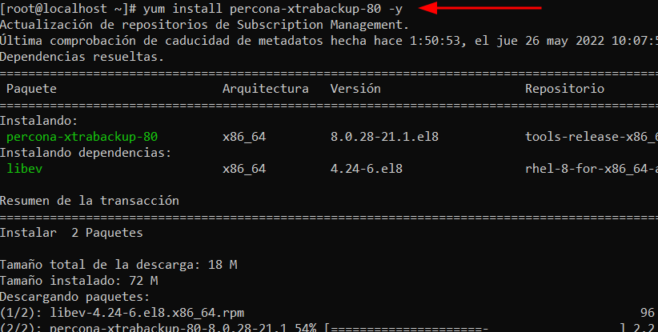
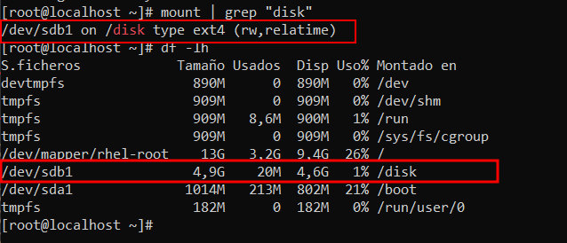

# Backups amb Percona XtraBackup 

## Connexió per SSH al Sistema (Opcional)
Si tenim instal·lat SSH en la nostra màquina de `MySQL`. Accedirem en remot per una correcta administració del Sistema.
```
ssh usuarimaquina@ip
```
<details open>
<summary><b>Connexió per SSH a la Màquina</b></summary>

</details>

## Introducció
En aquest apartat, farem una còpia completa i una restauració de les nostres bases de dades i del directori de dades.

⚠️S'ha fet aquesta guía, després de montar el sistema de replicació Master - Slave provinent del apartat anterior de [Configuració-Sistema-Replica](https://github.com/GrigorPogosyan/M02-Base-de-Dades/tree/main/Ac4-Replica-i-Backup/Configuracio-Sistema-Replica)⚠️

Tindrem un servidor MySQL, on farem un Backup dels fitxers que té, després farem canvis en les bases de dades que té, eliminació de base de dades, updates, simulant que hi ha hagut una incidència, i que volem tornar a recuperar les dades restaurant el backup anterior. A més 

Utilitzarem l'eina `Percona XtraBackup` que alguns dels següents scripts o programes són els següents:

 - `xtrabackup` --> L'eina que utilitzarem per fer la còpia i la restauració del Backup.

 - `xbcrypt` --> Eina que encripta i desencripta fitxers de Backup.

El primer que hem de fer és instal·lar el `Percona XtraBackup`. ((Hem de tenir el repositori afegit i habilitat (en teoria ho tenim degut a que hem hagut de fer aquests pasos al instal·lar Percona MySQL 8.0))
```
# yum install percona-xtrabackup-80 -y 
```
<details open>
<summary><b>Instal·lar les eines d'XtraBackup</b></summary>

</details>

Ara, el que hem de fer és crear un directori de backups, on aniran a parar els nostres backups que fem.
El directori en un cas real ha de ser un disc extern, ja que no té sentit guardar un backup en el mateix sistema en el que es fa el backup.

En aquests casos de virtualització i entorn de proves, montarem un disc en el nostre sistema, podem seguir els passos de configuració i montatge el disc en el [següent apartat](https://github.com/GrigorPogosyan/M02-Base-de-Dades/tree/main/Ac3-Storage-Engines-SGBD/InnoDB).

També crearem el directori on montarem el disc. En aquest cas crearé el directori /disk/backups, on el disc el montarem próximament a /disk
```
# mkdir /disk
# mkdir /disk/backups
```
I en resum si s'ha seguit correctament els passos de l'apartat esmentat anteriorment el montatge del disc s'hauria de veure d'aquesta manera:
<details open>
<summary><b>Veure que s'ha montat el disc en la carpeta</b></summary>

</details>
