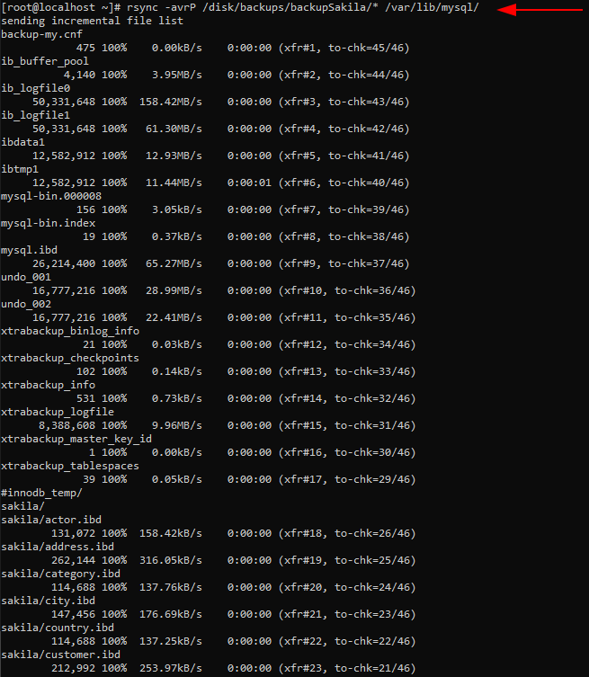

# Backups amb Percona XtraBackup 

## Connexió per SSH al Sistema (Opcional)
Si tenim instal·lat SSH en la nostra màquina de `MySQL`. Accedirem en remot per una correcta administració del Sistema.
```
ssh usuarimaquina@ip
```
<details open>
<summary><b>Connexió per SSH a la Màquina</b></summary>

</details>

## Introducció
En aquest apartat, farem una còpia completa i una restauració de les nostres bases de dades.

Tindrem un servidor MySQL, on farem un Backup dels fitxers que té, després farem canvis en les bases de dades que té, eliminació de base de dades, updates, simulant que hi ha hagut una incidència, i que volem tornar a recuperar les dades restaurant el backup anterior. A més 

Utilitzarem l'eina `Percona XtraBackup` que alguns dels següents scripts o programes són els següents:

 - `xtrabackup` --> L'eina que utilitzarem per fer la còpia i la restauració del Backup.

 - `xbcrypt` --> Eina que encripta i desencripta fitxers de Backup.

El primer que hem de fer és instal·lar el `Percona XtraBackup`. ((Hem de tenir el repositori afegit i habilitat (en teoria ho tenim degut a que hem hagut de fer aquests pasos al instal·lar Percona MySQL 8.0))

⚠️ EN CAS DE QUE ESTIGUEM EN UNA INFRAESTRUCTURA MASTER - SLAVE AL RESTAURAR UNA CÒPIA EN EL MÀSTER, HAUREM DE TORNAR A CONFIGURAR ELS SLAVES ⚠️
```
# yum install percona-xtrabackup-80 -y 
```
<details open>
<summary><b>Instal·lar les eines d'XtraBackup</b></summary>

</details>

Ara, el que hem de fer és crear un directori de backups, on aniran a parar els nostres backups que fem.
El directori en un cas real ha de ser un disc extern, ja que no té sentit guardar un backup en el mateix sistema en el que es fa el backup.

En aquests casos de virtualització i entorn de proves, montarem un disc en el nostre sistema, podem seguir els passos de configuració i montatge el disc en el [següent apartat](https://github.com/GrigorPogosyan/M02-Base-de-Dades/tree/main/Ac3-Storage-Engines-SGBD/InnoDB).

També crearem el directori on montarem el disc. En aquest cas crearé el directori /disk/backups, on el disc el montarem próximament a /disk
```
# mkdir /disk
# mkdir /disk/backups
```
I en resum si s'ha seguit correctament els passos de l'apartat esmentat anteriorment el montatge del disc s'hauria de veure d'aquesta manera:
<details open>
<summary><b>Veure que s'ha montat el disc en la carpeta</b></summary>

</details>

En aquesta carpeta no fa falta especificar x permisos per a que funcioni.

### Backup totes les Bases de dades
Per fer un backup de totes les bases de dades hem d'executar la següent sentència, on la carpeta `backupBD` no existeix i la crearà ell posant la còpia dins d'aquesta carpeta:
```
# xtrabackup --backup --datadir=/var/lib/mysql/ --target-dir=/disk/backups/backupBD -u root -pSox2020$
```
<details open>
<summary><b>Farem la còpia de seguretat de totes les bases de dades</b></summary>

</details>

I sabrem que la còpia ha sigut exitosa si el prompt ens retorna el següent missatge
<details open>
<summary><b>Copia exitosa</b></summary>

</details>

Després de fer cada backup, hem de *preparar* el seu contingut. perquè els arxius de dades no son coherents en el instant de temps que s'han preparat, perquè es van copiar en diferents moments mentres s'executava el programa i es posible que s'hagin afegit o canviat les dades mentre això sucedia. Es pot restaurar la còpia sense fer la preparació de la copia despres del backup, però es molt recomenable preparar-lo perquè poden donar errors de danys de l'arxiu. També hem de fer el `prepare` perquè els ibdata que copia, tota la informació no pot estar en el ibdata, podria haver-hi informació pendent de ser escrit en el ibdata que estigués en el undolog, doncs el prepare s'encarrega d'això.
```
# xtrabackup --prepare --target-dir=/disk/backups/backupBD
```
<details open>
<summary><b>Prepararem el Backup que hem fet</b></summary>


</details>


Un cop fet el `--prepare` ja tenim la còpia de seguretat neta i consistent i llesta per ser restaurada.

Ara, si mirem el contingut d'aquest directori podrem veure que tenim la còpia de totes les nostres bases de dades del MySQL.
```
# ls -alis /disk/backups/backupBD
```
<details open>
<summary><b>Mirar el contingut del directori on s'ha fet el Backup</b></summary>

</details>

Ara, un cop tenim feta la còpia sencera de les nostres bases de dades, anirem a simular una fallada de dades molt forta, és a dir borrarem les bases de dades de `mysql`, `information_schema` etc... 
```
# rm -r -R -f /var/lib/mysql/mysql
# rm -r -R -f /var/lib/mysql/performance_schema
# rm -r -R -f /var/lib/mysql/sakila
# rm -r -R -f /var/lib/mysql/github
# rm -r -R -f /var/lib/mysql/sys
```
<details open>
<summary><b>Provocarem errors</b></summary>

</details>

Després reiniciarem el servei i veurem que no pot ni arrancar degut a que falten aquestes Bases de dades.
<details open>
<summary><b>Veurem que el servei no arranca degut a que hem provocat una fallada forta</b></summary>


</details>

Ara, farem la restauració de la còpia de les nostres Base de Dades guardades anteriorment
```
# rsync -avrP /disk/backups/backupBD/* /var/lib/mysql/
```
<details open>
<summary><b>Restaurarem la còpia</b></summary>

</details>

Ara, en aquests fitxers restaurats hem de tornar a donar els permisos de `MySQL`, degut a que aquestes al fer-se la còpia passen a ser de root.
```
# chown  -R mysql:mysql /var/lib/mysql/*
```
<details open>
<summary><b>Veurem que els fitxers han quedat com abans amb els permisos corresponents</b></summary>

</details>

Ara, si reiniciem el servei i el comprovem, hauria de funcionar.
<details open>
<summary><b>Servei funciona després del backup</b></summary>

</details>

Ara, ens loguejarem al MySQL i farem unes quantes proves per verificar que tot funciona correctament.
```
# mysql -u root -pSox2020$

mysql> SELECT user FROM mysql.user;
mysql> SELECT * FROM information_schema.engines;
mysql> SELECT * FROM sakila.actor LIMIT 1;
```
<details open>
<summary><b>Comprovacions de que funciona la restauració de la còpia</b></summary>

</details>

### Backup BD específic

Si volem fer un backup d'una Base de dades en específic, el podrem fer de la següent manera:
```
# xtrabackup --backup --datadir=/var/lib/mysql/ --target-dir=/disk/backups/backupSakila --databases=sakila -u root -pSox2020$
```
<details open>
<summary><b>Realitzar el backup només de la BD de Sakila</b></summary>


</details>

També hauriem de *preparar* el backup d'aquesta base de dades.
```
# xtrabackup --prepare --target-dir=/disk/backups/backupSakila
```
<details open>
<summary><b>"Preparar" la còpia de la BD de Sakila</b></summary>


</details>

I si mirem el contingut del directori de Backups podem veure que només ha fet el backup d'aquesta base de dades
```
# ls -alis /disk/backups/backupSakila
```
<details open>
<summary><b>Veure que només ha fet backup de la BD de Sakila</b></summary>

</details>

Ara, simularem que perdem dades per error en la base de dades de Sakila. Abans desactivarem que verifiqui les clau foanras amb la variable de sessió. També modificarem la taula de pagaments i posarem 0 a tots els diners pagats.
```
mysql> USE sakila;

mysql> SET FOREIGN_KEY_CHECKS = 0;

mysql> DROP TABLE actor;

mysql> DROP TABLE address;

mysql> DROP TABLE city;

mysql> UPDATE payment SET amount = 0;

mysql> SELECT * FROM payment LIMIT 10;

mysql> SHOW TABLES;
```
<details open>
<summary><b>Simular una pèrdua de dades</b></summary>

</details>

Ara, el que hem de fer és parar el servei, restaurar la còpia i encendre el servei.
```
# systemctl stop mysqld
```
Restaurarem la còpia de la BD de Sakila, és una còpia sencera.
```
# rsync -avrP /disk/backups/backupSakila/* /var/lib/mysql/
```
<details open>
<summary><b>Restaurar la còpia</b></summary>

</details>

Ara, hem de tornar a donar els permisos de MySQL a la carpeta del MySQL recursivament. Perquè al haver fet el Backup de la BD de Sakila el propietari es canvia a Root, un cop restaurat l'hem de tornar a canviar al MySQL, canviem permisos de tot el directori de dades ja que el XtraBackup alhora de fer la còpia al Sakila ha copiat altres fitxers també com els fitxers `ib_buffer_pool`, `ib_logfile0`

<details open>
<summary><b>Fitxers del backup amb permisos root</b></summary>


</details>

Llavors canviarem recursivament els permisos (propietari)
```
# chown  -R mysql:mysql /var/lib/mysql
```
<details open>
<summary><b>Veure que ha canviat els permisos de tots els fitxers a MySQL</b></summary>


</details>

Ara, encendrem el servei de MySQL.
```
# systemctl start mysqld && systemctl status mysqld
```
<details open>
<summary><b>Reiniciar el servei de MySQL i comprovar que funciona</b></summary>

</details>

Ara el que farem serà veure si les taules restaurades funcionen o no, si hi podem inserir dades etc...
```
mysql> USE sakila;

mysql> SHOW TABLES;

mysql> SELECT * FROM actor LIMIT 5;

mysql> INSERT INTO actor (first_name,last_name) VALUES("Grigor","Pogosyan");
```
<details open>
<summary><b>Mirar si la restauració ha sigut exitosa</b></summary>

</details>

També mirarem si la taula que vam fer update, hem recuperat el seus valors
```
mysql> SELECT * FROM payment LIMIT 5;
```
<details open>
<summary><b>Veure que hem recuperat els valors del camp amount de la taula payment</b></summary>

</details>


